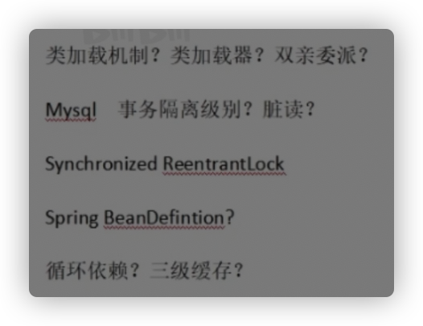
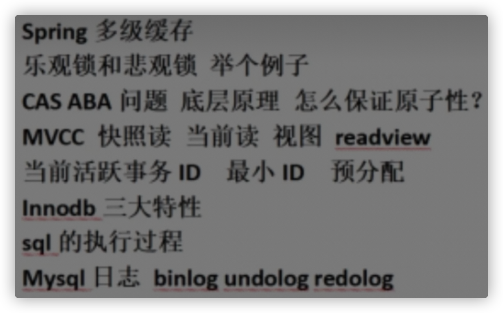
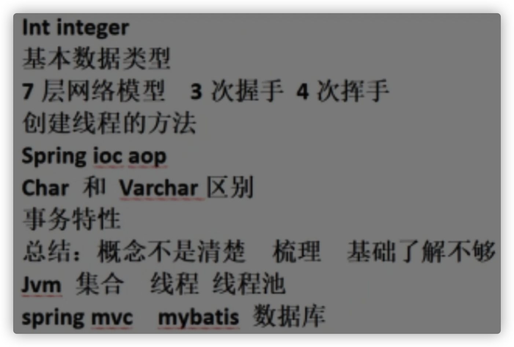
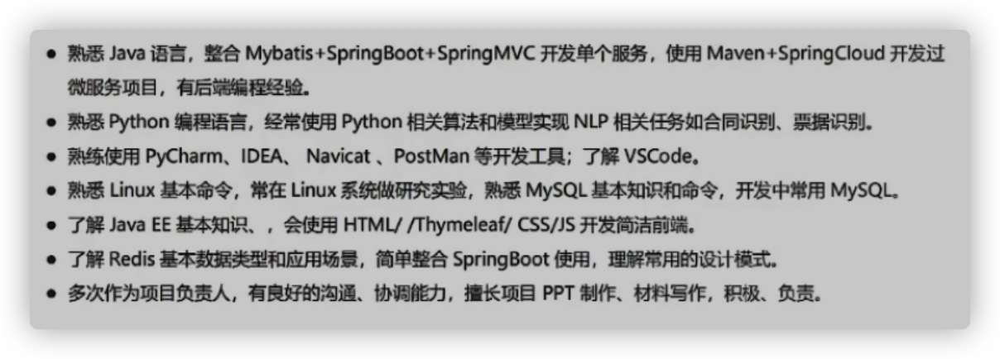
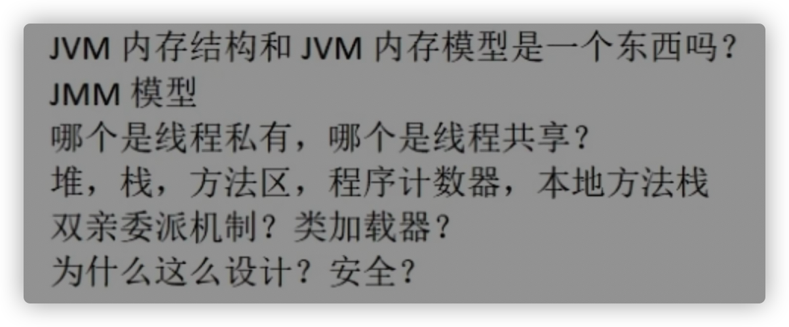
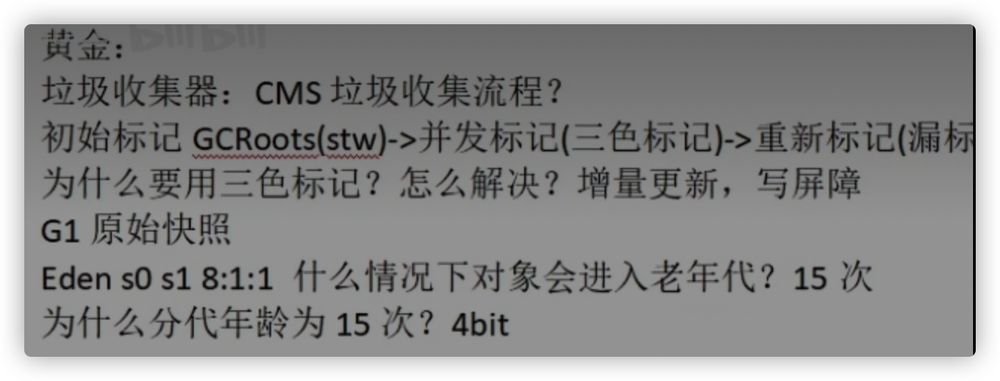

-  信息收集：github Java实习/ Java实习面试 /Java校招/ Java秋招/ Java春招/ Java初级面试/  Java面试技巧/ Java面试经验/ 还没找 Java校招简历

https://github.com/forthespada/developer-roadmap-zh-CN

https://github.com/ZaynXu/BE-note

https://github.com/himeet/xiaozhao

https://github.com/ThisisWilli/JavaStudy

https://github.com/xiantang/Java-BackEnd-Notes

https://github.com/DreamCats/java-notes

https://github.com/xuanqizi/JavaBagu

https://github.com/haungwanjun/JavaNotes

https://github.com/JACK-QBS/Interview

https://github.com/wangzichenking/2021-QiuZhao

https://github.com/simuel2333/JavaInterview

https://github.com/tianluoding/2022-Java-campus-recruitment

https://github.com/zhang19980825/Java-Road-to-God

https://github.com/zhang19980825/CS-Notes

https://github.com/Ranngo/Java

https://github.com/GatesMa/Interview

https://github.com/guoyang1996/NoteBook

https://github.com/Evelynww/WorkLoad

https://github.com/979531840/JavaAutumnRecruitmentInterview

https://github.com/JiangJiaWei520/CyC2018

https://github.com/whw19970927/JavaSecret

https://github.com/lvminghui/Java-Notes

https://github.com/husying/JNotes

https://github.com/zeanzai/Java-Interview-Questions

https://github.com/389895972/java-

https://github.com/QiuYukang/JavaNotesForInterview

https://github.com/weishuaiqiang/study_cs_notes

https://github.com/Dreamerhaha/JavaStudy

- 未过

https://github.com/puge-up/programming-play 

https://github.com/cunyu1943/JavaPark

https://github.com/AlexanderChen-Real/JavaInterview

https://github.com/0voice/develop_skill_tree#anchor_point_3

https://github.com/arkssss/StudyNotes

# 我的实习规划

- 心理上：认清自己是渣渣的现实，多准备，早投递，以面试经验来压倒心理恐惧，大不了还有秋招春招机会更多，大不了去麦当劳打工

  事后复盘下，吸取面试经验，这就足够了，切不可沉浸在喜悦或者悲痛之中，面试要做到“面的起，放得下”

  信心满满——>第一次被打击——>第二次被打击——>第三次被打击——>觉得上天不公，想放弃，几乎快崩溃——>慢慢总结，从新开始面试,心态360度大转变——>面试时战战兢兢，如履薄冰——>心态放好，鼓励自己，不放弃---->终于成功了，有种想哭的感觉！

- 行动：

  - 准备好简历写的内容
  - 找iOS实习题做归纳，找面试技巧，多翻翻到烂熟于心(掘金，简书5)，牛客，GitHub)
  - 准备好自我介绍和常问的人生问题
  - 更新完善我的app，准备好app的介绍,通过画流程图,遇到什么困难？怎么解决的？
  - 做好面试总结
  - 或者去网上找一些开源的项目跟着做也是可以的。但如果你问我，这些都没有那怎么办，还有最后一招，去找一些实战课程，自己跟着视频的进度完整的写完一遍代码，把整个项目吃透也是可以的。

3月~5月：暑期实习/上届春招（补招）
6月~8月：秋招提前批
9月~11月：秋招正式批
全年：日常实习

# 实习投递

海投网，实习僧，牛客，智联，boss，58，拉勾，应届生求职网,猎聘网，中华英才网，大街网，拉勾网，实习僧，校园招，LinkedIn，脉脉,知识星球,前程无忧，看准

# 面试技巧

## 反问对方

反问

1. 组里的技术栈
2. 新人指导

- 如何带团队
- 如何协调工作
- 项目背景和目标
- 成果
- 对自己的规划
- 面试官您是从事什么岗位的呢
- 主要做什么
- 薪资如何
- 加班严重吗
- 双休?
- 公司有食堂吗
- 贵公司的主要从事的业务是什么？
- 请问面试官，您觉得我今天的表现怎么样？可否有宝贵的建议

简历投递建议在星期1到星期4，早上时间 9.30 - 10.00，下午时间是2:15-3:00；星期5-7别投简历，很容易被后面的人覆盖掉了。

简历不要用word，用Pdf，简历命名：姓名+岗位+学校或学历

如果让你填的信息中有包括个人比较敏感的信息，不要填写。做笔试题不要东张西望甚至拿手机出来查，被看到了就别指望收到offer了

[程序员实习生面试心得]https://blog.csdn.net/stilll123456/article/details/72811588

之所以想加入`xx`,是因为`xx`,想加入一个有激情、有上进的Team - 官话,也就是自我介绍

在面试的时候，我强烈建议你录个音，之后方面整理面试笔记，反思自己的表现之类的！吸取教训和经验。面试完之后也不能松懈，继续背面试题，投简历，然后准备下一个面试。

坚持就是胜利，一个暑假过后，我把牛客的题目刷通了两遍，也学到了更广泛的技术知识。

我当时刷题有个习惯就是写题解，在评论区留下自己的思路，相信应该有不少同学刷牛客题目的时候都看到过我的身影吧。

你要是实习没工资，那绝对不靠谱。

网上一般建议的是准备好两份自我介绍：一份对 HR 说的，主要讲能突出自己的经历，会的编程技术一语带过；另一份对技术面试官说的，主要讲自己会的技术细节，项目经验，经历那些就一语带过。

1. 实习生的培养规划,然后就是提问环节。我询问了一下这边的主要职责（一开始有点卡，没听到），工作强度，工作地点和氛围。

2. 我询问了一下像我这种准备入行iOS开发的小菜鸟的职业规划和移动开发的未来。

3. 顺便问了是电话面试还是视频面试，

   这个很重要，

   一定要先问清楚。

   **询问面试官结果何时通知**

   在面试过程中积累经验和要学习的知识点，锻炼胆量和回答问题的方式。有录用最好，没录用就把不会的问题搞懂。

   研一或者没有实习经验的同学经常会对自己的能力没有清楚的认知，找实习的过程中就是一个自我检测的过程，实习的过程也是自我认知的过程，碰到问题正是查漏补缺的好时候。

   **尽早开始学习，尽早开始找实习，尽早开始试错。规划很重要。**

   不可否认的事实是，很多导师是不放学生实习的，但这并不影响你去面试。

   

项目经历请保持在两个以上，讲究**一主多辅**，要保证第一个是最拿的出手的。这样就能让面试官在今后face to face过程中能聊聊你的这个项目，这就是你的**谈资**！解决了哪些难点，项目中有哪些技术手段实现的亮点，可以再附上一些项目结束后的人生或工作感悟。

简历尽量保持在一页有余、两页不满

然后用用**开源库**啥的，读读开源框架的**解析博客**，有能力的读读源码（不建议，花费时间太长，想快速提高面试能力看看博客就够了，以后有时间了可以再细读

## 时间安排

（2）面试过程中一定要有信心，有礼貌，表达自己内心真实的想法，面试无非就是一次聊天，聊得越好对你越有帮助；

（4）建议大家不要一来就问工资。可以多问一些自己进公司之后要注意什么，要参与什么项目之类的，更多的注重自己是否能胜任这份工作。聊得好了，他们想留你的时候，自然会跟你谈工资的

但是要注意，有的面试官就喜欢对着简历问问题，所以你不太熟悉的技术还是要谨慎，而且不要出现“精通”这个词。可以使用熟练掌握、熟悉、了解这些词，注意语言的魅力！当你做好简历开始复习知识点的时候也一定要着重去复习你写的这些技术点【多背背相关面试题】

我个人建议投简历的时候在每天的早上`8:00 - 9:00`，然后不要在周末的时候投简历。连着多投几天。

注意就是你会收到很多公司的打来的电话，这些公司会简单的问一下你的基本情况，然后说一下打击你的话，然后提出他们公司有一个为期几个月的岗前培训，那么这个时候，你就可以直接的拒接了！基本上就是什么培训机构。

刚开始投简历的时候就先别挑公司了，只要能给个面试的机会就行！其实大多数人刚开始几次的面试肯定都是很慌张的，不知道怎么自我介绍和回答问题，总是容易卡壳，其实冷静下来之后有些问题你是知道怎么回答的，但就是由于紧张，所以没有回答上来。所以前几次面试，我觉得最主要是练胆量！

当你收到了一个面试的邀请的时候呢，当HR问你什么时候方便面试，那么你一定不要着急马上面试，可以把面试的时间约定在第二天！趁着还有一晚上的时间，临阵磨枪，好好磨磨。着重看那些最可能被问到的问题。想想自己的自我介绍该怎么说，好好的组织一下语言！

- 我的实习招聘（3月初—6月底）

投递了这家公司的简历，一定要去提前了解这家公司的主要业务，这样能在实习面试中加分。

暑假的两个月不能荒废，“好好准备，备战秋招”。暑假期间忙着实习，没有撸代码和补基础，差点被秋招的潮水拍死在沙滩上。  

投递完简历，测评一定要尽早去做，别错过了招聘流程。 

对于特别有意向的公司，花点路费、花点时间是值得的，因为参加现场面试更有优势。 

面试的公司多了，经验告诉我，具有以下特征的几乎都是培训公司：

1、专业不限，有无经验均可

2、管吃，管吃，待遇优厚

3、无经验亦可，面试通过，直接上岗

4、满18周岁，专业不限，对IT行业感兴趣，想要从事IT行业者

5、无项目经验转行优先

6、学徒，储干等等

投简历的时间：

上午：8:00——9:30

下午：2:00——3:00

第三、简历投出去了，要保持手机信息畅通，接收邮件正常等。接到面试邀请电话，要有礼貌，说话认真，问清楚面试时间等，并让她给你发送面试邀请电子邮件。去面试的时候，要注意仪表仪容，给面试官好印象。学会自我介绍，自我推销，面试官问什么答什么，尽量不要答非所问，因人而异吧！请诸君面试时，自我发挥吧！你的一举一动都会成为你面试失败的原因，细节、态度都很重要。

第四、经过一段时间的面试，你会不断的遭受打击，这时可能连当初的信心都没有了，有种身无可恋的感觉，已是身心疲惫，脑海里有无数次想放弃的冲动。别，千万别放弃，这时你可能离成功已经不远了，只要在坚持一下，就能成功！相信自己。面试的这段时间，要学会不断总结，每次面试几乎都是先做面试题，只有笔试过了，才有机会和技术官面试。总结面试题，不会不懂的要及时弥补，学会亡羊补牢，以便下次遇到同样的面试问题，保证能够答对。

第五、树立正确的择业观，工作无贵贱，技术无高低，只在意什么人使用它而已！相信自己，不要因为自己技术不好，就害怕！不要因为自己的大学不好，就自卑！也不要因为面试屡次失败，就放弃！找工作本就不是一件容易的事，需要我们自己努力去找！

1. 秋招就是正式开始找工作了，一般也分为两种：提前批和正式批。

- 秋招提前批：时间是**6 ～ 8 月**，大多以**内推**为主，就和保研的夏令营/预推免一样，这个时间段的参与秋招提前批的大佬特别多，同时岗位 hc 并不多（因为企业要考虑正式批的情况，会控制招聘人数），所以可以把这段时间简单理解为**神仙打架期**。
- 秋招正式批：时间是**9 ～ 11 月**，这个阶段就是所谓的**“金九银十”**了，一般到这个时候就很考验心态了，因为如果到 9 月份或 10 月份了，你手里还没有 Offer，再看看身边已经拿到 Offer 的同学，一定化身成柠檬精 🍋。不过这个时候心态千万别崩，继续投继续干，**广撒网才能多捕鱼**。

# 

# B站

https://www.bilibili.com/video/BV1Pa41147eK?spm_id_from=333.337.search-card.all.click&vd_source=1a93f17d4138aae10f5cc67210f18faf

JAVA--->架构师

golan（顶级大厂）云原生组件中间件

三个方向突破：技术业务管理

自我介绍：专业性，业务经验（零售业等），积极，解决问题能力，同事交流协调，自己最有价值，和聊天一样

你最擅长的技术方向是什么？就算hr问也不要小看

你希望与什么样的上级共事？能学到技术，既喜欢你这样的，解决问题，和谐，效率，公司氛围好没有障碍，坦诚交流，自己优缺点能直说

你对于我们公司了解多少？业务一些术语（聊天带出来），行业相关，技术自己了解，自己可以给公司带来什么？公司缺什么我会什么

喜欢这份工作的哪一点？团队，技术，业务，场景，氛围，特别喜欢，对工作有兴趣，特别向往……

在五年的时间内，你的职业规划？自己问公司晋升体系（来你这儿就是为了跟你干，创出名堂）

你朋友对你的评价？靠谱+例子，干啥都想着我带着我，出门看猫？

如果你做的一项工作受到上级领 导的表扬场，但你主管领导却说是他做 的，你该怎样？能力成长

谈谈你对跳槽的看法？有上升空间就一直呆，不会轻易跳槽，把公司干强干大，要是公司经济不能维持才会跳，但是会尽量保证不会有这样问题

请说出你选择这份工作的动机？工作不是瞎找，有价值，向往，自己能力能匹配，（说出自己做的功课），和其他公司不一样的地方，捧着说；对行业业务的理解

你能为我们公司带来什么呢？技术/资源协调，能带来的资源（面试leader）

你怎么理解你应聘的职位？对要求技术点了解透彻，适合岗位，你们缺啥我正好擅长，给我一个机会

https://www.bilibili.com/video/BV1vN4y1T7UR/?spm_id_from=333.788&vd_source=1a93f17d4138aae10f5cc67210f18faf

主要对代码的编写，文档的注释，spring，spring MVC，mybatis等开源的框架，使用过springboot；对集合，多线程，JVM有一定了解，书写基本Linux命令，书写sql语句

是什么，底层原理，怎么用场景，如何解决问题

数据库乐观锁，悲观锁

实习整个业务流，系统搞清楚，架构，核心功能，不只是自己负责的部分

基本数据类型都是多少位?

 并发安全，是什么，保证安全的方式有几种，都有什么区别

hashmap计算下标，为什么用红黑树好处

信号量,Fork Join

hashmap put元素jdk7 8区别（哈希计算等等），红黑树迁移的数据结构转变（目的好处），红黑树特点

Mysql mvvc原理，高水位

可重复读解决什么问题（没有解决幻读，为什么？）

当前读，快照读

间隙锁之间冲突吗？能解决幻读吗，什么时候又会出现幻读

线程池如何创建

我分绍一不我学的这些技术啥的吧.就是掌握JavaSE的内容,熟西面向对象的设计,了解这个集类和多现成的使用,还有这框架这方面的话就是： ssm 框架,还有mybatis plus,还有spring bo口t框架,嗯可以熟练的使用这些框架,数据库这方面的话咂 让较熟练使用这个ySOL这种关系性数据库,对它的存储引擎 索引还有事物的隔离级别 mVCC 这些东西有一定的了解嗯, 然后我门对着非关系进入出击库啊,然后就是这个redis. 了解这个redis的使用,然后了解他这个缓存穿透缓存雪崩缓存击穿，redis分布式锁的使用.jvm juc了解

项目网上跟着视频做的

特点：

特点的话就是与人相处还是比较轻松，学习比较刻苦，对于新事物还是能接爱的，然后对于不会的东西,还是会马上去学的(spring cold,因为那个做那个项目，用到了这个分布式下边的内容)

mysql慢查询，最左前缀，各种符号能否走索引<>=，索引数据结构 和二叉树有啥特点

mysql锁，有哪些锁，

间隙锁是什么锁，产生原因（非唯一）

next key，解决什么问题，如何解决

mvcc解决幻读等等 底层

隔离级别哪几种

自己做了一个论坛的项目，相当于是我自己第一个认真的从0到1的做一个项目， 然后在这个项目最开始的时候,比如说数据库表的设计 基础选型的时候 参照xx项目的数据库表设计 根据我的需求进行更改，其次呢我平时遇到的技术难点 一般都可以通过百度来进行解决。我这个项目的话，后来也对他进行了一个优化我觉得这个也算是一个难点吧，盒两支的服务器上部署的，然后我自己在测试的时候，发现他这个运行是比较卡的，想对他这个性能进行二个提升。然后我就在后台，对我这个服务器的进行一个监控，发现他其实是内存占用一直很高，肉存也占到了七八十%的样子，当时在网上对他进行一个虚拟肉存的配置。主要是把那个硬盘作为一个内存的当时一个一个缓冲，这个是一方面，还有另一方面，在我使用的过程中我自己造的数据，当我在分页查询的时候，页码在最后的时候，比如说， 我每次访问到200多页的时候，点那个按钮的时候就会比之前的卡，然后我就看阿里之前给的文档，数据库就是mysq数据库，主要查询是200页到205页，它其实查询的并不是200到205页，它其实查询的是0到205页，再把200页给丢弃掉，所以mysg的底层就是这么执行的。我对像这种情况也进行一些优化。嗯我优化的方式是给，数据库的那个主键 增加索引，然后通过二次查询， 来解解决这个问题就是我第一次查询的时候，我是只查询这个id，这样的话他在mysql底层，他会走这个b加数这个索引，所以然后查出来这些数据，然后我再做一个连表查询，跟我的那个实际要使用的那些数据，像这些都是我在分页就是展示使用的，然后我第二次就是对头一次结果进行再进一个连表查询，就可以对这个进行一个优化，我大概碰到的困难也就是这些，能想到的就是这些。

现在有10个g的数据,然后他要存到mysql口里面,怎么能够高效的存储（大文件拆解筛选问题），这个写的有点简单了

jvm类的加载过程,双亲委派呀,并发编程对吧,jmm,aqscs,ioc,aop,springboot自动装配，spring cloud注册中心 配置中心，

外包：薪资低，加班多，无归属感，学东西少。

 

# 问题

- 开始学的时间，学多久
- 转的原因
- 项目最了解功能的介绍，有意思的代码
- 描述印象深的排序
- 你讲一个比较了解的JAVA知识点
- 平时怎么学，在哪儿学
- 学到啥程度：应该就是稍微在就在公司里面再稍微对接一下，也可以上手
- 项目自己做的还是？是我在网上找的自学项目,然后都是我自己做的,但是我因为我时间并不是很多,先就理解各模块怎么运作的这个目的,但是可能就不是说事无巨细,然后输入代码都自己敲的
- 3,5年规划
- 看公司官网，文化，为什么选择这个公司
- springboot操作注解有哪些?
- redis项目使用场景:一致性要求不高,又被频繁读取的东西;加那个分布式锁他是所有微服务就是共享的一个信息中心
- 兴趣爱好
- 

