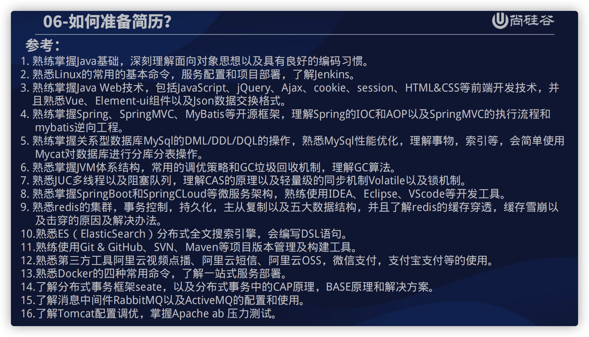
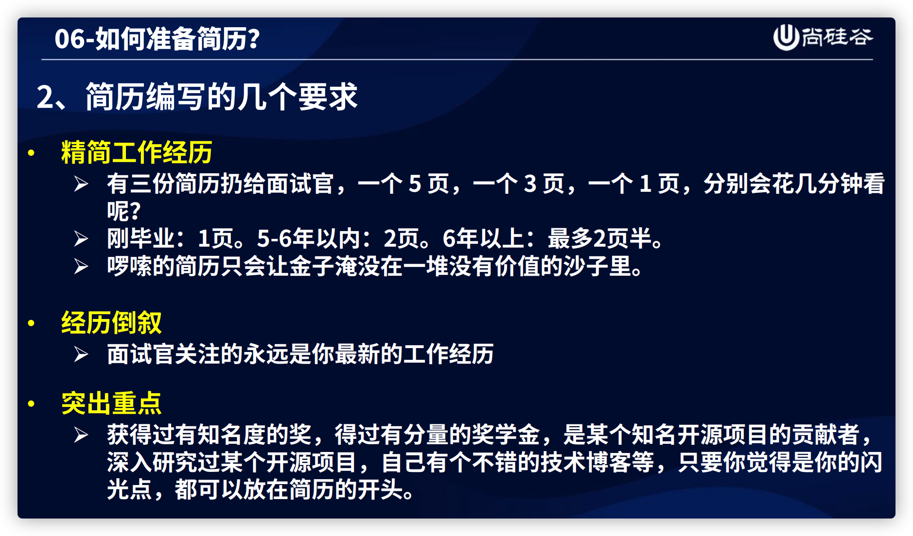
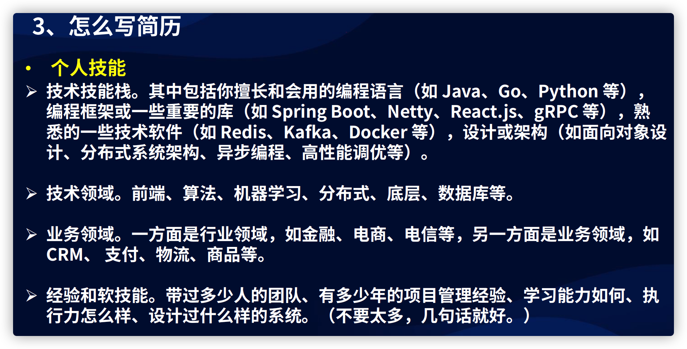

-  信息收集：github Java实习/ Java实习面试 /Java校招/ Java秋招/ Java春招/ Java初级面试/  Java面试技巧/ Java面试经验/ Java校招

# 投递app

海投网，实习僧，牛客，智联，boss，58，拉勾，应届生求职网,猎聘网，中华英才网，大街网，拉勾网，实习僧，校园招，LinkedIn，脉脉,知识星球,前程无忧，看准，各个学校的公众号

# 简历

## 投递

- 简历投递建议在星期1到星期4，早上时间 9.30 - 10.00，下午时间是2:15-3:00；星期5-7别投简历，很容易被后面的人覆盖掉了。
- 简历不要用word，用Pdf，简历命名：姓名+岗位+学校或学历
- 如果让你填的信息中有包括个人比较敏感的信息，不要填写。

## 简历准备

- 选择技术表述中掌握程度最高的那几个。如果回答的不到位，说明面试者不够可自信。“了解、掌握、熟练使用、精通”

- 项目经验，4个+

- 简历多写（拼了）

  

  

  

  

# 心态

- 大环境改变不了，不思考，否则精神内耗
- 找工作：概率问题
- 投简历（忘记不会的事情，恶补，概率问题）
- 害怕--面子（只是面试的时间，和面试官之间，很快就淡忘）
- 前几次面试，我觉得最主要是练胆量！
- 经过一段时间的面试，你会不断的遭受打击，这时可能连当初的信心都没有了，有种身无可恋的感觉，已是身心疲惫，脑海里有无数次想放弃的冲动。别，千万别放弃，这时你可能离成功已经不远了，只要在坚持一下，就能成功！相信自己。面试的这段时间，要学会不断总结
- 

# 面试技巧

## 反问对方

问面试官：

- 组里的技术栈
- 主要从事的业务，内容，成果；主要职责
- 面试官您是从事什么岗位的呢
- 工作强度，工作地点和氛围。
- 请问面试官，您觉得我今天的表现怎么样？可否有宝贵的建议

问hr：

- 新人指导
- 薪资组成，五险一金，年假
- 加班严重吗 双休?
- 公司有食堂吗
- **发工资的日期。**正常的公司都会在15号之前发工资，要是15号后发工资的，大概率不靠谱。
- 企业文化
- 加班：加班，要么给钱，要么调休。这是作为员工的合法权益。
- 结果何时通知
- 问公司晋升体系

## 技巧

- 聊得越好对你越有帮助；
- 建议大家不要一来就问工资。聊得好了，他们想留你的时候，自然会跟你谈工资的
- 做笔试题不要东张西望甚至拿手机出来查，被看到了就别指望收到offer了

## 课下准备

- 有的面试官就喜欢对着简历问问题
- 投递了这家公司的简历，一定要去提前了解这家公司的主要业务，这样能在实习面试中加分。
- 当你收到了一个面试的邀请的时候呢，当HR问你什么时候方便面试，那么你一定不要着急马上面试，可以把面试的时间约定在第二天！趁着还有一晚上的时间，临阵磨枪，好好磨磨。着重看那些最可能被问到的问题。想想自己的自我介绍该怎么说，好好的组织一下语言！
- 恶补：细-->粗 粗-->细（教学项目驱动，囫囵吞枣学完，不熟的再单独照找学，1-3月）

# 避坑

- 要是实习没工资，那绝对不靠谱。

- 不去没投过的

- 面试的时候，也建议大家多看看公司的文化墙装饰，如果公司文化墙上都是老板的照片和言论，公司极有可能是“一言堂”；如果公司文化墙上都是心灵鸡汤或者是打鸡血的成功语录，那么很有可能出现“职场PUA”。

- 注意就是你会收到很多公司的打来的电话，这些公司会简单的问一下你的基本情况，然后说一下打击你的话，然后提出他们公司有一个为期几个月的岗前培训，那么这个时候，你就可以直接的拒接了！基本上就是什么培训机构。

- 面试的公司多了，经验告诉我，具有以下特征的几乎都是培训公司：

  1、专业不限，有无经验均可

  2、管吃，管吃，待遇优厚

  3、无经验亦可，面试通过，直接上岗

  4、满18周岁，专业不限，对IT行业感兴趣，想要从事IT行业者

  5、无项目经验转行优先

  6、学徒，储干等等

# 问题

- 开始学的时间，学多久
- 转的原因
- 项目最了解功能的介绍，有意思的代码
- 描述印象深的排序
- 你讲一个比较了解的JAVA知识点
- 平时怎么学，在哪儿学
- 学到啥程度：应该就是稍微在就在公司里面再稍微对接一下，也可以上手
- 项目自己做的还是？是我在网上找的自学项目,然后都是我自己做的,但是我因为我时间并不是很多,先就理解各模块怎么运作的这个目的,但是可能就不是说事无巨细,然后输入代码都自己敲的
- 3,5年规划
- springboot操作注解有哪些?
- redis项目使用场景:一致性要求不高,又被频繁读取的东西;加那个分布式锁他是所有微服务就是共享的一个信息中心
- 兴趣爱好
- 谈谈你对跳槽的看法？有上升空间就一直呆，不会轻易跳槽，把公司干强干大，要是公司经济不能维持才会跳，但是会尽量保证不会有这样问题

---

# 简历删除的部分（备份）：

自我评价

- 代码结构清晰、命名规范、具有良好的编码习惯；喜欢封装，注释爱好者。
- 对IT领域软件开发和设计工作有浓厚的兴趣，能承受较大的工作压力。
- 具有很强的团队精神、团队的时间观念；有良好的组织、协调和沟通能力。
- 有较强的自驱力和自学能力，能独立进行问题的分析、搜索并解决遇到的问题。

# 投递打招呼

您好，请问这边岗位介意0经验转行Java后端开发吗？我专业是希腊语因为职业发展原因选择转行，对Java后端开发技术方面非常热爱，并利用课余时间尽可能自学了将近一年的Java后端开发技术，熟悉Java语⾔基础，Spring、SpringMVC、MyBatis/MyBatisPlus、SpringBoot等相关后端框架，MySQL、Redis数据库的使⽤。因为是转行所以会比其他人更努力也更珍惜这次工作机会，您看是否合适呢？
