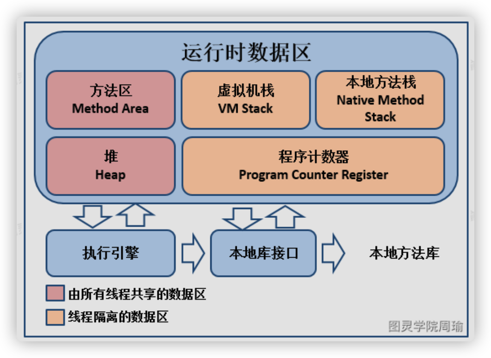
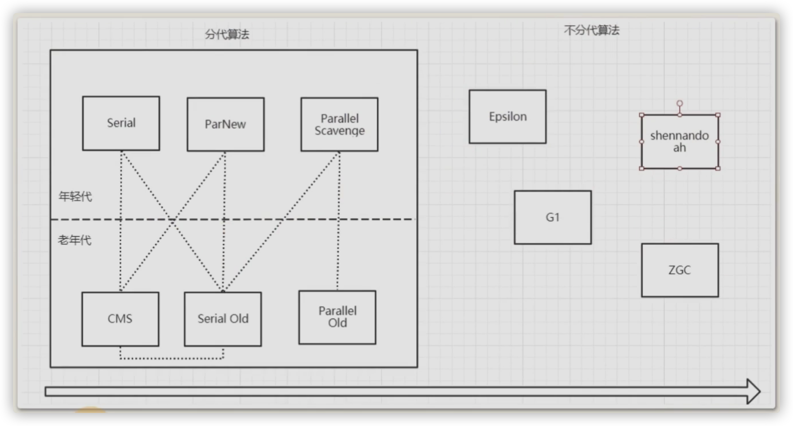
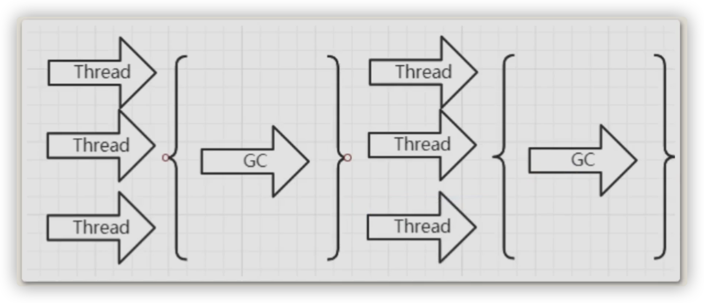
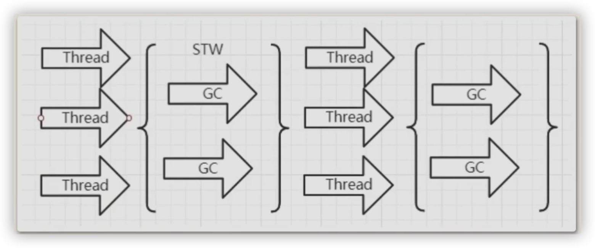
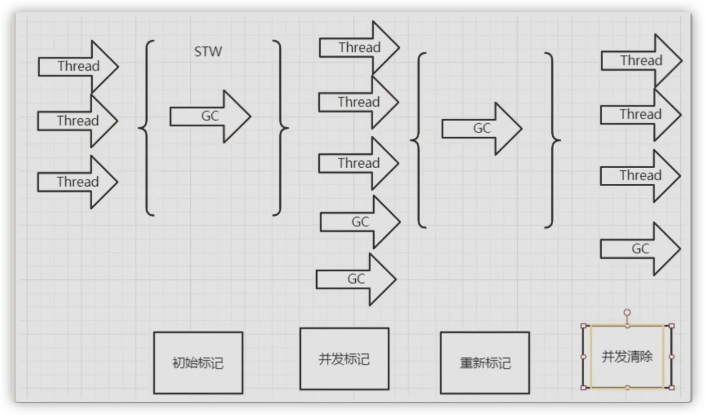
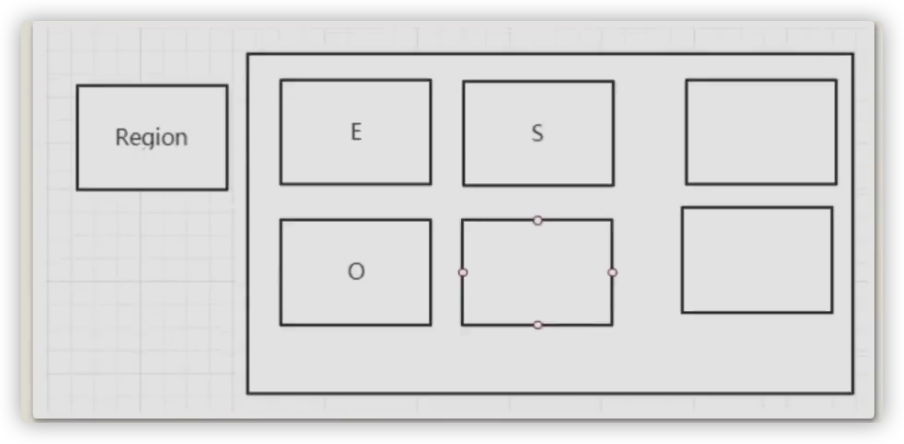
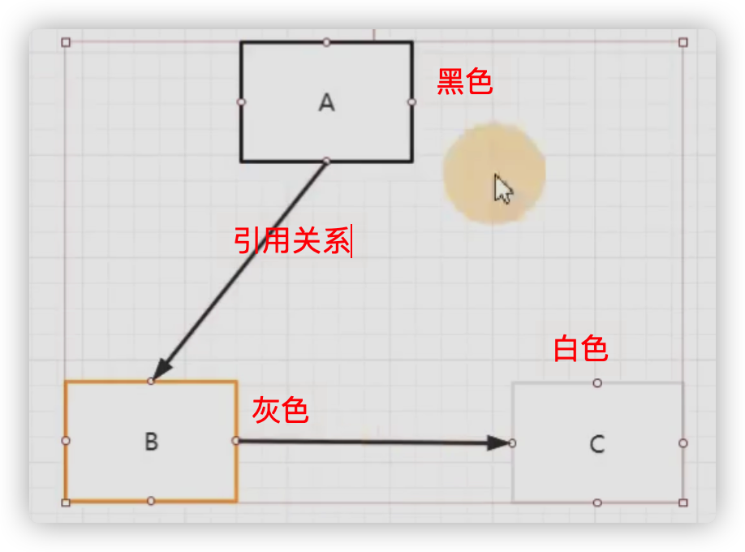
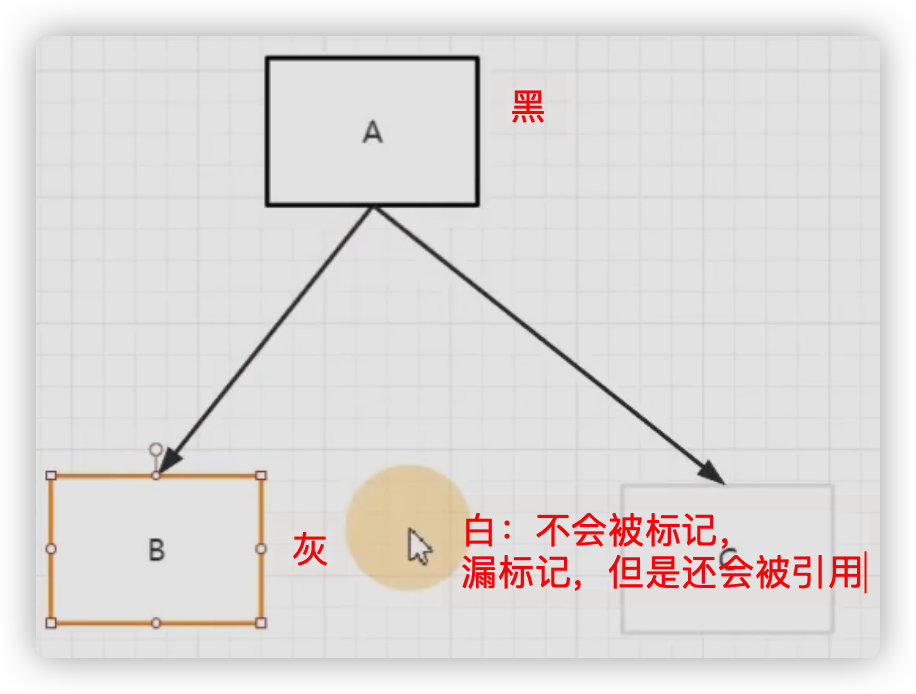
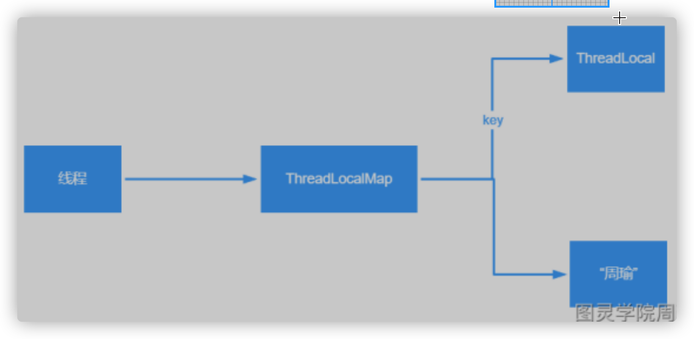

## 1_面向对象

**什么是面向对象？**

1. 对比面向过程，面向对象与面向过程是两种不同的**处理问题的角度**

2. 面向过程更注重事情的每一个**步骤及顺序**，面向对象更注重事情有哪些**参与者**（对象）、及各自需要做什么

3. 比如：洗衣机洗衣服
   面向过程会将任务拆解成一系列的步骤（函数）

   1、打开洗衣机->2、放衣服->3、放洗衣粉>4、清洗-…->5、烘干

   面向对象会拆出人和洗衣机两个对象：
   人：打开洗衣机，放衣服，放洗衣粉
   洗衣机：清洗，烘干

   从以上例子能看出，面向过程**直接高效**，而面向对象更易于**复用、扩展和维护**

## 2_封装

1. 封装的意义:
   内部细节对外部调用透明，**外部调用无需修改或者关心内部实现**
2. 举例1：javabean的属性私有，提供getset对外访问，因为属性的赋值或者获取逻辑只能由javabean本身决定，而不能由外部胡乱修改

```java
private string name;
public void setName(string name){
this.name "tuling_"+name;
}
//该name有自己的命名规则，明显不能由外部直接赋值
```

举例2：orm框架操作数据库，我们不需要关心链接是如何建立的、sql是如何执行的，只需要引入mybatis,调方法即可
将orm操作细节封装在mybatis框架中

## 3_继承

- 子类共性的**方法或者属性**直接使用父类的，而不需要自己再定义代码，**方便复用**
- 只需扩展自己个性化的

## 4_多态

1. 基于对象**所属类的不同**，外部对**同一个方法**的调用，实际执行的逻辑不同。
2. 优点：更换子类，不改变调用方代码
   缺点：无法调用子类特有的**功能**
3. 三个条件：
   继承
   方法重写
   **父类引用指向子类对象**

```java
父类类型 变量名= new 子类对象； 
变量名.方法名()；
```

## 5_JDK、JRE、JVM之间的区别 

1. 是什么

- JDK(Java SE Development Kit)，Java**标准开发包**，它提供了**编译、运⾏**Java程序所需的各种⼯具和资源，包括**Java编译器、JRE**，以及常⽤的**Java类库**等
- JRE( Java Runtime Environment) ，Java运⾏环境。JRE中包括**JVM**以及JVM⼯作所需要的**类库**。
- JVM(Java Virtual Mechinal)，Java虚拟机，是JRE的⼀部分，它是整个java实现**跨平台**的最核⼼的部分，负责运⾏编译过后的字节码⽂件。 

2. 流程

   写出来的Java代码，想要运⾏，需要先编译成字节码，那就需要**编译器**，⽽**JDK**中就包含了编译器javac，编译之后的字节码文件*.class⽂件，需要⼀个可以执⾏字节码的程序，这个程序就是**JVM**（Java虚拟机），专⻔⽤来执⾏Java字节码的。 JVM在执⾏Java字节码时，需要把字节码解释为机器指令，⽽**不同操作系统的机器指令**是有可能不⼀样的，所以就导致不同操作系统上的JVM是不⼀样的。

   扩展

   JVM是⽤来执⾏Java字节码的，所以凡是某个代码编译之后是Java字节码，那就都能在JVM上运⾏，⽐如Apache Groovy, Scala and Kotlin 等等。 

## 6_==和equals方法的区别
- ==:如果是**基本数据类型**，比较是值，如果是**引用数据类型(类，接口，数组)**，比较的是引用地址
- equals:基本数据类型无法使用，是Object类的方法。
  没有重写则与==比较规则一样，没有重写具体看各个类重写equals方法之后的比较逻辑
  比如String类，虽然是引用类型，但是String类中重写了equals方法，方法内部比较的是**字符串中的各个字符是否全部相等**。

## 7_hashCode()与equals()之间的关系

1. hashCode()

在Java中，每个对象都可以调⽤⾃⼰的hashCode()⽅法得到⾃⼰的哈希值(hashCode)，可以利⽤hashCode来做⼀些提前的判断，⽐如： 

- 如果两个对象的hashCode不相等，那么这两个对象肯定不相等 
- 如果两个对象的hashCode相等，不代表这两个对象⼀定相等（根据hashCode()规则）
- 如果两个对象相等，那么他们的hashCode就⼀定相等

2. 举例

在Java中比较两个对象是否相等时，先调用对象的hashCode进行比较，再进一步调用equals()方法进行比较。如果hashCode不相等，就可以直接认为这两个对象不相等

如果hashCode相等，那么就会进⼀步调⽤equals()⽅法进⾏⽐较。⽽equals()⽅法，就是⽤来最终确定两个对象是不是相等的，通常equals()⽅法的实现会⽐较重，逻辑⽐较多，⽽hashCode()主要就是得到⼀个哈希值，实际上就⼀个数字，相对⽽⾔⽐较轻，所以在⽐较两个对象时，通常都会先根据hashCode先⽐较⼀下。 

## 8_final
- **修饰类**：表示类不可被继承
- **修饰方法**：表示方法不可被子类重写，但是可以重载
- **修饰变量**：

1. 修饰变量
   - 如果final修饰的是**类变量**，只能在**静态初始化块**中指定初始值或者**声明**该类变量时指定初始值。
   - 如果final修饰的是**成员变量**，可以在非静态初始化块、声明该变量或者构造器中指定初始值。
   - 如果final修饰的是**局部变量**，在定义时指定默认值（后面的代码不能对变量再赋值），也可以不指定默认值，而在后面的代码中对final变量赋初值（仅一次）

```java
public class FinalVar{
final static int a=0;//在声明的时候就需要赋值或者静态代码块赋值 
/**或
static{
a=0;
}*/
  
final int b=0;//在声明的时候就需要赋值或者代码块中赋值 或者构造器赋值
/**或
{
b=0;
}*/
  
public static void main(string[]args){
final int localA;
localA=0;//在使用之前一定要赋值 
//1ocalA=1;但是不允许第二次赋值
	}
}
```

2. 可变性

- 如果是**基本数据类型**的变量，则其数值一旦在初始化之后便不能更改。
- 如果是**引用数据类型**的变量，则在对其初始化之后便不能再让其指向另一个对象（引用地址不能改变）。但是引用的值是可变的。

```java
public class FinalReferenceTest{
	public static void main(){
		final int[] iArr={1,2,3,4}; 
    iArr[2]=-3;//合法
		iArr=nu11;//非法，对iArr不能重新赋值（引用地址的值）

    final Person p = new Person(25);
		p.setAge(24);//合法 
    p=nu11;//非法
  }
}
```

**为什么局部内部类和匿名内部类只能访问final局部变量？**

```java
public class Test
  public static void main(string[]args){
  //局部final变量a,b
  public void test(final int b){
	  final int a = 10;
    //匿名内部类
    new Thread(){
  	public void run(){
  		system.out.printin(a);
		  system.out.println(b) 
    };
  }.start();
 }
}

class outclass{
  final int age = 12;
  
  public void outPrint(final int x){
    class Inclass{
      public void InPrint(){
        System.out.println(x)
        System.out.println(age);
      }
    }
  new Inclass().InPrint();
  }
}
```

1. 首先需要知道的一点是：内部类和外部类是处于**同一个级别**的，内部类不会因为定义在方法中就会随着**方法**的执行完毕就被销毁。
   这个类会被变异出两个class文件，一个是外部类.class文件，一个是内部类.class文件
2. 【局部变量】这里就会产生问题：当外部类的方法结束时，局部变量就会被销毁了，但是内部类对象可能还存在（只有没有再引用它时，才会死亡)。
   这里就出现了一个矛盾：内部类对象访问了一个不存在的变量。
   为了解决这个问题，就将局部变量复制了一份作为**内部类的成员变量**，这样当局部变量死亡后，内部类仍可以访问它，实际访问的是局部变量的"copy"。

3. 【final】将局部变量复制为内部类的成员变量时，必须保证这两个变量是一样的，也就是如果我们在内部类中修改了成员变量，方法中的局部变量也得跟着改变，怎么解决问题呢？

   就将局部变量设置为final,对它初始化后，我就不让你再去修改这个变量，就**保证了内部类的成员变量 和 方法的局部变量的一致性**。

## 9_String、StringBuffer、StringBuilder的区别

1. String是不可变的，如果尝试去修改，会新⽣成⼀个字符串对象(方法区里面的**字符串常量池**里面)，StringBuffer和StringBuilder是可变的 
2. **StringBuffer是线程安全的**，StringBuilder是线程不安全的，所以在单线程环境下StringBuilder效率会更⾼ 

## 10_重载和重写的区别

- 重载(Overload)： 在⼀个类中，同名的⽅法如果有不同的**参数列表**（参数类型不同、参数个数不同，顺序不同）则视为重载。 与**返回值**无关；与**访问修饰符**无关。被重载的方法可以声明**新的或更广的异常**；
  最常用的地方就是构造器的重载。
- 重写(Override)： 其实就是在⼦类中把⽗类本身有的⽅法重新写⼀遍。⼦类继承了⽗类的⽅法，但有时⼦类并不想原封不动地继承⽗类中的某个⽅法，所以在**⽅法名、参数列表相同、返回值范围小于等于父类**的情况下， 对⽅法体进⾏修改，这就是重写。抛出的**异常范围小于等于父类，访问修饰符范围大于等于父类**；如果父类方法访问修饰符为**private**则子类就不能重写该方法。

## 11_抽象类和接口的区别

- 两者异同

  - 抽象类除了抽象方法还可以有实现方法，而接口中只能存在public abstract方法。
    接口的设计目的，是对类的行为进行约束（更准确的说是一种“有”约束，因为接口不能规定类不可以有什么行为)，也就是提供一种机制，可以强制要求不同的类具有相同的行为。它只约束了行为的有无，但不对如何实现行为进行限制。
  - 抽象类中的**成员变量**可以是各种类型的，而接口中的成员变量只能是**public static final类型的。**
  - 抽象类只能继承一个，接口可以实现多个。

- 抽象类

  - 抽象类的设计目的，是**代码复用**。当不同的类具有某些相同的行为,且其中一部分行为的实现方式一致时，可以让这些类都派生于一个抽象类。如果实现方法不一样就保留抽象方法。
    抽象类不允许实例化出来。
    抽象类中不一定包含抽象方法,但是有抽象方法的类必定是抽象类。
  - 抽象类是对类本质的抽象，表达的是is a的关系，比如：XiaoMing is a Person。

- 接口

  - 接口是对行为的抽象，表达的是like a的关系。比如：Bird like a Aircraft(像飞行器一样可以飞) ，但其本质上is a Bird。接口的核心是**定义行为**，即实现类可以做什么，至于实现类主体是谁、是如何实现的，接口并不关心。

- 使用场景：当你关注一个事物的**本质**的时候，用抽象类；当你关注一个**操作**的时候，用接口。

- 总结：

  抽象类的功能要远超过接口，但是，定义抽象类的代价高。因为Java每个类只能继承一个类。在这个类中，你必须继承或编写出其所有子类的所有共性。虽然接口在功能上会弱化许多，但是它只是针对一个动作的描述。而且你可以在一个类中同时实现多个接口。在设计阶段会降低难度

## 12_List和Set的区别 

- List：有序，按元素插⼊的顺序保存，可重复，允许多个Null元素，可以使⽤Iterator取出所有元素，再逐⼀遍历，还可以使⽤get(int index)获取指定下标的元素 
- Set：⽆序，不可重复，**最多允许有⼀个Null元素**，取元素时只能⽤Iterator接⼝取得所有元素，再逐⼀遍历各个元素

## 13_ArrayList和LinkedList区别 

1. ⾸先，他们的底层数据结构不同，ArrayList底层是基于**数组**（**连续内存**存储）实现的，LinkedList底层是基于**链表**实现的【可以存储在**分散的内存**中（可以碎片化存储）】
2. 由于底层数据结构不同，他们所**适⽤场景**也不同，ArrayList更适合查找、下标访问，LinkedList更适合 删除和添加(不适合查询：需要逐一遍历)
3. 另外ArrayList和LinkedList都实现了List接⼝，但是LinkedList还额外实现了Deque接⼝，所以 LinkedList还可以当做队列来使⽤ 

- ArrayList:扩容机制：因为数组长度固定，超出长度存数据时需要新建数组，然后将老数组的数据拷贝到新数组，如果不是尾部插入数据还会涉及到**元素的移动**
  使用**尾插法**并指定初始容量可以极大提升性能、甚至超过LinkedList(需要创建大量的node对象)
- LinkedList:遍历LinkedList必须使用iterator，不能使用**for循环**，因为每次for循环体内通过**get(i)**取得某一元素时都需要对list重新进行遍历，性能消耗极大。

## 14_HashMap和HashTable有什么区别？其底层实现是什么？
- 区别：
  (1)HashMap方法没有synchronized修饰，线程不安全，**HashTable线程安全**；
  (2)HashMap允许key和value均可为null,而HashTable**均不可**
  且两者的的key值均不能重复，若添加key相同的键值对，后面的value会自动覆盖前面的value，但不会报错。
- HashMap底层实现（见20）

## 15_谈谈ConcurrentHashMap的扩容机制

1.8版本

1. 当某个线程进⾏put时，如果发现ConcurrentHashMap正在进⾏扩容那么该线程⼀起进⾏扩容 
2. 如果某个线程put时，发现没有正在进⾏扩容，则将key-value添加到ConcurrentHashMap中，然后判断是否超过阈值，超过了则进⾏扩容 
3. ConcurrentHashMap⽀持多个线程同时扩容
4. 扩容之前也先⽣成⼀个新的数组
5. 在转移元素时，先将原数组分组，将每组分给不同的线程来进⾏元素的转移，每个线程负责⼀组或多组的**元素转移⼯作** 

## 16_JDK1.7到JDK1.8 HashMap 发⽣了什么变化(底层)? 

1. 1.7底层是数组+链表（为了解决hash冲突），1.8中底层是数组+链表+**红⿊树**，加红⿊树的⽬的是提⾼HashMap插⼊和查询整体效率(HashMap put key的时候，遍历找这个key在当前这个哈希map里面是不是存在，所以链表长不利于提高查询插入效率)
2. 1.7中链表插⼊使⽤的是头插法，1.8中链表插⼊使⽤的是尾插法，因为1.8中插⼊key和value时需要 判断链表元素个数（有足够个数换成红黑树），所以需要遍历链表统计链表元素个数，所以正好就直接使⽤尾插法 
3. 1.7中哈希算法⽐较复杂，1.8中进⾏了简化，因为复杂的哈希算法的⽬的 就是提⾼**散列性**，来提升HashMap的整体效率，⽽1.8中新增了红⿊树，所以可以适当的简化哈希算法，**节省CPU资源** 

## 17_说⼀下HashMap的Put⽅法 

- 先说HashMap的Put⽅法的⼤体流程： 

  1. 根据Key通过（此时数组的长度-1）&hash得出数组下标 

  2. 如果数组下标位置元素为空（没有产生hash冲突），则将key和value封装为（JDK1.7中是Entry对象，JDK1.8中 是Node对象）并存入数组

  3. 如果数组下标位置元素不为空（产生hash冲突）

     a. 如果是JDK1.7，则**先判断是否需要扩容**（1.8后判断），如果要扩容就进⾏扩容，如果不⽤扩容就⽣成Entry对象，并使⽤**头插法**（1.8尾插法）添加到当前位置的链表中

     b. 如果是JDK1.8，则会先判断当前位置上的**Node的类型**，看是红⿊树Node，还是链表Node 

     ​	ⅰ. 如果此位置上的Node对象是链表节点，则将key和value封装为⼀个链表Node并通过**尾插法**插⼊到链表的最后位置去，因为是尾插法，所以需要遍历链表
     在遍历链表的过程中会用equals()判断是否存在当前key，如果存在则更新value，当遍历完链表后，将新链表Node插⼊到链表后，会看当前链表的节点个数，如果链表长度**⼤于等于8**、并且数组长度大于64，那么则会将该链表转成红⿊树 
     
     ​	ⅱ 如果是红⿊树Node，则将key和value封装为⼀个红⿊树节点并添加到红⿊树中去，在这个过程中会判断红⿊树中是否存在当前key，如果存在则更新value 
     
     ​	ⅲ. 将key和value封装为Node插⼊到链表或红⿊树中后，再判断是否需要进⾏扩容，如果需要就扩容，如果不需要就结束PUT⽅法
     
     【key为null,存在下标0的位置】
     
     【数组扩容（同ArrayList）】

## 18_泛型中extends和super的区别

1. <? extends T>表示包括T在内的任何T的⼦类 
2. <? super T>表示包括T在内的任何T的⽗类 

## 19_深拷⻉和浅拷⻉

1. 浅拷⻉是指，只会拷⻉基本数据类型的值，以及实例对象的**引⽤地址**，并不会复制⼀份引⽤地址所指向的对象，也就是浅拷⻉出来的对象，内部的属性指向的是同⼀个对象 
2. 深拷⻉是指，既会拷⻉基本数据类型的值，也会针对实例对象的**引⽤地址所指向的对象**进⾏复制， 深拷⻉出来的对象，内部的属性指向的**不是同⼀个对象**

## 20_HashMap的扩容机制原理

1.8版本 

1. ⽣成新数组（2倍）

2. 遍历⽼数组中的每个位置上的链表或红⿊树 

3. 如果是链表，则直接将链表中的每个元素重新计算下标，并添加到新数组中去 

4. 如果是红⿊树，则先遍历红⿊树，先计算出红⿊树中每个元素对应在新数组中的下标位置 

   a.  统计每个下标位置的元素个数

   b. 如果该位置下的元素个数超过了8，则⽣成⼀个新的红⿊树，并将**根节点**添加到新数组的对应位置 

   c. 如果该位置下的元素个数没有超过8，那么则⽣成⼀个链表，并将链表的**头节点**添加到新数组的对应位置 

5. 所有元素转移完了之后，将新数组赋值给HashMap对象的table属性

## 21_CopyOnWriteArrayList的底层原理是怎样的

1. ⾸先CopyOnWriteArrayList内部也是⽤过数组来实现的，在向CopyOnWriteArrayList**添加元素**时，会复制⼀个新的数组，写操作在新数组上进⾏，读操作在原数组上进⾏ 
2. 写操作会加锁，防⽌出现并发**写⼊丢失数据**的问题 
3. 写操作结束之后会把原数组指向新数组 
4. CopyOnWriteArrayList允许在写操作时来读取数据，⼤⼤提⾼了读的性能，因此适合 **读多写少**的应⽤场景，但CopyOnWriteArrayList会⽐较占内存（每次写都要去复制一个新的数组），同时可能读到的数据不是实时最新的数据，所以不适合实时性要求很⾼的场景

## 22_什么是字节码？采⽤字节码的好处是什么？ 

编译器(javac)将Java**源⽂件**(*.java)⽂件编译成为Java字节码⽂件(*.class)，可以做到⼀次编译到处运⾏， windows上编译好的class⽂件，可以直接在linux上运⾏，通过这种⽅式做到跨平台，不过Java的跨平台有⼀个前提条件，就是不同的操作系统上安装的JDK或JRE是不⼀样的，虽然字节码是通⽤的，但是需要把字节码解释成**各个操作系统的机器指令**是需要不同的**解释器**的，所以针对各个操作系统需要有各⾃的JDK或JRE。 

采⽤字节码的好处，⼀⽅⾯实现了**跨平台**，另外⼀⽅⾯也提⾼了**代码执⾏的性能**，编译器在编译源代码时可以做⼀些编译期的优化。 

## 23_Java中的异常体系是怎样的

- Java中的所有异常都来⾃顶级⽗类Throwable。 
- Throwable下有两个⼦类Exception和Error。 
- Error表示⾮常严重的错误，⽐如java.lang.StackOverFlowError和Java.lang.OutOfMemoryError， 通常这些错误出现时，仅仅想靠程序⾃⼰是解决不了的，可能是虚拟机、磁盘、操作系统层⾯出现的问题
  所以通常也不建议在代码中去**捕获**这些Error，因为捕获的意义不⼤，因为程序可能根本运⾏不了。 
- Exception表示异常，表示程序出现Exception时，是可以靠程序⾃⼰来解决的，⽐如 NullPointerException、IllegalAccessException等，我们可以捕获这些异常来做特殊处理。 
  - Exception的⼦类通常⼜可以分为RuntimeException和⾮RuntimeException两类 
  - RunTimeException表示运⾏期异常，表示这个异常是在代码运⾏过程中抛出的，这些异常是**⾮检查异常**，程序中**可以选择捕获**处理，也可以不处理。这些异常⼀般是由程序逻辑错误引起的，程序应该从逻辑⻆度尽可能避免这类异常的发⽣，⽐如NullPointerException、IndexOutOfBoundsException等。 
  - ⾮RuntimeException表示⾮运⾏期异常，也就是我们常说的检查异常，是必须进⾏处理的异常，如果不处理，程序就不能检查异常通过。如IOException、SQLException等以及⽤户**⾃定义**的Exception异常。 

## 24_在Java的异常处理机制中，什么时候应该抛出异常，什么时候捕获异常？

本⽅法能否合理的处理该异常，如果处理不了就继续向上抛出异常

包括本⽅法中在调⽤另外⼀个⽅法时，发现出现了异常，如果这个异常应该由⾃⼰来处理，那就捕获该异常并进⾏处理。 

## 25_Java中有哪些类加载器 

JDK⾃带有三个类加载器：BootStrapClassLoader、ExtClassLoader、AppClassLoader。 

- BootStrapClassLoader是ExtClassLoader的⽗类加载器，默认负责加载%JAVA_HOME%lib下的 jar包和class类。 
- ExtClassLoader是AppClassLoader的⽗类加载器，负责加载%JAVA_HOME%/lib/ext⽂件夹下的 jar包和class类。 
- AppClassLoader是**⾃定义类加载器**的⽗类，负责加载classpath下的**类⽂件**。 

## 26_说说类加载器双亲委派模型

JVM中存在三个默认的类加载器： 

1. BootstrapClassLoader
2. ExtClassLoader 
3. AppClassLoader 

AppClassLoader的⽗加载器是ExtClassLoader，ExtClassLoader的⽗加载器是 BootstrapClassLoader。 

- JVM在加载⼀个类时，会调⽤AppClassLoader的**loadClass**⽅法来加载这个类，不过在这个⽅法中，会先使⽤ExtClassLoader的loadClass⽅法来加载类，同样ExtClassLoader的loadClass⽅法中会先使⽤ BootstrapClassLoader来加载类，如果BootstrapClassLoader加载到了就直接成功
  如果 BootstrapClassLoader没有加载到，那么ExtClassLoader就会⾃⼰尝试加载该类，如果没有加载到， 那么则会由AppClassLoader来加载这个类。 

​	所以，**双亲委派指得是，JVM在加载类时，会委派给Ext和Bootstrap进⾏加载，如果没加载到才由⾃⼰进⾏加载。** 

- 双亲委派模型的好处：
  - 主要是为了**安全性**，避免用户自己编写的类动态替换 Java的一些**核心类**，比如 String。
  - 同时也**避免了类的重复加载**，因为 **JVM中区分不同类**，不仅仅是根据类名，相同的class文件被不同的 ClassLoader加载就是不同的两个类

## 27_GC如何判断对象可以被回收

- 引用计数法：每个对象有一个引用计数属性，新增一个引用时计数加1，引用释放时计数减1，计数为0时可以回收，

- 可达性分析法：从GC Roots开始向下搜索，搜索所走过的路径称为引用链。当一个对象到GC Roots没有任何引用链相连时，则证明此对象是不可用的，那么虚拟机就判断是可回收对象。

  > 引用计数法，可能会出现循环引用问题，GC Roots引用A，A引用了B，B又引用了A，这时候就算他们都不再使用了，也永远无法被回收。

  GC Roots的对象有：

  - 虚拟机栈中引用的对象【add()实例方法中new uer对象，user对象就是GC Roots对象，CG对象回收只会遍历活动栈中的内容，来做可达性分析，add()执行完弹出活动栈user对象就直接被回收】
  - 方法区中类静态属性引用的对象
  - 方法区中常量引用的对象
  - 本地方法栈中JNI(即一般说的Native方法)引用的对象

- 可达性算法中的不可达对象并不是立即死亡的，对象拥有一次自我拯救的机会。
  - 对象被系统宣告死亡至少要经历两次标记过程：第一次是经过可达性分析发现没有与GC Roots相连接的引用链，第二次是在由虚拟机自动建立的Finalizerl队列中判断是否需要执行finalize()方法。
  - 当对象变成(GC Roots)不可达时，GC会判断该对象是否覆盖了finalize方法，若未覆盖，则直接将其回收。
  - 否则，若对象未执行过finalize方法，将其放入F-Queuel队列，由低优先级线程执行该队列中对象的finalize方法。执行 finalize方法完毕后，GC会再次判断该对象是否可达，若不可达，则进行回收，否则，对象"“复活"(finalize()里面引用了其他对象)
    每个对象只能触发一次finalize()方法
  - 由于finalize()方法运行代价高昂，不确定性大，无法保证各个对象的调用顺序，不推荐使用。

## 28_JVM中哪些是线程共享区 

- 方法区存储类的信息，堆区存储对象，虚拟机栈存储方法，程序计数器每个线程当前执行到第几行代码，**堆区和⽅法区**是所有线程共享的，栈、本地⽅法栈、程序计数器是每个线程独有的



## 29_你们项⽬如何排查JVM问题 

对于还在正常运⾏的系统： 

1. 可以使⽤jmap来查看JVM中各个区域的使⽤情况 
2. 可以通过jstack来查看线程的运⾏情况，⽐如哪些线程阻塞、是否出现了死锁 
3. 可以通过jstat命令来查看垃圾回收的情况，特别是fullgc，如果发现fullgc⽐较频繁，那么就得进⾏调优了 
4. 各个命令的结果，或者jvisualvm等⼯具来进⾏分析 
5. ⾸先，初步猜测频繁发送fullgc的原因，如果频繁发⽣fullgc但是⼜⼀直没有出现内存溢出，那么表示fullgc实际上是回收了很多对象了，所以这些对象最好能在younggc过程中就直接回收掉，避免这些对象进⼊到⽼年代，对于这种情况，就要考虑这些存活时间不⻓的对象是不是⽐较⼤，导致年轻代放不下，直接进⼊到了⽼年代，尝试加⼤年轻代的⼤⼩，如果改完之后，fullgc减少，则证明修改 有效 
6. 同时，还可以找到占⽤CPU最多的线程，定位到具体的⽅法，优化这个⽅法的执⾏，看是否能避免某些对象的创建，从⽽节省内存 

对于已经发⽣了OOM的系统： 

1. ⼀般⽣产系统中都会设置当系统发⽣了OOM时，⽣成当时的dump⽂件（- XX:+HeapDumpOnOutOfMemoryError -XX:HeapDumpPath=/usr/local/base） 
2. 我们可以利⽤jsisualvm等⼯具来分析dump⽂件 
3. 根据dump⽂件找到异常的实例对象，和异常的线程（占⽤CPU⾼），定位到具体的代码 
4. 然后再进⾏详细的分析和调试 

总之，调优不是⼀蹴⽽就的，需要分析、推理、实践、总结、再分析，最终定位到具体的问题 

## 30_⼀个对象从加载到JVM，再到被GC清除，都经历了什么过程？ 

1. ⾸先把字节码⽂件内容加载到⽅法区（类加载）
2. 然后再根据类信息在堆区创建对象 
3. 对象⾸先会分配在堆区中年轻代的Eden区，经过⼀次Minor GC后，对象如果存活，就会进⼊ Suvivor区。在后续的每次Minor GC中，如果对象⼀直存活，就会在Suvivor区来回拷⻉，每移动 ⼀次，年龄加1 
4. 当年龄超过15后，对象依然存活，对象就会进⼊⽼年代 
5. 如果经过Full GC，被标记为垃圾对象，那么就会被GC线程清理掉

## 31_怎么确定⼀个对象到底是不是垃圾？ 

1. 引⽤计数算法： 这种⽅式是给堆内存当中的每个对象记录⼀个引⽤个数。引⽤个数为0的就认为是垃圾。这是早期JDK中使⽤的⽅式。引⽤计数⽆法解决循环引⽤的问题。 
2. 可达性算法： 这种⽅式是在内存中，从根对象向下⼀直找引⽤，找到的对象就不是垃圾，没找到的对象就是垃圾。 

## 32_JVM有哪些垃圾回收算法？ 

1. 标记清除算法： 

   ​	a. 标记阶段：把垃圾内存标记出来 

   ​	b. 清除阶段：直接将垃圾内存回收。 

   ​	c. 这种算法是⽐较简单的，但是有个很严重的问题，就是会产⽣⼤量的内存碎⽚。 

2. 复制算法：为了解决标记清除算法的内存碎⽚问题，就产⽣了复制算法。复制算法将内存分为⼤⼩相等的两半，每次只使⽤其中⼀半。垃圾回收时，将当前这⼀块的存活对象全部拷⻉到另⼀半，然后当前这⼀半内存就可以直接清除。这种算法没有内存碎⽚，但是他的问题就在于浪费空间。⽽且，他的效率跟存活对象的个数有关。 

3. 标记压缩算法：为了解决复制算法的缺陷，就提出了标记压缩算法。这种算法在标记阶段跟标记清除算法是⼀样的，但是在完成标记之后，不是直接清理垃圾内存，⽽是将存活对象往⼀端移动，然后将边界以外的所有内存直接清除。 

## 33_什么是STW？ 

STW: Stop-The-World，是在垃圾回收算法执⾏过程当中，需要将JVM内存冻结的⼀种状态。在STW 状态下，JAVA的所有线程都停⽌,执⾏的GC线程除外，native⽅法可以执⾏，但是，不能与JVM交互。GC各种算法优化的重点，就是减少STW，同时这也是JVM调优的重点。 

## 34_JVM有哪些垃圾回收器？他们都是怎么工作的？STW都发生在哪些阶段？

JVM的垃圾回收器：



**Serial串行**



整体过程比较简单，就像踢足球一样，需要GC时，直接暂停，GC完了再继续。
这个垃圾回收器，是早期垃圾回收器，只有一个线程执行GC。在多CPU架构下，性能就会下降严重。只适用于几十兆的内存空间。

**Parallel并行**



在串行基础上，增加多线程GC。PS+PO(Parallel Scavenge + Parallel Old)这种组合是DK1.8默认的垃圾回收器。在多CPU的架构下，性能会比Seriali高很多。

**CMS Concurrent Mark Sweep**



核心思想，就是将STW打散，让一部分GC线程与用户线程并发执行。整个GC过程分为四个阶段（不是STW就是并发）
1、初始标记阶段：STW只标记出根对象直接引用的对象。
2、并发标记：继续标记其他对象，与应用程序是并发执行。
3、重新标记：STW对并发执行阶段的对象进行重新标记。（把并发标记中产生变化的对象重新标记）
4、并发清除：并行。将产生的垃圾清除。清除过程中，应用程序又会不断的产生新的垃圾，叫做浮动垃圾。这些垃圾就要留到下一次GC过程中清除。

**G1 Garbage First垃圾优先**



他的内存模型是实际不分代，但是逻辑上是分代的。在内存模型中，对于堆内存就不再分老年代和新生代，而是划分成一个一个的小内存块，叫做Region。每个Regioni可以隶属于不同的年代。
GC分为四个阶段：
第一：初始标记，标记出GCRootj直接引用的对象。【STW】
第二：标记Region,通过RSet（存在于每个Region中，记录引用信息）标记出上一个阶段标记的Region引用到的Old区Region。
第三：并发标记阶段：跟CMS的步骤是差不多的。只是遍历的范围不再是整个Old区，而只需要遍历第二步标记出来的Region。
第四：重新标记：跟CMS中的重新标记过程是差不多的。
第五：垃圾清理：与CMS不同的是，G1可以采用拷贝算法，直接将整个Region中的对象拷贝到另一个Region。而这个阶段，G1只选择垃圾较多的Region来清理，并不是完全清理。

## 35_为什么要设计这么多的垃圾回收器？
内存逐渐变大

## 36_什么是三色标记？如何解决错标记和漏标记的问题？
CMS的核心算法就是三色标记





三色标记：是一种逻辑上的抽象。将每个内存对象分成三种颜色：
黑色：表示自己和成员变量都已经标记完毕。
灰色：自己标记完了，但是成员变量还没有完全标记完。
白色：自己未标记完。
CMS通过增量标记（将黑变为灰）increment update的方式来解决漏标（漏标的会被回收）的问题。

## 37_常用的JVM启动参数有哪些？

在绝大部分业务场景下，常用的JVM配置参数也就10来个

```apl
# 设置堆内存（最大、最小）
-Xmx4g -Xms4g
# 指定GC算法（G1算法），配置最大垃圾回收栈的时间（毫秒）
-XX:+UseG1GC -XX:MaxGCPauseMillis=50
# 指定GC并行线程数
-XX:ParallelGCThreads=4
# 打印GC日志
-XX:+PrintGCDetails -XX:+PrintGCDateStamps
# 指定GC日志文件
-Xloggc:gc.log
# 指定Meta区的最大值
XX:MaxMetaspaceSize=2g 
#设置单个线程栈的大小
-Xss1m
#指定堆内存溢出时自动进行Dump（Java8默认不开启，需要手动开启）
XX:+HeapDumpOnOutOfMemoryError
-XX:HeapDumpPath=/usr/local/
```

## 38_线程的生命周期？线程有几种状态?

1. 线程通常有五种状态，创建，就绪，运行、阻塞和死亡状态。
   阻塞的情况又分为三种：
   	(1)、等待阻塞：运行的线程执行Wait方法，该线程会释放占用的所有资源，JVM会把该线程放入"等待池"中。进入这个状态后，是不能自动唤醒的，必须依靠其他线程调用notify或notifyAll方法才能被唤醒，wait是objecta类的方法
   	(2)、同步阻塞(synchronized)：运行的线程在获取对象的同步锁时，若该同步锁被别的线程占用，则JVM会把该线程放入锁“池"中。
   	(3)、其他阻塞：运行的线程执行sleep或join方法，或者发出了I/O请求时，JVM会把该线程置为阻塞状态。当 sleep状态超时、join等待线程终止或者超时、或者l/O处理完毕时，线程重新转入就绪状态。sleep是Thread类的方法
   2. 生命周期的状态
      	1.新建状态(New):新创建了一个线程对象。
      	2.就绪状态(Runnable)：线程对象创建后，其他线程调用了该对象的start方法。该状态的线程位于可运行线程池中，变得可运行，等待获取CPU的使用权。
      	3.运行状态(Running):就绪状态的线程获取了CPU,执行程序代码。
      	4.阻塞状态(Blocked)：阻塞状态是线程因为某种原因放弃CPU使用权，暂时停止运行。直到线程进入就绪状态，才有机会转到运行状态。
      	5.死亡状态(Dead):线程执行完了或者因异常退出了run方法，该线程结束生命周期。

## 39_sleep()、wait()、join()、yield()的区别

1.锁池
所有需要竞争同步锁的线程都会放在锁池当中（一个方法加了synchronized，该线程就会竞争锁，没拿到锁就在锁池），比如当前对象的锁已经被其中一个线程得到，则其他线程需要在这 个锁池进行等待，当前面的线程释放同步锁后锁池中的线程去竞争同步锁，当某个线程得到后会进入就绪队列进行 等待cpu资源分配。
2.等待池
当我们调用wait()方法后（在synchronized代码块内，拿到锁，不在锁池中），线程会放到等待池当中（wait()把锁释放掉），等待池的线程是不会去竞争同步锁。只有调用了notify() 或notifyAll()后等待池的线程才会开始去竞争锁，notify()是随机从等待池选出一个线程放到锁池，而notifyAll() 是将等待池的所有线程放到锁池当中
1、sleep是Thread类的静态本地方法，wait则是Object类的本地方法。
2、sleep方法不会释放Iock,但是wait会释放，而且会加入到等待队列（等待池）中。

```java
sleep就是把cpu的执行资格和执行权释放出去，不再运行此线程，当定时时间结束再取回cpu资源，参与cpu的调度，获 取到cpu资源后就可以继续运行了。而如果s1eep时该线程有锁，[那么s1eep不会释放这个锁]，而是把锁带着进入了冻结状 态，也就是说其他需要这个锁的线程根本不可能获取到这个锁。也就是说无法执行程序。如果在睡眠期间其他线程调用了这 个线程的interrupt方法，那么这个线程也会抛出interruptexception异常返回，这点和wait是一样的。
```

3、sleep方法不依赖于同步器synchronized（不在synchronized方法里面也可以调用）,但是wait需要依赖synchronized关键字。
4、sleep不需要被唤醒（休眠之后推出阻塞），但是wait需要（不指定时间的话）。
5、sleep一般用于当前线程休眠，或者轮循暂停操作，wait则多用于多线程之间的通信。（A线程调用notift唤醒B线程）
6、sleep会让出CPU执行时间且强制上下文切换，而wait则不一定，wait后可能还是有机会重新竞争到锁继续 执行的。

yield()执行后线程直接进入就绪状态，马上释放了cpu的执行权，但是依然保留了cpu的执行资格，所以有可能 cu下次进行线程调度还会让这个线程获取到执行权继续执行

join()执行后线程进入阻塞状态，例如在线程B中调用线程A的join(),那线程B会进入到阻塞队列，直到线程
A结束或中断线程

```java
public static void main(string[]args)throws InterruptedException{
  Thread t1 new Thread(new Runnable(){
    @override
    public void run(){
      try{
      Thread.sleep(3000);
      }catch (InterruptedException e){
      e.printstackTrace();
      }
      system.out.println("22222222"); 
     }
  });
      t1.start();
  		//main线程进入阻塞，不是t1线程
      t1.join();
      //这行代码必须要等t1全部执行完毕，才会执行
      System.out.println("1111"); 
}
//22222222
//1111
```

## 说说对线程安全的理解

线程安全：多个线程访问同一个对象结果和单个线程访问结果一样

不是线程安全、应该是内存安全，堆是共享内存，可以被所有线程访问

堆是进程和线程共有的空间，分全局堆和局部堆。全局堆就是所有没有分配的空间，局部堆就是用户分配的空间。 堆在操作系统对进程初始化的时候分配，运行过程中也可以向系统要额外的堆，但是用完了要还给操作系统，要不然就是内存泄漏。
在Java中，堆是Java虚拟机所管理内存中最大的一块，是所有线程共享的一块内存区域，在虚拟机启动时创建。堆所存在的内存区域的唯一目的就是存放对象实例，几乎所有的对象实例以及数组都在这里分配内存。

栈是每个线程独有的，保存其运行状态和局部自动变量的。栈在线程开始的时候初始化，每个线程的栈互相独立， 因此，栈是线程安全的。操作系统在切换线程的时候会自动切换栈。栈空间不需要在高级语言里面显式的分配和释放。【当前方法执行完，就弹出栈，空间自动回收】

目前主流操作系统都是多任务的，即多个进程同时运行。为了保证安全，每个进程只能访问分配给自己的内存空间，而不能访问别的进程的，这是由操作系统保障的。
在每个进程的内存空间中都会有一块特殊的公共区域，通常称为堆（内存）。进程内的所有线程都可以访问到该区域，这就是造成问题的潜在原因。

## Thread、Runable的区别

新建线程的方式要么继承Thread，要么实现Runable。Thread实现了Runable接口。

无论使用Runnable还是Thread,都会new Thread,然后 执行run方法。用法上，如果有复杂的线程操作需求，那就选择继承Thread,如果只是简单的执行一个任务，那就实现runnable，Thread API更加丰富。

```java
//会卖出多一倍的票 
public class Test{
	public static void main(string[]args){
//TODO Auto-generated method stub
		new MyThread().start();
    new MyThread().start();
}
static class MyThread extends Thread{
    private int ticket 5;
    public void run(){
      while(true){
        System.out.println("Thread ticket ="ticket--);
        if(ticket < 0){
          break;
        }
      }
    }
  }
}
```

## 对守护线程的理解

守护线程：为所有非守护线程提供服务的线程；任何一个守护线程都是整个JVM中所有非守护线程的保姆
守护线程类似于整个进程的一个默默无闻的小喽喽；它的生死无关重要，它却依赖整个进程而运行；哪天其他线程 结束了，没有要执行的了，程序就结束了，理都没理守护线程，就把它中断了；
注意：由于守护线程的终止是自身无法控制的，因此千万不要把IO、Fil等重要操作逻辑分配给它；因为它不靠 谱；
守护线程的作用是什么？
举例，GC垃圾回收线程：就是一个经典的守护线程，当我们的程序中不再有任何运行的Thread,程序就不会再产
生垃圾，垃圾回收器也就无事可做，所以当垃圾回收线程是JVM上仅剩的线程时，垃圾回收线程会自动离开。它始终在低级别的状态中运行，用于实时监控和管理系统中的可回收资源。
应用场景：(1)来为其它线程提供服务支持的情况；(2)或者在任何情况下，程序结束时，这个线程必须正常 且立刻关闭，就可以作为守护线程来使用；反之，如果一个正在执行某个操作的线程必须要正确地关闭掉否则就会 出现不好的后果的话，那么这个线程就不能是守护线程，而是用户线程。通常都是些关键的事务，比方说，数据库 录入或者更新，这些操作都是不能中断的。

thread.setDaemon(true)必须在thread.start()之前设置，否则会跑出一个llegalThreadStateException异常。你不能把正在运行的常规线程设置为守护线程。

在Daemon线程中产生的新线程也是Daemon的。
守护线程不能用于去访问固有资源，比如读写操作或者计算逻辑。因为它会在任何时候甚至在一个操作的中间发生中断。

Java自带的多线程框架，比如ExecutorService,会将守护线程转换为用户线程，所以如果要使用后台线程就不能用Java的线程池。

## ThreadLocal的底层原理 

1. ThreadLocal是Java中所提供的线程本地存储机制，可以利⽤该机制将数据**缓存在某个线程内部**， 该线程可以在任意时刻、任意⽅法中获取缓存的数据 

2. ThreadLocal底层是通过ThreadLocalMap来实现的，每个Thread对象（注意不是ThreadLocal对 象）中都存在⼀个ThreadLocalMap，Map的key为ThreadLocal对象，Map的value为需要缓存的值。所以一个线程可以缓存许多数据。 

3. 如果在线程池中使⽤ThreadLocal会造成内存泄漏，因为当ThreadLocal对象使⽤完之后，应该要把设置的key，value，也就是Entry对象进⾏回收，但线程池中的线程不会回收，⽽线程对象是通过强 引⽤指向ThreadLocalMap，ThreadLocalMap也是通过强引⽤指向Entry对象，线程不被回收， Entry对象也就不会被回收，从⽽出现内存泄漏，解决办法是，在使⽤了ThreadLocal对象之后，⼿ 动调⽤ThreadLocal的remove⽅法，⼿动清楚Entry对象 

4. ThreadLocal经典的应⽤场景就是连接管理（⼀个线程持有⼀个连接，该连接对象可以在不同的⽅ 法之间进⾏传递，线程之间不共享同⼀个连接）

```java
public class User{
  private ThreadLocal<String>name;
  public void setName(){
  	name.set("周瑜")； 
  }
  public void getName(){
  	String s = this.name.get();
  	name.remove();
  }
}
```



## 并发、并⾏、串⾏之间的区别 

底层串行执行，执行快，cpu调度

1. 串⾏：⼀个任务执⾏完，才能执⾏下⼀个任务（排队）

2. 并⾏(Parallelism)：两个任务同时执⾏ 

3. 并发(Concurrency)：两个任务整体看上去是同时执⾏，在底层，两个任务被拆成了很多份，然后 

⼀个⼀个执⾏，站在更⾼的⻆度看来两个任务是同时在执⾏的【底层串行执行，执行快，cpu调度】

## 并发的三大特性

原子性（多线程并发之下）
原子性是指在一个操作中cpu不可以在中途暂停然后再调度，即不被中断操作，要不全部执行完成，要不都不执行。就好比转账，从账户A向账户B转1000元，那么必然包括2个操作：从账户A减去1000元，往账户B加上1000元。2个操作必须全部完成。

```java
private long count = 0;
public void calc(){
count++;
}
```

1:将count从主存读到工作内存（线程各自的）中的副本中
2:+1的运算
3:将结果写入工作内存

【前3步操作是原子性，要么一起做，要么都不做】

4:将工作内存的值刷回主存什么时候刷入由操作系统决定（不确定)

那程序中原子性指的是最小的操作单元，比如自增操作，它本身其实并不是原子性操作，分了3步的，包括读取变量的原始值、进行加1操作、写入工作内存。所以在多线程中，有可能一个线程还没自增完，可能才执行到第二部，另一个线程就已经读取了值，导致结果错误。那如果我们能保证自增操作是一个原子性的操作，那么就能保证其他线程读取到的一定是自增后的数据。

关键字：synchronized

可见性				
当多个线程访问同一个变量时，一个线程修改了这个变量的值，其他线程能够立即看得到修改的值。
若两个线程在不同的cpu,那么线程1改变了的值还没刷新到主存，线程2又使用了i,那么这个i值肯定还是之前 的，线程1对变量的修改线程没看到这就是可见性问题。

关键字：volatile、synchronized、final

有序性
虚拟机在进行代码编译时，对于那些改变顺序之后不会对最终结果造成影响的代码，虚拟机不一定会按照我们写的代码的顺序来执行，有可能将他们重排序。实际上，对于有些代码进行重排序之后，虽然对变量的值没有造成影 响，但有可能会出现线程安全问题。

```java
int a = 0;
boo1 flag = false;
public void write(){
  //单个线程执行write()，方法的顺序不影响结果
  //多个线程执行时如果发生cpu调度，方法的顺序会影响结果
  a = 2;						//1
  flag = true;			//2
}

public void multiply(){
	if (flag) {				//3
		int ret = a * a;//4
  }
}
```

write方法里的1和2做了重排序，线程1先对flag赋值为true,随后执行到线程2，ret直接计算结束，再到线程 1,这时候a才赋值为2，很明显迟了一步
关键字：volatile、synchronized

volatile本身就包含了禁止指令重排序的语义，而synchronized关键字是由"一个变量在同一时刻只允许一条线程对其进行lock操作"这条规则明确的。

## Java死锁如何避免？ 

造成死锁的⼏个原因： 

1. ⼀个资源每次只能被⼀个线程使⽤ 

2. ⼀个线程在阻塞等待某个资源时，不释放已占有资源 

3. ⼀个线程已经获得的资源，在未使⽤完之前，不能被强⾏剥夺 

4. 若⼲线程形成头尾相接的循环等待资源关系 这是造成死锁必须要达到的4个条件，如果要避免死锁，只需要不满⾜其中某⼀个条件即可。⽽其中前3 个条件是作为锁要符合的条件，所以要避免死锁就需要打破第4个条件，不出现循环等待锁的关系。 

在开发过程中： 

1. 要注意加锁顺序，保证每个线程按同样的顺序进⾏加锁（线程1先加A锁再加B锁，线程2也先加A锁再加B锁）

2. 要注意加锁时限，可以针对所设置⼀个超时时间（超时加不到目标的锁，就连带着原来占有的锁放弃）

3. 要注意死锁检查，这是⼀种预防机制，确保在第⼀时间发现死锁并进⾏解决

## 如何理解volatile关键字

在并发领域中，存在三大特性：原子性、有序性、可见性。volatile关键字用来修饰对象的属性，在并发环境下可以保证这个属性的可见性，对于加了volatile关键字的属性，在对这个属性进行修改时，会直接将cpu高速缓存中的数据在修改的时候写回到主内存，对这个变量的读取也会直接从主内存中读取，从而保证了可见性。
如果没有加volatile关键字的属性，读/写cpu高速缓存中的数据，再写回到主内存。
底层是通过操作系统的内存屏障来实现的，由于使用了内存屏障，所以会禁止指令重排，所以同时也就保证了有序性，在很多并发场景下，如果用好volatile关键字可以很好的提高执行效率。

## 为什么用线程池？解释下线程池参数？

1、降低资源消耗：提高线程利用率，降低创建和销毁线程的消耗。
2、提高响应速度；任务来了，直接有线程可用可执行，而不是先创建线程，再执行。
3、提高线程的可管理性；线程是稀缺资源，使用线程池可以统一分配调优监控。

- corePoolSize代表核心线程数，也就是正常情况下创建工作的线程数，这些线程创建后并不会消除，而是一种常驻线程（最终随着线程池的回收一起回收）
- maxinumPoolSize代表的是最大线程数，它与核心线程数相对应，表示最大允许被创建的线程数，比如当前
  任务较多，将核心线程数都用完了，还无法满足需求时，此时就会创建新的线程，但是线程池内线程总数不会 超过最大线程数
- keepAliveTime、unit表示超出核心线程数之外的线程的空闲存活时间，也就是核心线程不会消除，但是 超出核心线程数的部分线程如果空闲一定的时间则会被消除，我们可以通过setKeepAliveTime来设置空闲时 间
- workQueue用来存放待执行的任务，假设我们现在核心线程都已被使用，还有任务进来则全部放入队列，直 到整个队列被放满但任务还再持续进入则会开始创建新的线程
- ThreadFactory实际上是一个线程工厂，用来生产线程执行任务。我们可以选择使用默认的创建工厂，产生 的线程都在同一个组内，拥有相同的优先级，且都不是守护线程。当然我们也可以选择自定义线程工厂，一般 我们会根据业务来制定不同的线程工厂
- Handler任务拒绝策略，有两种情况，第一种是当我们调用shutdown等方法关闭线程池后，这时候即使线 程池内部还有没执行完的任务正在执行，但是由于线程池已经关闭，我们再继续想线程池提交任务就会遭到拒 绝。另一种情况就是当达到最大线程数，线程池已经没有能力继续处理新提交的任务时，这是也就拒绝

## 线程池的底层⼯作原理 

线程池内部是通过队列+线程实现的，当我们利⽤线程池执⾏任务时： 

1. 如果此时线程池中的线程数量⼩于corePoolSize，即使线程池中的线程都处于空闲状态，也要创建 新的线程来处理被添加的任务。 

2. 如果此时线程池中的线程数量等于corePoolSize，但是缓冲队列workQueue未满，那么任务被放⼊ 缓冲队列。 

3. 如果此时线程池中的线程数量⼤于等于corePoolSize，缓冲队列workQueue满，并且线程池中的数量⼩于maximumPoolSize，建新的线程来处理被添加的任务。 

4. 如果此时线程池中的线程数量⼤于corePoolSize，缓冲队列workQueue满，并且线程池中的数量等于maximumPoolSize，那么通过 handler所指定的策略来处理此任务。 

5. 当线程池中的线程数量⼤于 corePoolSize时，如果某线程空闲时间超过keepAliveTime，线程将被 终⽌。这样，线程池可以动态的调整池中的线程数 

## 线程池中阻塞队列的作用？为什么是先添加列队而不是先创建最大线程？

1、一般的队列只能保证作为一个有限长度的缓冲区，如果超出了缓冲长度，就无法保留当前的任务了，阻塞队列 通过阻塞可以保留住当前想要继续入队的任务。（阻塞队列满了，后面的任务就会阻塞住）
阻塞队列可以保证任务队列中没有任务时阻塞获取任务的线程，使得线程进入wait状态，释放cpu资源。
阻塞队列自带阻塞和唤醒的功能，不需要额外处理，无任务执行时，线程池利用阻塞队列的tak方法挂起，从而维 持核心线程的存活、不至于一直占用cpu资源

作用：阻塞线程，唤醒线程，保存任务

2、在创建新线程的时候，是要获取全局锁的，这个时候其它的就得阻塞，影响了整体效率。
就好比一个企业里面有10个(core)正式工的名额，最多招10个正式工，要是任务超过正式工人数(task> core)的情况下，工厂领导（线程池）不是首先扩招工人，还是这10人，但是任务可以稍微积压一下，即先放到 队列去（代价低）。10个正式工慢慢干，迟早会干完的，要是任务还在继续增加，超过正式工的加班忍耐极限了 (队列满了)，就的招外包帮忙了（注意是临时工）要是正式工加上外包还是不能完成任务，那新来的任务就会被 领导拒绝了（线程池的拒绝策略）。


当线程池中的核⼼线程都在忙时，如果继续往线程池中添加任务，那么任务会先放⼊队列，队列满了之 后，才会新开线程。这就相当于，⼀个公司本来有10个程序员，本来这10个程序员能正常的处理各种需 求，但是随着公司的发展，需求在慢慢的增加，但是⼀开始这些需求只会增加在待开发列表中，然后这 10个程序员加班加点的从待开发列表中获取需求并进⾏处理，但是某⼀天待开发列表满了，公司发现现有的10个程序员是真的处理不过来了，所以就开始新招员⼯了。 

## 线程池中线程复用原理
线程池将线程和任务进行解耦，线程是线程，任务是任务，摆脱了之前通过Thread创建线程时的一个线程必 须对应一个任务的限制。

在线程池中，同一个线程可以从阻塞队列中不断获取新任务来执行，其核心原理在于线程池对Thread进行了封装，并不是每次执行任务都会调用Thread.start()来创建新线程，而是让每个线程去执行一个"循环任务"，在这 个"循环任务"中不停检查是否有任务需要被执行，如果有则直接执行，也就是调用任务中的run方法，将run方法当成一个普通的方法执行，通过这种方式只使用固定的线程就将所有任务的run方法串联起来。（我们通常使用线程不用run()这会同步执行，用start()来异步执行）在线程池的线程里调用start()就会创建子线程

## ReentrantLock中的公平锁和⾮公平锁的底层实现 

⾸先不管是公平锁和⾮公平锁，它们的底层实现都会使⽤AQS来进⾏线程排队，它们的区别在于：线程在使 ⽤lock()⽅法加锁时，如果是公平锁，会先检查AQS队列中是否存在线程在排队，如果有线程在排队， 

则当前线程也进⾏排队，如果是⾮公平锁，则不会去检查是否有线程在排队，⽽是直接竞争锁。 

不管是公平锁还是⾮公平锁，⼀旦没竞争到锁，都会进⾏排队，当锁释放时，都是唤醒排在最前⾯的线 程，所以⾮公平锁只是体现在了线程加锁阶段，⽽没有体现在线程被唤醒阶段。 

另外，ReentrantLock是可重⼊锁，不管是公平锁还是⾮公平锁都是可重⼊的。

## ReentrantLock中tryLock()和lock()⽅法的区别 

1. tryLock()表示非阻塞加锁，尝试加锁，可能加到，也可能加不到，该⽅法不会阻塞线程，如果加到锁则返回 true，没有加到则返回false，该线程就没有加到锁，也没有阻塞，要不要继续执行由程序员控制

2. lock()表示阻塞加锁，线程会阻塞直到加到锁，⽅法也没有返回值 

## CountDownLatch和Semaphore的区别和底层原理 

CountDownLatch表示计数器，可以给CountDownLatch设置⼀个数字，⼀个线程调⽤ CountDownLatch的await()将会阻塞，其他线程可以调⽤CountDownLatch的countDown()⽅法来对 CountDownLatch中的数字减⼀，当数字被减成0后，所有await的线程都将被唤醒。 

对应的底层原理就是，调⽤await()⽅法的线程会利⽤AQS排队，⼀旦数字被减为0，则会将AQS中 排队的线程依次唤醒。 具体哪个线程拿到锁就不一定。

Semaphore表示信号量，可以设置许可的个数，表示同时允许最多多少个线程使⽤该信号量，通 过acquire()来获取许可，如果没有许可可⽤则线程阻塞，并通过AQS来排队，可以通过release()⽅法来释放许可，当某个线程释放了某个许可后，会从AQS中正在排队的第⼀个线程开始依次唤醒，直到没有空闲许可。  具体哪个线程拿到锁就不一定。

```java
static CountDownLatch countDownLatch = new CountDownLatch(3);
public static void main(String[]args) throws InterruptedException{
//线程1
countDownLatch.await(); 
//线程5
countDownLatch.await();
//线程2
countDownLatch.countDown ();
//线程3
countDownLatch.countDown ();
//线程4
countDownLatch.countDown ();
}
```

```java
static Semaphore semaphore = new Semaphore(permits:3);
public static void main(String[]args) throws InterruptedException{
//线程1
semaphore.acquire();
//线程2
semaphore.acquire();
//线程3
semaphore.acquire();
//线程4
semaphore.acquire();//阻塞
//线程1
semaphore.release()
}
```

## Sychronized的偏向锁、轻量级锁、重量级锁 

1. 偏向锁：在锁对象的对象头中记录⼀下当前获取到该锁的线程ID，这把锁现在就处于偏向状态，偏向某个线程，该线程下次如果⼜来获取该锁就可以直接获取到了 

2. 轻量级锁：由偏向锁升级⽽来，当⼀个线程获取到锁后，此时这把锁是偏向锁，此时如果有第⼆个线程来竞争锁，偏向锁就会升级为轻量级锁，之所以叫轻量级锁，是为了和重量级锁区分开来，轻量级锁底层是通过JVM层面⾃旋来实现的，并不会阻塞线程 

3. 如果⾃旋次数过多仍然没有获取到锁，则会升级为重量级锁，会调用操作系统底层的API，重量级锁会导致线程阻塞 

4. 从偏向锁到重量锁过度期间，使用自旋锁在中间判断是否存在竞争，自旋锁是一种锁竞争机制。

   ⾃旋锁：⾃旋锁就是线程在获取锁的过程中，不会去阻塞线程，也就⽆所谓唤醒线程，阻塞和唤醒这两个步骤都是需要操作系统去进⾏的，⽐较消耗时间，⾃旋锁是线程通过CAS获取预期的⼀个标记，如果没有获取到，则继续循环获取，如果获取到了则表示获取到了锁，这个过程线程⼀直在运⾏中，相对⽽⾔没有使⽤太多的操作系统资源，⽐较轻量。 

