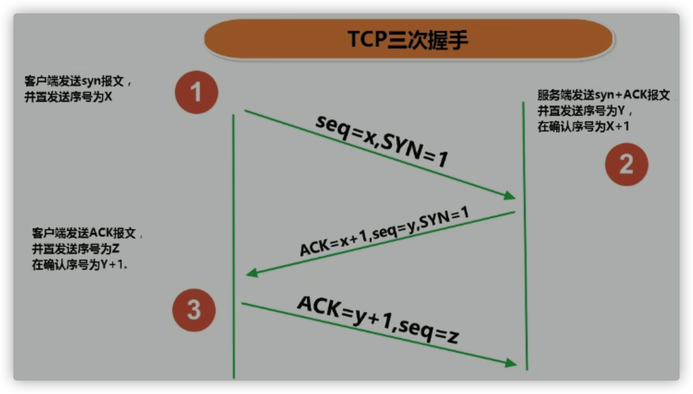
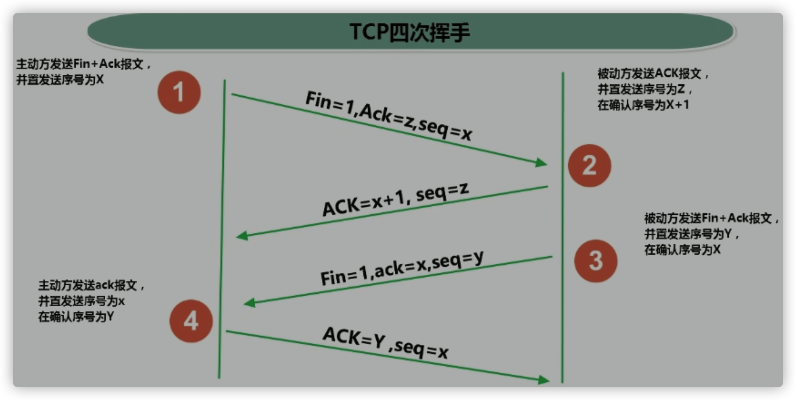
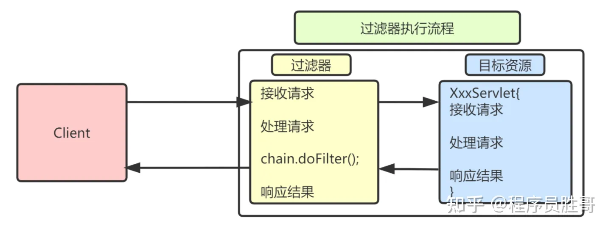

# 10_JavaWeb

## Servlet使用

- servlet是运行在服务器上的一个小程序，用来处理服务器请求。
- 重要步骤：
  - 自定义Servlet类，继承HttpServlet类；重写doGet，doPost方法。
  - 修改web.xml，或者用注解：
    来指定servlet与请求的映射关系，指定哪个Servlet拦截哪个请求。
- 几个重要对象：
  - HttpServletRequest：
    - doGet，doPost等方法的参数，将当前http请求的信息封装为一个HttpServletRequest对象，提供方法获取请求信息。（请求头，获取cookie）
  - HttpServletResponse：
    - doGet，doPost等方法的参数，将当前http返回的信息封装为一个HttpServletResponse对象，提供方法返回响应信息。（添加cookie，重定向到指定请求地址）
  - ServletConfig：
    - 获取Servlet信息
  - ServletContext：
    - 一个web应用在启动时会创建一个ServletContext对象，表示web应用的上下文，可以用来配置读取当前应用的全局配置，servlet之间通过servletContext对象来进行通信。
    - 获取servlet全局属性、添加过滤器、添加监听器

## Servlet的生命周期

- 调用init方法进行初始化操作，如初始化连接池，连接数据库等。
- 调用service方法处理请求，根据请求方法调用对应的doGet、doPost、doPut等方法
- 调用destroy方法销毁

## Servlet线程不安全

- 当有新的客户端请求该Servlet时，一般不会再实例化该Servlet类，也就是有多个线程在使用这个实例。

- 尽量的不要在servlet中定义成员变量。如果不得不定义成员变量，那么不要去：

  ①不要去修改成员变量的值

  ②不要去根据成员变量的值做一些逻辑判断

## Http协议

- Http 称之为超文本传输协议，是一种通信协议，它允许将超文本标记语言(HTML)文档从Web服务器传送到客户端的浏览器。
- Http包含两个部分：**请求和响应**
  - 请求：
    - 请求包含三个部分：请求行、请求消息头、请求主体
      - 请求行包含是三个信息：请求的方式、请求的URL、请求的协议
      - 请求消息头中包含了很多客户端需要告诉服务器的信息，比如：我的浏览器型号、版本、我能接收的内容的类型、我给你发的内容的类型、内容的长度等等
      - 请求体，三种情况
        - get方式，没有请求体
        - post方式，有请求体
        - json格式，有请求体
  - 响应：
    - 响应三个部分：响应行、响应头、响应体
      - 响应行包含三个信息：协议、响应状态码(200)、响应状态(ok)
      - 响应头：包含了服务器的信息；服务器发送给浏览器的信息（内容的媒体类型、编码、内容长度等）
      - 响应体：响应的实际内容（比如请求add.html页面时，响应的内容就是<html><head><body><form....）

## 会话跟踪技术
- 会话跟踪技术用来**跟踪用户的整个会话**

- 会话：用户在打开浏览器访问web服务器资源的时候会话会建立，直到有一方断开连接，会话结束，在一次的会话中可以含多次请求和响应

- 需要原因：

  Http协议是无状态的协议：服务器无法判断这两次请求是同一个客户端发过来的，还是不同的客户端发过来的。
  一旦数据交换完毕，客户端与服务器端的连接就会关闭，再次交换数据需要建立新的连接。**这就意味着服务器无法从连接上跟踪会话**。

会话跟踪技术：

- 服务器会话追踪技术：session

   - **session通过在服务器端记录信息确定用户身份**。session保存在服务器上，底层Map(key是sessionID，value是session对象)。

   - sessionID存储：客户端用cookie保存sessionID，请求头都会带上该cookie信息

   - 客户端第一次发请求给服务器，服务器获取session，获取不到，则创建新的，然后响应给客户端。下次客户端给服务器发请求时，会把sessionID带给服务器，服务器就判断这一次请求和上次某次请求是同一个客户端，从而能够区分开客户端。

   - 服务器如果没有找到对应的sessionID，要么是我们把浏览器关掉了（cookie过期），要么session超时了（没有请求服务器时间超时），session被服务器清除了，则服务器会给你分配一个新的sessionID。

   - 禁用cookie：

     　　如果客户端禁用了cookie，通常有两种方法实现session而不依赖cookie。

     1）URL重写，就是把sessionID直接附加在URL路径的后面。

     2）表单隐藏字段。就是服务器会自动修改表单，添加一个隐藏字段，以便在表单提交时能够把sessionID传递回服务器

   - 使用选择：session会在一定时间内保存在服务器上。当访问增多，会比较占用你服务器的性能，考虑到减轻服务器性能方面，应当使用cookie。

   - 使用场景：购物车，添加了商品之后服务端可以知道哪位客户添加了哪些商品。

   - 常用的API：

     - request.getSession() -> 获取当前的会话，没有则创建一个新的会话
     - session.setAttribute(k,v)
     - session.getAttribute(k)
     - removeAttribute(k)

- 客户端会话跟踪技术：Cookie
  - **Cookie通过在客户端记录信息确定用户身份**。Cookie保存在客户端浏览器中。
  - 一般cookie的过期时间为浏览器会话结束；
  - 客户端第一次发请求给服务器，服务器响应给客户端Cookie。客户端会把Cookie保存起来。当浏览器再请求该网站时，浏览器把请求的网址连同该Cookie一同提交给服务器。服务器可以修改Cookie的内容。
  - 生命周期区分会话Cookie和持久Cookie（设置了过期时间）
  - 使用选择：cookie不是很安全，别人可以分析存放在本地的cookie并进行cookie欺骗，考虑到安全应当使用session。
  - 使用场景：登录网站，今输入用户名密码登录了，第二天再打开很多情况下就直接打开了。

## 服务器内部转发以及客户端重定向

- 服务器内部转发 : 
  - 一次请求响应的过程，对于客户端而言，内部经过了多少次转发，客户端是不知道的，地址栏没有变化
- 客户端重定向： 
  - 两次请求响应的过程。客户端肯定知道请求URL有变化，地址栏有变化

## 网络通信协议:OSI七层模型和TCP/IP协议

- OSI七层模型

  - 应用层：为应用程序提供网络服务，APP数据
  - 表示层：数据格式化，加密，解密
  - 会话层：建立，维护，管理会话连接，APP之间链接
  - 传输层：建立，维护，管理端到端连接，**TCP、UDP协议**【选择快递商】
  - 网络层：网络层 ip寻址和路由选择，**IP协议**【选择中转站】
  - 数据链路层：控制网络层和物理层之间的通信【运输路径】
  - 物理层：比特流传输

- TCP/IP协议

  - 应用层【对应OSI应用层、表示层、会话层 】
  - 传输层：传输控制协议TCP；用户数据报协议UDP。
    - TCP需要建立连接，进行大数据量的传输，可靠，效率低
    - UDP不需要建立连接，以数据包形式发送，不可靠，效率高
  - 网络层：IP协议是网络层的主要协议，支持网间互连的数据通信。
  - 数据链路层
  - 物理层

  实际上传输数据需要给数据按照层次包上TCP/IP五层协议，如果传输过程中需要使用哪个协议就要剥洋葱一样剥到需要的协议，如果发现被剥掉的协议还要用就重新包上

- TCP三次握手：三次握手才能保证双方具有接收和发送的能力。
  1. 客户端发，我是客户端
  2. 服务端发，我知道你是客户端，我是服务端
  3. 客户端发，我知道你知道 我是客户端，你是服务端

- TCP四次挥手：客户端或服务器均可主动发起挥手动作，通常客户端发起
  1. 我要断开链接了
  2. 我知道你要断开了
  3. 我断开链接了
  4. 我看看你真的断开了没有

## URL

- URL统一资源定位符，它表示Internet上某一资源的地址，浏览器通过解析给定的URL可以在网络上查找相应的文件或其他资源。
- 格式：
   *  http://localhost:8080/examples/beauty.jpg?username=Tom
   *  协议   主机名   端口号  资源地址           参数列表

## 过滤器Filter

- 当有一堆东西的时候，只希望过滤留下需要的。
- 开发步骤：
  - 新建类实现Filter接口，实现方法：init、doFilter、destroy
  - 配置Filter，可以用注解@WebFilter，也可以使用xml文件 <filter> <filter-mapping>
- 调用时机：过滤器是在请求进入容器后，但请求进入`servlet`之前进行预处理的(最前)。请求结束返回也是，是在`servlet`处理完后，返回给前端之前(最后)。
- 过滤器链
  如果采取的是注解的方式进行配置，那么过滤器链的拦截顺序是按照全类名的先后顺序排序的
  如果采取的是xml的方式进行配置，那么按照配置的先后顺序进行排序
- 使用场景：统⼀编码处理、敏感字符过滤

## 拦截器Interceptor

- 在一个流程正在进行的时候，希望干预它的进展，甚至终止。
- 开发步骤：
  - 新建类实现HandlerInterceptor接口，实现方法：
    - preHandle 在controller请求处理之前进行调用
      - 如果当前拦截器preHandle返回为true。则执行下一个拦截器的preHandle；
      - 如果当前拦截器返回为false。直接倒序执行所有已经执行了的拦截器的afterCompletion；
      - 所有拦截器都返回True，才执行目标方法
    - postHandle 
      - 倒序执行所有拦截器的postHandle方法。
      - 在Controller中的方法调用之后，DispatcherServlet 返回渲染视图之前被调用。 
    - afterCompletion 
      - 前面的步骤有任何异常都会直接倒序触发 afterCompletion
      - 在整个请求结束之后， DispatcherServlet渲染了对应的视图之后执行。
- 使用场景：登录验证，权限验证、日志记录、性能监控

## 监听器@WebListener

- 当一个事件发生的时候，希望获得这个事件发生的详细信息，而并不想干预这个事件本身的进程。
- 监听包括request域(ServletRequest)，session域(HttpSession)，application域(ServletContext)的创建，销毁和属性的变化；
- 开发步骤：
  - 使用注解@WebListener
  - 实现相应Listener接口
  - 监听的方法需要事件对象传递进来，在监听器上通过事件对象获取事件源，对事件源进行修改
- 调用时机：当事件源发生某个动作的时候，它会调用事件监听器的方法，把事件对象传递进去。
- 使用场景：统计网站访问量，初始化的动作(ServletContext范围的监听器)，对客户端信息的变化进行跟踪(Session范围的监听器)

## 大的程序流程

- 请求被过滤器拦截-->
- DispatcherServlet中央控制器，根据url定位到能够处理这个请求的controller组件---->
- 拦截器的preHandle()---->
- 调用Controller组件中的方法---->
- 调用Service方法---->
- 调用DAOImpl,baseDao与数据库交互---->
- 数据返回Servlet----->
- 拦截器的postHandle()---->
- DispatcherServlet将数据渲染到页面上---->
- 拦截器的afterCompletion()---->
- 被过滤器拦截---->
- 返回给客户端

## 保存作用域

1） request：一次请求响应范围，无论服务器内部转发多少次
2） session：一次会话范围有效
3） application： 一次应用程序范围有（服务器端端应用程序）

## 访问一个URL，执行的过程？

http://localhost:8080/pro23/page.do?operate=page&page=login 访问这个URL，执行的过程是什么样的？

http://  localhost   :8080   /pro23          /page.do                        ?operate=page&page=login
协议     ServerIP   port    context root    request.getServletPath()         query string

1) DispatcherServlet -> urlPattern :  *.do  拦截 -> /page.do
2) request.getServletPath() ->  /page.do
3) 解析处理字符串 ，将/page.do -> page
4) 拿到page这个字符串，然后去IOC容器（BeanFactory）中寻找id=page的那个bean对象   -> PageController.java
5) request.getParameter("operate") 获取operate的值 -> page，因此得知，应该执行 PageController中的page()方法
6) PageController中的page方法定义如下：
   public String page(String page){
     return page ;
   }
7) 在queryString:   ?operate=page&page=login 中获取请求参数，参数名是page，参数值是login
   因此page方法的参数page值会被赋上"login"
   然后return "login" , return 给谁？
8) 因为PageController的page方法是DispatcherServlet通过反射调用的，因此字符串"login"返回给DispatcherServlet
9) DispatcherServlet接收到返回值，然后处理视图
   目前处理视图的方式有两种： 1.带前缀redirect:    2.不带前缀
   当前，返回"login"，不带前缀
   那么执行  super.processTemplete("login",request,response);
10) 此时ViewBaseServlet中的processTemplete方法会执行，效果是：
       在"login"这个字符串前面拼接 "/"  (其实就是配置文件中view-prefixe配置的值)
       在"login"这个字符串后面拼接 ".html" (其实就是配置文件中view-suffix配置的值)
       最后进行服务器转发

## javaweb项目开发的套路要点

   1. 在web.xml文件中配置：

      配置前缀和后缀，这样thymeleaf引擎就可以根据我们返回的字符串进行拼接，再跳转
      配置监听器要读取的参数，目的是加载IOC容器的配置文件（也就是applicationContext.xml，配置需要注入bean的ID和路径）
      监听器监听Servlet上下文对象初始化后， 创建IOC容器、存入bean，然后将其保存到application作用域，后面中央控制器再从application作用域中去获取IOC容器。

   2. 开发具体的业务模块：
      1） 一个具体的业务模块纵向上由几个部分组成：
         - html页面
         - POJO类
         - DAO接口和实现类
         - Service接口和实现类
         - Controller 控制器组件

      2）如果html页面有thymeleaf表达式，必须要经过PageController来访问super.processTemplate

      3）在applicationContext.xml中配置 DAO、Service、Controller，以及三者之间的依赖关系

      4）DAO实现类中 ， 继承BaseDAO，然后实现具体的接口

      5） Controller类的编写规则

      ​	① 在applicationContext.xml中配置Controller，bean id及路径。
        用户在前端发请求时，对应的servletpath就是   /user.do   , 其中的“user”就是对应此处的bean的id值

      ​	② 在Controller中设计的方法名需要和operate的值一致

      ​	③ 在表单中，组件的name属性和Controller中方法的参数名一致
      ​    <input type="text" name="loginId" />
      ​    public String login(String loginId , String pwd , HttpSession session){
      6）  DispatcherServlet中步骤大致分为：

      0. 从application作用域获取IOC容器

      1. 解析servletPath ， 在IOC容器中寻找对应的Controller组件
      2. 准备operate指定的方法所要求的参数
      3. 调用operate指定的方法
      4. 接收到执行operate指定的方法的返回值，对返回值进行处理 - 视图处理

      7）为什么DispatcherServlet能够从application作用域获取到IOC容器？
      ContextLoaderListener在容器启动时(listener)会执行初始化任务，而它的操作就是：

      1. 解析IOC的配置文件，创建一个一个的组件，并完成组件之间依赖关系的注入
      2. 将IOC容器保存到application作用域
