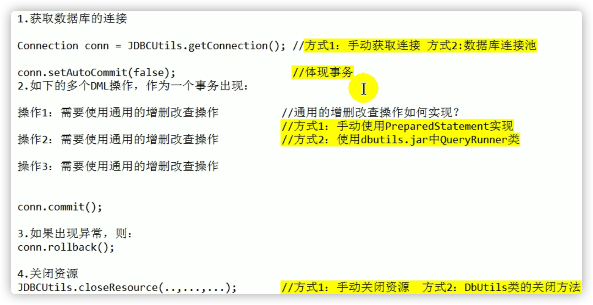

# 12_数据库相关

## JDBC

- JDBC(Java Database Connectivity)是一个**独立于特定数据库管理系统、通用的SQL数据库存取和操作的公共接口**（一组API），定义了用来访问数据库的标准Java类库，（**
  java.sql,javax.sql**）使用这些类库可以以一种**标准**的方法、方便地访问数据库资源。

- DBC接口（API）包括两个层次：
    - **面向应用的API**：Java API，抽象接口，供应用程序开发人员使用（连接数据库，执行SQL语句，获得结果）。
    - **面向数据库的API**：Java Driver API，供开发商开发数据库驱动程序用。

- JDBC的目标是使Java程序员使用JDBC可以连接任何**提供了JDBC驱动程序**的数据库系统，这样就使得程序员无需对特定的数据库系统的特点有过多的了解，从而大大简化和加快了开发过程。

- JDBC接口---->JDBC驱动程序（数据库厂商对JDBC面向数据库接口的实现）-->MySQL

- 调用PreparedStatement对象传入sql语句、sql参数，执行sql；如果是查询，返回结果集ResultSet，遍历，通过反射给java对象属性赋值；获取的数据库连接要手动关闭。

## DBUtils

commons-dbutils 是 Apache 组织提供的一个开源
JDBC工具类库，它是对JDBC的简单封装，学习成本极低，并且使用dbutils能极大简化jdbc编码的工作量，同时也不会影响程序的性能。调用QueryRunner对象传入sql语句、sql参数，执行sql，如果是更新、删除、添加返回影响的行数；如果是查询，提供ResultSetHandler接口的实现类返回相应类型的数据，javabean、List等，类型自己指定。获取的数据库连接要手动关闭。

## DAO

- DAO/BaseDAO：Data Access Object访问数据信息的类和接口，包括了对数据的CRUD（Create、Retrival、Update、Delete），而不包含任何业务相关的信息。
- 作用：为了实现功能的模块化，更有利于代码的维护和升级。
- 使用层次：BookDaoImpl继承BaseDao<T>，实现BookDao接口
    - BaseDao提供接口来传入sql，sql参数进行CRUD操作，利用泛型返回对应的查询对象。
    - BookDao接口规定具体方法功能
    - BookDaoImpl调用BaseDao API，传入具体的sql语句，使用占位符替代参数
    - 具体使用：BookDao接口指向BookDaoImpl对象，传入需要的参数即可。

## 数据库连接池

- **数据库连接池**负责分配、管理和释放数据库连接，它**允许应用程序重复使用一个现有的数据库连接，而不是重新建立一个**。

- 好处：

    - 提高数据库的连接资源复用性，不用反复创建、断开数据库连接，减少系统消耗。
    - 提高系统反应速度，数据库连接池在初始化过程中，已经创建了若干数据库连接置于连接池中备用，直接利用现有可用连接。
    - 可以对数据库连接池进行配置，能控制最大数据库连接数，避免某一应用独占所有的数据库资源。
    - 避免数据库连接泄漏，设定占用超时，强制回收被占用连接。

- 数据库连接池在初始化时将创建一定数量的数据库连接放到连接池中，这些数据库连接的数量是由**最小数据库连接数来设定**的。无论这些数据库连接是否被使用，连接池都将一直保证至少拥有这么多的连接数量。连接池的**最大数据库连接数量**
  限定了这个连接池能占有的最大连接数，当应用程序向连接池请求的连接数超过最大连接数量时，这些请求将被加入到**等待队列**中。

  当数据库访问结束后，程序还是像以前一样关闭数据库连接：conn.close(); 但conn.close()并没有关闭数据库的物理连接，它仅仅把数据库连接释放，归还给了数据库连接池。

- JDBC 的数据库连接池使用 javax.sql.DataSource 接口来表示，该接口通常由第三方提供实现，如Druid、C3P0。

## JDBCTemplate

- Spring框架对JDBC进行封装，使用JdbcTemplate方便实现对数据库操作。
- service（添加事务） 注入 dao，在 dao 注入 JdbcTemplate，在 JdbcTemplate 注入 DataSource
- 调用 jdbcTemplate对象传入sql语句、sql参数，执行sql，如果是更新、删除、添加返回影响的行数；如果是查询，提供RowMapper接口的实现类返回所需类型的数据，类型自己写。

