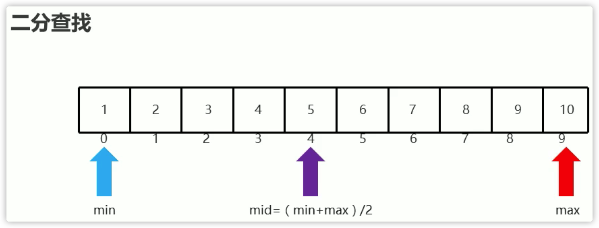
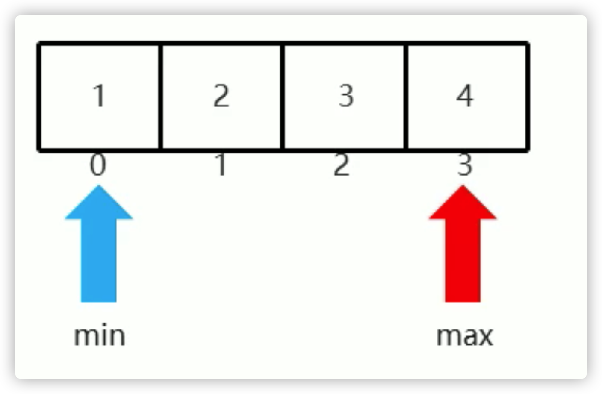
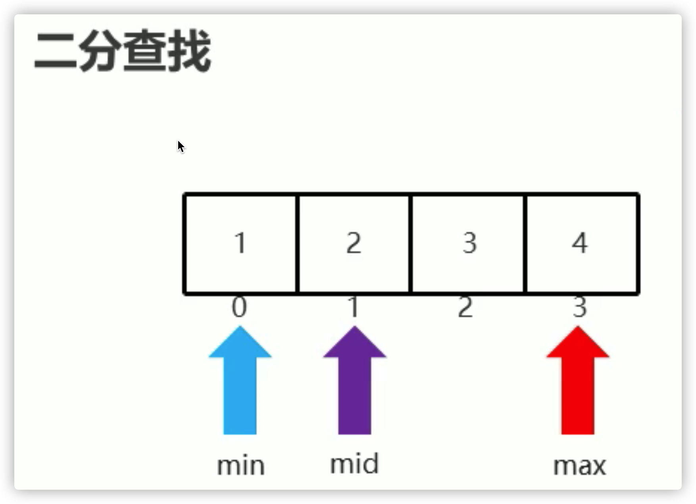

# 13_算法

## 查找

### 二分法

前提：数据有序排列





 

数组的二分查找步骤

1. 定义两个变量，表示要查找的范围。默认min=0,max=最大索引 
2. 循环查找，但是min<=max 
3. 计算出mid的值
4. 判断mid位置的元素是否为要查找的元素，如果是直接返回对应索引
5. 如果要查找的值在mid的左半边，那么min值不变，maⅸ=mid-1.继续下次循环查找 
6. 如果要查找的值在mid的右半边，那么max值不变，mim=mid+1继续下次循环查找 
7. 当min>max时，表示要查找的元素在数组中不存在，返回-1.

```java
public class MyBinarySearchDemo {
    public static void main(String[] args) {
        int [] arr = {1,2,3,4,5,6,7,8,9,10};
        int number = 11;

        //1,我现在要干嘛? --- 二分查找
        //2.我干这件事情需要什么? --- 数组 元素
        //3,我干完了,要不要把结果返回调用者 --- 把索引返回给调用者
        int index = binarySearchForIndex(arr,number);
        System.out.println(index);
    }

    private static int binarySearchForIndex(int[] arr, int number) {
        //1,定义查找的范围
        int min = 0;
        int max = arr.length - 1;
        //2.循环查找 min <= max
        while(min <= max){
            //3.计算出中间位置 mid
            int mid = (min + max) >> 1;
            //mid指向的元素 > number
            if(arr[mid] > number){
                //表示要查找的元素在左边.
                max = mid -1;
            }else if(arr[mid] < number){
                //mid指向的元素 < number
                //表示要查找的元素在右边.
                min = mid + 1;
            }else{
                //mid指向的元素 == number
                return mid;
            }
        }
        //如果min大于了max就表示元素不存在,返回-1.
        return -1;
    }
}
```


## 排序

### 冒泡排序（手写）


```java
// 冒泡排序  Api
    private static void bubbleSort(int[] arr) {
        int temp = 0;// 用于交换的临时变量 
        boolean flag = false;// 用于标识，是否交换过 
        // 冒泡排序的时间复杂度 O(n^2),因为套了两个循环
        for (int i = 0; i < arr.length - 1; i++) {
            for (int j = 0; j < arr.length - 1 - i; j++) {
                // 如果前面的数比后面的数大，则交换
                if(arr[j] > arr[j+1]) {
                    flag = true;
                    temp = arr[j];
                    arr[j] = arr[j+1];
                    arr[j+1]= temp;
                }
            }
            if(!flag) {
                // 在一趟排序中，一次交换都没有发生过,或者是一大轮已经排了一次
                break;
            }else {
                flag = false;// 重置flag!!!, 进行下次判断
            }
        }
    }
```

### 快速排序（手写）


```java
 // 快速排序 Api
    public void quickSort(int[] arr, int left, int rigth) {
        int l = left;// 左下标
        int r = rigth;// 右下标
				// pivot 中轴的值
        int pivot = arr[(rigth + left) / 2];
        int temp = 0;// temp 临时变量为交换时 引用

        // while目的：
        // 1、让其比 pivot 小的值 放左边
        // 2、让其比 pivot 大的值 放右边
        while (l < r) {// 前提： 左边始终小于右边的值
            // 在pivot 的左边一直找，找到大于等于 pivot值，才退出
            while (arr[l] < pivot) {
                l += 1;// 或l++，不过 后自增似乎效率低，因为最终还是 l=l+1 既 l+=1
            }
            // 在pivot 的右边一直找，找到小于等于pivot值，才退出
            while (arr[r] > pivot) {
                r -= 1;
            }

            // 若 l >= r 则说明 pivot 两边的值已经按照规则 ：
            // 左边全部小于等于pivot,右边全部大于等于pivot 排列好了(最终结果)
            if (l >= r) {
                break;
            }

            // 交换
            temp = arr[l];
            arr[l] = arr[r];
            arr[r] = temp;

            // 若交换后发现：arr[l] = arr[pivot] 值相等， 则前移 r--
            if (arr[l] == pivot) {
                r -= 1;
            }
            // 若交换后发现：arr[r] = arr[pivot] 值相等， 则后移 l++
            if (arr[r] == pivot) {
                l += 1;
            }
        }

        // 若 l==r,则必须 l++，r-- 否则陷入死循环，导致栈溢出
        if (l == r) {
            l += 1;
            r -= 1;
        }

        // 向左递归
        if (left < r)
            quickSort(arr, left, r);
        // 向右递归
        if (rigth > l)
            quickSort(arr, l, rigth);
    }
```