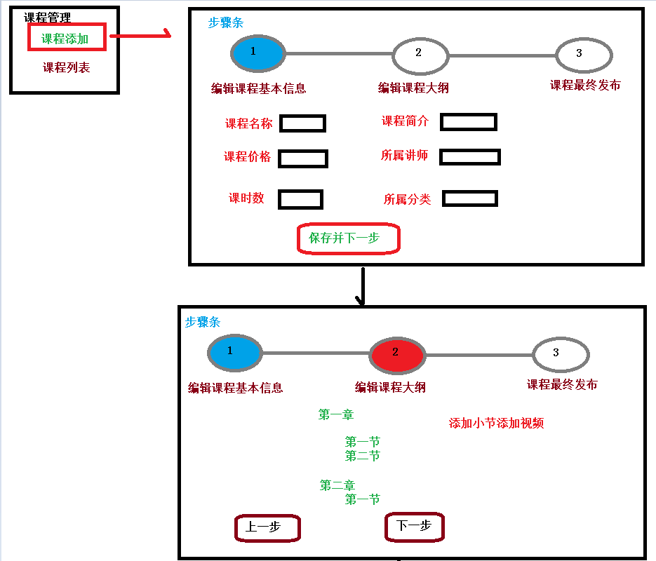
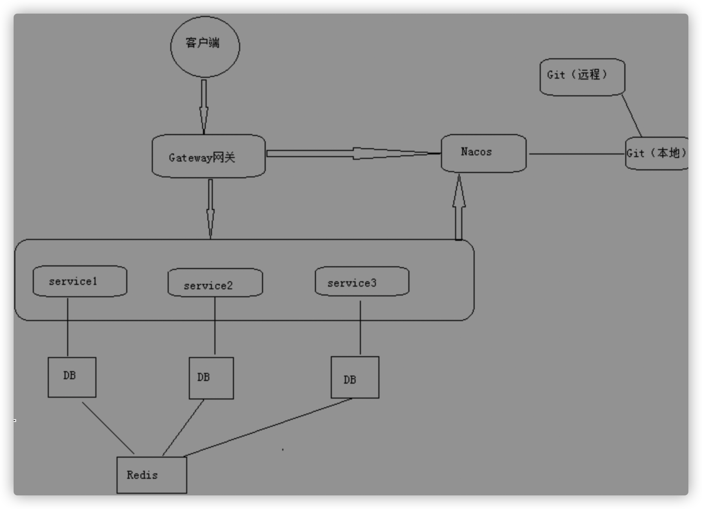

# 14_项目

## 4个模块

- **canal_clientedu**：canal数据同步工具，把远程库里面内容同步到本地库里面（统计）

- **common**：
  
  - common_utils：工具，JWT生成token 从token获取数据、MD5加密、自定义响应的类(封装响应码、响应数据等)……
  - service_base：自定义的异常、redis配置类、swagger配置类……
  - spring_security：SpringSecurity权限管理（登录过滤器、权限过滤器）……
  
- **infrastructure** ：gateway（登录过滤器）……

- **service**：
  
  1. service_acl：权限管理模块，（5张表：菜单表[权限、访问路径、组件路径等]、角色表、用户表、菜单角色关系表、角色用户关系表）
  
  2. service_cms：banner模块，（1张表：[图片地址、链接地址(课程banner、讲师banner)]
  
  3. service_edu：教育模块
  
     - 课程、讲师
  
     - 章节表、评论表、课程表、分类表、讲师表、视频表
  
  4. service_msm：短信验证模块
  
  5. service_order：订单模块，订单表、支付日志表
  
  6. service_oss：阿里云OSS模块
  
  7. service_statistics：统计模块，统计表
  
  8. service_ucenter：注册登录模块，用户表
  
  9. service_vod：阿里云视频模块

## 项目描述

- 项目前后端分离开发，后端通过SpringBoot搭建，采用SpringCloud微服务架构，持久层用的是MyBatisPlus，使用Swagger生成接口文档，前端采用vue 、element-ui、nuxt、babel等等。

  接入了阿里云视频点播、阿里云OSS、短信服务。

- 系统分为前台用户系统和后台管理系统两部分。

  前台用户系统包括：首页数据显示、课程列表和详情、课程支付，课程视频播放，微信登录、微信支付等等

  后台管理系统包括：讲师管理、课程分类管理、课程管理、统计分析、Banner管理、订单管理、权限管理等功能。

- 加入了SpringCloud，将一些关键业务和访问量比较大的部分分离了出去

  目前独立出来的服务有教学服务、视频点播服务、用户服务、统计分析服务、网关服务等

# 功能点

## 一、项目后台管理系统功能

1. 登录功能（SpringSecurity框架）

   - SpringSecurity框架：实现权限管理功能

     - **用户认证**(用户能否访问该系统，登录)和**用户授权**(用户是否有权限执行某个操作)
     - SpringSecurity用filter，对请求的路径进行过滤。
     - 登录成功后，Spring-security解析header头获取token信息，解析token获取当前用户名，根据用户名就可以从redis中获取权限列表，Spring-security来判断当前请求是否有权限访问。
     - SpringSecurity登录认证过程

     

2. 权限管理模块

   角色：管理员（都可以），讲师（课程管理模块，统计分析模块）

   1)菜单管理：菜单（前台对应的路由）

   - 列表、添加、修改、删除

   2）角色管理

   - 列表、添加、修改、删除、批量删除
   - 为角色分配菜单（操作某菜单权限）

   3）用户管理

   - 列表、添加、修改、删除、批量删除
   - 为用户分配角色

   4）**权限管理表和关系：使用五张表**

3. 讲师管理模块：
   - 分页列表（第三方分页工具：请求传入page, limit参数，接口返回数据和总条数）
   - 条件查询（搜索姓名，头衔）：将查询要求封装一个查询对象，查询的时候取属性查询；请求也带着page, limit参数，接口返回数据和总条数
   - 添加、修改、删除

4. 课程分类模块
   - 课程分类列表：使用树形结构显示课程分类列表（一级分类、二级分类）
   - 添加课程分类：读取Excel里面课程分类数据，添加到数据库中(EasyExcel)

5. 课程管理模块
   - 课程列表功能：编辑课程基本信息、编辑课程大纲信息
   - **发布课程**：
     - 流程：第一步填写课程基本信息，第二步添加课程大纲（章节和小节），第三步课程信息确认，最终课程发布
     - 课程如何判断是否已经被发布了？使用status字段
     - **添加小节上传课程视频**：阿里云视频点播SDK返回视频id，数据库存储视频id。删除也用视频id。
6. 统计分析模块
   - **生成统计数据**：canal数据同步工具，把远程库里面内容同步到本地库里面
   - 使用cron表达式，定时统计数据；
     统计分析数据表里，一天对应一行，生成一行数据；
   - 统计数据图表显示：ECharts

## 二、项目前台用户系统功能

1. 首页数据显示
   - 显示幻灯片功能
   - 显示热门课程
   - 显示名师

2. **注册功能**：获取手机验证码(阿里云短信服务)，密码MD5加密
   发送短信：自己生成验证码，发送短信成功后，将验证码存储在redis中，设置过期时间。
   验证注册：从redis读取验证码，手机号不能重复。

3. **登录功能**

   - 普通登录和退出：SSO（单点登录：一个项目多个独立运行模块，在任何一个模块登录，其他模块都登录）

     - 单点登录/分布式访问 三种常见方式：

       - 第一种：**session广播机制**实现：将session复制到其他模块中，模块多的话，空间浪费。

       - 第二种：使用cookie+redis实现：

         1. 在项目某个模块进行登录，登录之后，把数据放到两个地方
            - redis：key：生成唯一随机值，value：用户数据(用户id）
            - cookie：把redis里面生成key值放到cookie里面
         2. 访问项目中其他模块，带着cookie发送请求，服务端获取cookie，到redis进行查询，根据key进行查询，如果查询到数据就是登录

       - 第三种：使用token实现：

         在项目某个模块进行登录，登录之后，按照规则生成字符串，把登录之后用户信息(id)包含到字符串token里面，把token返回

         - 可以把token通过cookie返回(采用)
         - 把字符串通过地址栏返回，每次访问在地址栏带着生成字符串，如果可以获取到，就是登录

     - JWT：用来按照一定规则生成字符串。
       使用JWT生成token字符串
        JWT有三部分组成：头信息、主体信息（用户信息 ID、昵称）、签名哈希(防伪标志)

     - 登录实现流程：**调用登录接口返回token。**
       前端把返回token字符串放到cookie里面。**前端拦截器**判断cookie是否有token，如果有，把token放到header里面。**调用接口根据token获取用户信息**，前端把用户信息放到cookie里面，进行显示。

   - **微信扫描登录**

     - OAuth2是解决**开放系统间授权、分布式访问**问题的一种解决方案。
       - 开放系统间授权：按照规则生成字符串给访问者，访问者拿着字符串访问资源
       - 分布式访问（单点登录）：令牌机制，按照一定规则生成字符串，字符串包含用户信息
     - 获取扫描人信息过程？
        扫描之后微信接口返回code（临时票据），拿着code值请求微信固定地址，得到两个值：access_token（访问凭证）和openid（微信唯一标识）,你拿着这两个值再去请求微信固定的地址，得到微信扫描人信息（比如id，昵称，头像等等）。如果不存在就自动注册。
     - **后端根据微信信息使用 JWT，生成token字符串，把token字符串通过路径传递到首页面。**使用 JWT解析token数据，获得id。
   
4. 名师列表功能
5. 名师详情功能
6. 课程列表功能：
   - 分页列表（第三方分页工具：请求传入page, limit参数）
   - 条件查询（销量、最新、价格排序，按照课程分类显示）
7. 课程详情页
   - 课程信息显示（包含课程介绍，分类，讲师，课程大纲）
   - **判断课程是否需要购买**（接口查询是否免费，付费的话是否购买）
8. 课程视频在线播放：使用阿里云播放器SDK，点小节，通过路径传入视频id获取视频凭证，将视频凭证、视频id传到播放器组件
9. **课程支付功能**（微信支付）：两张表（订单表，支付日志表）
   
   - 如果课程是收费课程，点击立即购买，生成课程订单：
     获得课程信息、用户信息，返回订单id
   - 点击订单页面去支付，生成微信支付二维码：
     传入订单id，接口根据订单id获得订单信息，给微信，返回二维码地址等信息
   - 微信最终支付，支付状态查询（前端定时3秒查询是否支付）：
     用HttpClient给微信发送请求，如果支付成功就更新订单状态，并插入到支付日志表，前端跳转到课程详情页面

# 技术点

## 前端技术

1. vue
2. ES6规范(JS)：
   - 简化JS写法
     - 箭头函数：方便函数书写
     - 声明对象简写：声明对象，对象的属性自动赋值，将和属性名一致的变量赋值给属性。
   - let var声明变量：var 声明的变量**没有**局部作用域；let 声明的变量有局部作用域
   - **对象拓展运算符**（...）：取出参数对象所有可遍历属性然后拷贝到当前对象，用于复制对象，对象合并。
3. Element-ui：用的的一套**后台管理系统集成方案**。后台系统使用**vue-admin-template**，基于vue+Element-ui。
4. 前台系统使用Nuxt：**服务端渲染技术，Nuxt封装node.js**，将数据一次性返回给浏览器。安装完成后会给前端开发提供目录结构。
   - 资源目录 assets：静态资源
   - 组件目录 components
   - 布局目录 layouts
   - 页面目录 pages：路由及视图……等等目录（理解一下大意）
5. nodejs
6. NPM：**包管理工具**，类似于Maven，Node.js已经集成了npm工具
   npm命令： npm init(项目初始化，生成 包的配置文件)    npm install  依赖名称
7. Babel：**转码器**，可以把ES6代码转换成ES5代码，不用担心现有环境是否支持。
   Node.js不能直接运行ES6模块化代码
8. 前端模块化（后端模块化操作，一个类通过**注入**调用另一个类）
   - 通过一个页面或者一个js文件，调用另外一个js文件里面的方法。（js不支持"类"、包等概念）
9. 统计数据图表显示：ECharts

## 后端技术一

1. SpringBoot
   - SpringBoot本质是就是Spring，是快速构建Spring工程脚手架
   - 细节：
     - 启动类设置扫描规则 @ComponentScan("包路径")，扫描其他模块。
       比如：微服务架构下，每个模块可以有一个启动类，工具模块不用启动类。如果其他模块需要使用工具模块，需要设置扫描规则。
     - 配置文件：每个模块可以有一个配置文件application.properties。一个模块的启动类和配置文件要么都有要么都没有。
       - SpringBoot配置文件类型：properties和yml
       - 配置文件加载顺序：bootstrap-->application-->application-dev (之前的配置文件写了spring.profiles.active=dev)
2. SpringCloud
   - 是很多框架总称，使用这些框架实现微服务架构，基于SpringBoot实现
   - 组成框架有哪些？
     - 服务发现一Netflix Eureka(Nacos)
       服务调用一Netflix Feign
       熔断器一Netflix Hystrix
       服务网关一Spring Cloud GateWay
       分布式配置一Spring Cloud Config(Nacos)
       消息总线一Spring Cloud Bus(Nacos)
     - 项目中，使用阿里巴巴Nacos，替代SpringCloud一些组件。使用Nacos作为注册中心、配置中心 
     - Feign：服务调用，一个微服务调用另外一个微服务，实现远程调用，比如在课程模块调用用户模块判断课程是否购买
3. MyBatisPlus
   - MyBatisPlus就是对MyBatis做增强，简化开发、提高效率。
   - 优势：**内置通用 Mapper、通用 Service**，直接面向对象操作，简化了单表操作，不用写sql。比如查询通过map封装查询条件，只用封装需要包含修改属性的对象。
   - 自动填充：一些数据，每次都使用相同的方式填充，例如记录的创建时间。指定属性在初次赋值 还是 更新时自动填充，设置各个字段自动填充的规则。
   - 乐观锁：
     - 解决：丟失更新，多个人同时修改同条记录，最后提交的把之前的提交数据覆盖。
     - 实现思路：取出数据时，获取当前version，更新时，若发现获取的version和实际的version不一致，就更新失败，否则更新并将version+1。
     - 具体实现：
       - 数据库中添加version字段
       - 实体类添加version字段，并添加 @Version 注解
       - 自动填充初次给version赋值1
       - 配置乐观锁插件
   - 逻辑删除：将是否被删除字段状态修改为“被删除状态”，之后在数据库中仍旧能看到此条数据记录。查询自动排除逻辑删除数据。
   - 条件构造器 Wapper：复杂条件查询，使用QueryWrapper构建条件
   - 提供代码生成器：生成写controller、service、 mapper(.xml)、entity
4. EasyExcel：项目用在添加课程分类，读取excel数据

## 后端技术二

1. Spring Security

2. Redis

   - 首页数据通过Redis进行缓存
   - Redis数据类型
   - 使用Redis作为缓存，不太重要或者不经常改变数据适合放到Redis作为缓存 

3. Nginx反向代理服务器：

   - Nginx起到网关作用。

   - 请求转发：客户端发送请求给Nginx端口-->Nginx根据请求路径转发到具体服务器中

   - 负载均衡：把请求平均分担到不同服务器（集群情况下，多台服务器放相同内容）中

   - 动静分离：存放静态资源的静态服务器，存放java代码的服务器

4. OAuth2+JWT

5. HttpClient

   - 服务端发送请求返回响应的工具，不需要浏览器完成请求和响应的过程
   - 应用场景：微信登录获取扫描人信息，微信支付查询支付状态 

6. Cookie

   - Cookie特点：
     - 客户端技术
     - 每次发送请求带着cookie值进行发送
     - cookie有默认会话级别，关闭浏览器cookie默认不存在了，但是可以设置cookie有效时长  setMaxAge

7. 阿里云OSS

   - 文件存储服务器，返回文件url
   - 项目使用：添加讲师时候上传讲师头像

8. 阿里云视频点播

   - 视频上传、删除、播放
   - 整合阿里云视频播放器进行视频播放
   - 阿里云短信服务

# 问题

1. [前端问题] 多次路由跳转到同一个vue页面，页面中created方法只会执行一次
   - 解：使用vue监听，路由变化就重新init
2. [前端问题]  ES6模块化运行问题
   - 解：Nodejs不能直接运行ES6模块化代码，需要使用Babel把ES6模块化代码转换ES5代码 执行
3. mp生成19位id值，JavaScript处理数字类型值时候，只会处理到16位
   - 解：使实体类对应字符串类型
4. 跨域问题（403）
   - 跨域：浏览器从一个域名的网页去请求另一个域名的资源时，域名、端口、协议任一不同，都是跨域 。
   - 解：在Controller添加注解，或者通过网关解决
5. 413问题
   - 上传视频时候，因为Nginx有上传文件大小限制，如果超过Nginx大小，出现413（请求体过大）
   - 解：在Nginx配置客户端大小
6. Maven加载问题
   - maven加载项目时候，默认不会加载src-java文件夹里面xml类型文件的
   - 解决方案：直接复制xml文件到target目录，或通过配置实现
7. 系统中都有那些角色？
   - 管理员、用户
8. 前后端联调经常遇到的问题：
   - 请求方式发送错误post、get
   - 后台必要的参数，前端省略了
   - 数据类型不匹配
   - 空指针异常
9. 前端渲染和后端渲染有什么区别
   - 前端渲染是返回json给前端，通过javascript将数据绑定到页面上
   - 后端渲染是在服务器端将页面生成直接发送给服务器，有利于SEO的优化
10. 能画一下系统架构图吗

