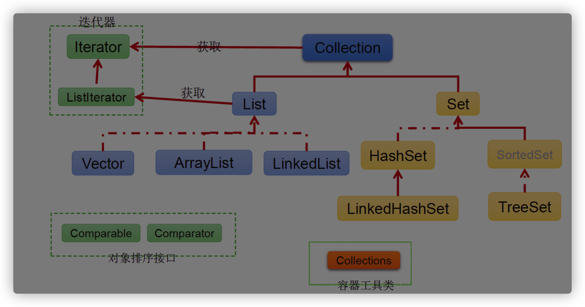
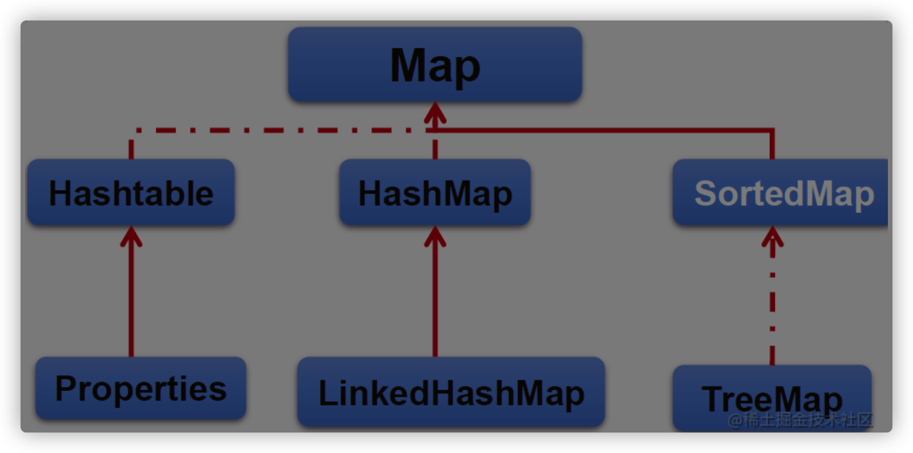

周瑜：https://www.bilibili.com/video/BV1Mg411S74N/?spm_id_from=333.999.0.0&vd_source=1a93f17d4138aae10f5cc67210f18faf

硬核干货！为了帮你2022年面试跳槽 能成功进大厂。我费尽心血整理了这200道Java高频面试题

# 1_Java基础

## Java数据类型

基本数据类型：

- 数值型：
  - 整型：byte（1字节）、short（2字节）、int（4字节）、long（8字节）
  - 浮点型：float（4字节）、double（8字节）
- 字符型：char（2字节）
- 布尔型：boolean（1字节）

引用数据类型：类、接口、数组

## 面向对象

1. 是什么：面向对象与面向过程是**处理问题的两种角度**

2. 面向过程注重每一个**步骤及顺序**，面向对象更注重有哪些**参与者**（对象）、及各自需要做什么

3. 比如：洗衣机洗衣服
   面向过程会将任务拆解成一系列的步骤（函数）

   1、打开洗衣机->2、放衣服->3、放洗衣粉>4、清洗-…->5、烘干

   面向对象会拆出人和洗衣机两个对象：
   人：打开洗衣机，放衣服，放洗衣粉
   洗衣机：清洗，烘干

   从以上例子能看出，面向过程**直接高效**，而面向对象更易于**复用、扩展和维护**

## 封装

1. 封装的意义：**外部调用无需修改或者关心内部实现**
2. 举例1：javabean的属性私有，提供getset对外访问，因为属性的赋值或者获取逻辑只能由javabean本身决定，而不能由外部胡乱修改

```java
private string name;
public void setName(string name){
this.name "tuling_"+name;
}
//该name有自己的命名规则，明显不能由外部直接赋值
```

​		举例2：mybatis操作数据库，我们不需要关心链接是如何建立的、sql是如何执行的

## 继承

- 父类：子类共性的**方法或者属性**直接使用父类的，而不需要自己再定义代码，**方便复用**
- 子类：只需扩展自己个性化的

## 多态

1. 是什么：基于对象**所属类的不同**，外部对**同一个方法**的调用，实际执行的逻辑不同。
3. 三个条件：
   子类继承父类
   子类重写父类方法
   **父类引用指向子类对象**
3. 优点：更换子类，不改变调用方代码
   缺点：无法调用子类特有的**功能**

```java
父类类型 变量名= new 子类对象； 
变量名.方法名()；
```

## JDK、JRE、JVM之间的区别 

1. 是什么

- JDK(Java SE Development Kit)，Java**标准开发包**，它提供了**编译、运⾏**Java程序所需的各种⼯具和资源，包括**Java编译器、JRE**，以及常⽤的**Java类库**等
- JRE( Java Runtime Environment) ，Java运⾏环境。JRE中包括**JVM**以及JVM⼯作所需要的**类库**。
- JVM(Java Virtual Mechinal)，Java虚拟机，负责运⾏编译过后的字节码⽂件。 

2. 流程

   - Java代码，使用**编译器**编译成字节码
- 编译之后生成字节码文件*.class⽂件，使用**JVM**（Java虚拟机）来执⾏Java字节码。
     -  JVM在执⾏Java字节码时，需要把字节码解释为机器指令，⽽**不同操作系统的机器指令**有可能不⼀样，所以就导致不同操作系统上的JVM不⼀样。
  - Java跨平台：凡是某个代码**编译之后是Java字节码**，那就都能在JVM上运⾏，⽐如Scala、Kotlin 等等。 

## ==和equals方法的区别
- ==：
  - 如果是**基本数据类型**，比较值；
  - 如果是**引用数据类型(类，接口，数组)**，比较引用地址

- equals：
  - 基本数据类型无法使用，是Object类的方法。
  - 没有重写则与==比较规则一样，没有重写具体看各个类重写equals方法的比较逻辑
    比如String类，虽然是引用类型，但是String类中重写了equals方法，方法内部比较**字符串中的各个字符是否全部相等**。


## hashCode()与equals()之间的关系

1. hashCode()
   - 干什么用：每个对象调⽤⾃⼰的hashCode()得到哈希值(hashCode)，可以利⽤hashCode来做⼀些提前的判断，⽐如： 
     - 如果两个对象的hashCode不相等，那么这两个对象肯定不相等 
     - 如果两个对象的hashCode相等，不代表这两个对象⼀定相等（根据hashCode()规则）
     - 如果两个对象相等，那么他们的hashCode就⼀定相等

2. 两者使用
   - 在Java中比较两个对象是否相等时，调用对象的hashCode()进行比较，如果hashCode不相等，就可以直接认为这两个对象不相等
   - 如果hashCode相等，调⽤equals()⽅法进⾏⽐较。
   - 使用顺序原因：通常equals()⽅法的实现逻辑⽐较多，⽽hashCode()主要就是得到⼀个哈希值，实际上就⼀个数字，相对⽽⾔⽐较轻。 

## final

1. 修饰情况：

   - **修饰类**：表示类不可被继承

   - **修饰方法**：表示方法不可被子类重写，但是可以重载

   - **修饰变量**：使用前指定初始值，且只能赋值一次

     - 修饰**类变量**（final static），**静态初始化块**、**声明**该类变量时指定初始值。

     - 修饰**成员变量**（final），非静态初始化块、声明该变量、**构造器**中指定初始值。

2. 可变性

   - 修饰**基本数据类型**的变量，数值一旦在初始化之后不能更改。
   - 修饰**引用数据类型**的变量，初始化之后不能指向另一个对象（引用地址不能改变）。但是引用的值是可变的。

3. **局部内部类和匿名内部类只能访问final局部变量**

   1. 内部类和外部类处于**同一个级别**，如果内部类对象还被引用的话，内部类就不会因为定义在方法中就会随着**方法**的执行完毕就被销毁。
      同一级别体现：这个类会被变异出两个class文件，一个是外部类.class文件，一个是内部类.class文件

   2. 这里就出现了一个矛盾：内部类对象访问了一个不存在的变量。
      为了解决这个问题，将外部局部变量复制一份作为**内部类的成员变量**。

   3. 将外部局部变量复制为内部类的成员变量时，必须保证这两个变量一样。

      将局部变量设置为final,对它初始化后，就不让修改这个变量。

```java
public class Test
  public static void main(string[]args){
  //局部final变量a,b
  public void test(final int b){
	  final int a = 10;
    //匿名内部类
    new Thread(){
  	public void run(){
  		system.out.printin(a);
		  system.out.println(b) 
    };
  }.start();
 }
}
//局部内部类
class outclass{
  final int age = 12;
  
  public void outPrint(final int x){
    class Inclass{
      public void InPrint(){
        System.out.println(x)
        System.out.println(age);
      }
    }
  new Inclass().InPrint();
  }
}
```

## String、StringBuffer、StringBuilder的区别

1. String是不可变的，如果尝试去修改，会新⽣成⼀个字符串对象(方法区里面的**字符串常量池**里面)，StringBuffer和StringBuilder是可变的 
2. **StringBuffer是线程安全的**，StringBuilder是线程不安全的，所以在单线程环境下StringBuilder效率会更⾼ 

## 重载和重写的区别

- 重载(Overload)： 
  - 在⼀个类中，同名的⽅法有不同的**参数列表**（参数类型不同、参数个数不同，顺序不同）。 
  - 与**返回值、访问修饰符、异常无关**；
  - 最常用的地方就是构造器的重载。
  
- 重写(Override)： 
  - ⼦类在**⽅法名、参数列表相同、返回值范围小于等于父类**的情况下， 对⽅法体进⾏修改。
  - 抛出的**异常范围小于等于父类，访问修饰符范围大于等于父类**；
  - 如果父类方法访问修饰符为**private**则子类就不能重写该方法。


## 抽象类和接口的区别

- 两者异同

  1. 抽象类除了抽象方法还可以有实现方法，而接口中只能存在抽象方法。
     - 原因：接口的设计目的，要求不同的类具有相同的行为，但不限制如何实现行为。
  2. 抽象类中的**成员变量**可以是各种类型的，而接口中的成员变量只能是**public static final类型。**
  3. 抽象类只能继承一个，接口可以实现多个。
- 抽象类

  - 抽象类是对类**本质的抽象**，表达的是is a的关系，比如：XiaoMing is a Person。
  - 当不同的类具有某些相同的行为，可以让这些类派生一个抽象类。如果实现方法不一样就保留抽象方法，提高复用性。
  - 抽象类不允许被实例化。
  - 抽象类中不一定包含抽象方法,但是有抽象方法的类必定是抽象类。
- 接口

  - 接口是对**行为的抽象**，表达的是like a的关系。比如：鸟像飞机一样可以飞 ，但其本质上是鸟。
- 接口的核心是**定义行为**，即实现类可以做什么，至于实现类主体是谁、是如何实现的，接口并不关心。
- 总结：
  - 抽象类的功能要远超过接口，但是，定义抽象类的代价高。因为Java每个类只能继承一个类。
  - 虽然接口在功能上弱化许多，但可以在一个类中同时实现多个接口，在设计阶段会降低难度。

## 泛型中extends和super的区别

1. <? extends T>表示包括T在内的任何T的⼦类 
2. <? super T>表示包括T在内的任何T的⽗类 

## 深拷⻉和浅拷⻉

1. 浅拷⻉：拷⻉基本数据类型的值，拷贝引用数据类型的**引⽤地址**，比如说拷贝对象，并不会复制⼀份引⽤地址所指向的对象，也就是浅拷⻉出来的对象，内部的属性指向的是同⼀个对象 
2. 深拷⻉：拷⻉基本数据类型的值，也会针对实例对象的**引⽤地址所指向的对象**进⾏复制， 深拷⻉出来的对象，**内部的属性指向的不是同⼀个对象**

## 集合





```java
实线继承，虚线实现
|----Collection接口：单列集合，用来存储一个一个对象；
	|----List接口：存储有序、可重复数据
		|----ArrayList：线程不安全，效率高
		|----LinkedList：线程不安全，效率高；对于频繁的插入、删除操作，使用此类效率比ArrayList高(一个改，移动一堆)；底层使用双向链表存储
		|----Vector：作为List接口的古老实现类；线程安全的，效率低
 
      
	|----Set接口：存储无序、不可重复数据;
		|----HashSet：作为Set接口的主要实现类；线程不安全；可以存储null值
			|----LinkedHashSet：作为HashSet的子类；遍历其内部数据时，可以按照添加的顺序遍历,对于频繁的遍历操作，LinkedHashSet效率高于HashSet.
		|----TreeSet：默认按照添加的顺序排序，可以按照添加对象的指定属性，进行排序；底层红黑树。
 
      
	|----Map接口：双列集合，用来存储一对(key - value)一对的数据   -->高中函数：y = f(x)
		|----HashMap:作为Map的主要实现类；线程不安全，效率高；存储null的key和value
			|----LinkedHashMap:保证在遍历map元素时，可以按照添加的顺序实现遍历。
                        底层使用双向链表存储。
                        对于频繁的遍历操作，此类执行效率高于HashMap。
		|----TreeMap:默认按照添加的顺序排序，可以按照添加对象的指定属性，进行排序；底层使用红黑树
		|----Hashtable:作为古老的实现类；线程安全，效率低；不能存储null的key和value
			|----Properties:常用来处理配置文件。key和value都是String类型
```

## List和Set的区别 

- List：
  - 有序，按元素插⼊的顺序保存，可重复，允许多个Null元素
  - 可以使⽤Iterator取出所有元素，再逐⼀遍历，还可以使⽤get(int index)获取指定下标的元素 

- Set：
  - ⽆序，不可重复，**最多允许有⼀个Null元素**
  - 只能用Iterator接口取出所有元素，再逐一遍历各个元素


## ArrayList和LinkedList区别

两者都线程不安全。

1. 底层数据结构不同，ArrayList底层是基于**数组**（**连续内存**存储）实现的，LinkedList底层是基于**双向链表**实现的【可以存储在**分散的内存**中（可以碎片化存储）】
2. **适⽤场景**也不同，ArrayList更适合**查找**、**下标访问**，LinkedList更适合 **删除和添加(**不适合查询：需要逐一遍历)
3. 另外ArrayList和LinkedList都实现了List接⼝，但是LinkedList还额外实现了Deque接⼝，所以 LinkedList还可以当做队列来使⽤

- ArrayList扩容机制：数组**长度固定**，超出长度存数据时需要新建数组，然后将老数组的数据拷贝到新数组，如果不是尾部插入数据还会涉及到**元素的移动**
  使用**尾插法**并指定初始容量可以极大提升性能、甚至超过LinkedList(需要创建大量的node对象)
- LinkedList:遍历LinkedList必须使用iterator，不能使用**for循环**，因为每次for循环体内通过**get(i)**取得某一元素时都需要对list重新进行遍历，**性能消耗**极大。

## HashMap和HashTable有什么区别？其底层实现是什么？
- 区别：
  - HashMap方法没有synchronized修饰，线程不安全，**HashTable线程安全**；
  - HashMap允许key和value均可为null,而HashTable**均不可**

## JDK1.7到1.8 HashMap发⽣了什么变化? 

1. 1.7底层是数组+链表，1.8中底层是数组+链表+**红⿊树**
   - 加红⿊树的⽬的是提⾼HashMap**插⼊和查询**整体效率(HashMap put key的时候，遍历找这个key在当前这个哈希map里面是否存在，所以链表长不利于提高查询插入效率)
2. 1.7中链表插⼊使⽤的是头插法，1.8中链表插⼊使⽤的是尾插法
   - 因为1.8中插⼊key和value时需要判断链表元素个数（有足够个数换成红黑树），所以需要遍历链表统计链表元素个数，所以正好就直接使⽤尾插法 
3. 1.7中哈希算法⽐较复杂，1.8中进⾏了简化
   - 因为复杂的哈希算法的⽬的是提⾼**散列性**，来提升HashMap的整体效率，⽽1.8中新增了红⿊树，所以可以适当的简化哈希算法，**节省CPU资源** 

## HashMap的Put⽅法

1. 根据Key得出数组下标 

2. 如果数组下标位置元素为空（没有产生hash冲突），则将key和value封装为（JDK1.7中是Entry对象，JDK1.8中 是Node对象）存入数组

3. 如果数组下标位置元素不为空（产生hash冲突）

   a. 如果是JDK1.7，则**先判断是否需要扩容**（1.8后判断），如果要扩容就进⾏扩容，如果不⽤扩容就⽣成**Entry**对象，并使⽤**头插法**（1.8尾插法）添加到当前位置的链表中

   b. 如果是JDK1.8，则会先判断当前位置上的**Node的类型**，看是红⿊树Node，还是链表Node 

   ​	ⅰ. 如果此位置上的Node对象是链表节点，则将key和value封装为⼀个链表Node并通过**尾插法**插⼊到链表的最后位置去，在遍历链表的过程中用equals()判断是否存在当前key，如果存在则更新value，当遍历完链表后，将新链表Node插⼊到链表后，看当前链表的节点个数，如果**当前链表长度⼤于8、且数组长度大于64**，那么则会将该链表转成红⿊树 
   
   ​	ⅱ 如果是红⿊树Node，则将key和value封装为⼀个红⿊树节点并添加到红⿊树中去，在这个过程中会判断红⿊树中是否存在当前key，如果存在则更新value 
   
   ​	ⅲ. 将key和value封装为Node插⼊到链表或红⿊树中后，再判断是否需要进⾏扩容，如果需要就扩容
   
   【key为null,存在下标0的位置】
   

## HashMap的扩容机制原理

1.8版本

**HashMap底层数组初始大小是16**

1. ⽣成新数组，大小为原来的**两倍**

2. 如果是链表，则直接将链表中的每个元素重新计算下标，并添加到新数组中去 

3. 如果是红⿊树，则先遍历红⿊树，先计算出红⿊树中每个元素对应在新数组中的下标位置 

   a.  统计每个下标位置的元素个数

   b. 如果该位置下的元素个数超过了8，则⽣成⼀个新的红⿊树，并将**根节点**添加到新数组的对应位置 

   c. 如果该位置下的元素个数没有超过8，那么则⽣成⼀个链表，并将链表的**头节点**添加到新数组的对应位置 

4. 所有元素转移完了之后，将新数组赋值给HashMap对象的**table**属性

## 异常体系

- Java中的所有异常都来⾃顶级⽗类Throwable。 
- Throwable下有两个⼦类Exception和Error。 
- Error表示⾮常严重的错误，⽐如**StackOverFlowError**和**OutOfMemoryError**， 通常这些错误出现时，仅仅想靠程序⾃⼰是解决不了的，可能是虚拟机、磁盘、操作系统层⾯出现的问题
  所以通常也不建议在代码中去**捕获**这些Error，因为捕获的意义不⼤，因为程序可能根本运⾏不了。 
- Exception表示异常，表示程序出现Exception时，是可以靠程序⾃⼰来解决的。 
  - Exception的⼦类通常⼜可以分为RuntimeException和⾮RuntimeException两类 
  - RunTimeException表示运⾏期异常，表示这个异常是在代码运⾏过程中抛出的，这些异常是**⾮检查异常**，程序中**可以选择捕获**处理，也可以不处理。这些异常⼀般是由程序逻辑错误引起的，程序应该从逻辑⻆度尽可能避免这类异常的发⽣，⽐如**NullPointerException**、**IndexOutOfBoundsException**等。 
  - ⾮RuntimeException表示⾮运⾏期异常，也就是我们常说的检查异常，是必须进⾏处理的异常，如果不处理，程序就不能检查异常通过。如**IOException**、**SQLException**等以及⽤户**⾃定义**的Exception异常。 

## 异常处理机制中，什么时候抛出异常，捕获异常？

- 本⽅法能否合理地处理该异常，如果处理不了就继续向上抛出异常
- A⽅法中调⽤B⽅法时，B方法出现了异常，就比较合适由A方法捕获该异常并进⾏处理。 

## 类加载器双亲委派模型

- JVM中存在三个默认的类加载器： 

  1. BootstrapClassLoader

  2. ExtClassLoader

  3. AppClassLoader（AppClassLoader是**⾃定义类加载器**的⽗类）

     AppClassLoader的⽗加载器是ExtClassLoader，ExtClassLoader的⽗加载器是 BootstrapClassLoader。 

- JVM在加载⼀个类时，会调⽤AppClassLoader的**loadClass**⽅法来加载这个类，不过在这个⽅法中，会先使⽤ExtClassLoader的loadClass⽅法来加载类，同样ExtClassLoader的loadClass⽅法中会先使⽤ BootstrapClassLoader来加载类，如果BootstrapClassLoader加载到了就直接成功
  - 如果 BootstrapClassLoader没有加载到，那么ExtClassLoader就会⾃⼰尝试加载该类，如果没有加载到， 那么则会由AppClassLoader来加载这个类。 

​	**双亲委派指得是，JVM在加载类时，会委派给Ext和Bootstrap进⾏加载，如果没加载到才由⾃⼰进⾏加载。** 

- 双亲委派模型的好处：
  - 主要是为了**安全性**，避免用户自己编写的类动态替换 Java的一些**核心类**，比如 String。
  - 同时也**避免了类的重复加载**，因为 **JVM中区分不同类**，不仅仅是根据类名，相同的**class文件**被不同的ClassLoader加载就是不同的两个类

## GC如何判断对象可以被回收

- 引用计数法：每个对象有一个**引用计数属性**，新增一个引用时计数加1，引用释放时计数减1，计数为0时可以回收，

  > 引用计数法，可能会出现**循环引用**问题，A引用B，B又引用A，这时候就算他们都不再使用了，也永远无法被回收。

- **可达性分析法**：从GC Roots开始向下**搜索**，搜索所走过的路径称为**引用链**。当一个对象到GC Roots没有任何引用链相连时，则证明此对象是不可用的，那么虚拟机就判断是可回收对象。

  - GC Roots的对象有：
    1. 虚拟机栈中引用的对象【add()实例方法中new uer对象，user对象就是GC Roots对象，CG对象回收只会遍历**活动栈**中的内容，来做可达性分析，add()执行完弹出活动栈user对象就直接被回收】
    2. 方法区中类静态属性引用的对象
    3. 方法区中常量引用的对象
    4. Native方法引用的对象
  - 可达性算法中的不可达对象并不是立即死亡的，对象拥有一次自我拯救的机会。
    执行finalizer方法，再看是否可达，决定要不要回收

下面先不背

- 对象被系统宣告死亡**至少要经历两次标记过程**：第一次是经过可达性分析发现没有与GC Roots相连接的引用链，第二次是在由虚拟机自动建立的Finalizerl队列中判断是否需要执行finalize()方法。
- 当对象变成(GC Roots)不可达时，GC会判断该对象是否覆盖了finalize方法，若未覆盖，则直接将其回收。
- 否则，若对象未执行过finalize方法，将其放入F-Queue队列，由低优先级线程执行该队列中对象的finalize方法。执行 finalize方法完毕后，GC会再次判断该对象是否可达，若不可达，则进行回收，否则，对象"“复活"(finalize()里面引用了其他对象)
  每个对象只能触发一次finalize()方法
- 由于finalize()方法**运行代价高昂，不确定性大**，无法保证各个对象的**调用顺序**，不推荐使用。

## JVM中哪些是线程共享区 

- 区与存储内容：
  1. 方法区存储**类的信息**
  2. 堆区存储对象
  3. 虚拟机栈存储Java方法信息
  4. 本地方法栈存储**native方法**信息
  5. 程序计数器：每个线程当前执行到第几行代码
- 线程是否共享：**堆区和⽅法区**是所有线程共享的，虚拟机栈、本地⽅法栈、程序计数器是每个线程独有的


## ⼀个对象从加载到JVM，再到被GC清除，都经历了什么过程？ 

1. ⾸先把字节码⽂件内容加载到⽅法区（类加载）
2. 然后再根据类信息在堆区创建对象
3. 对象⾸先会分配在堆区中**年轻代的Eden**区，经过⼀次Minor GC后，对象如果存活，就会进⼊Survivor区。在后续的每次Minor GC中，如果对象⼀直存活，就会在Survivor区来回拷⻉，每移动⼀次，年龄加1
4. 当年龄超过15后，对象依然存活，对象就会进⼊**⽼年代**
5. 如果经过Full GC，被标记为垃圾对象，那么就会被**GC线程**清理掉

## JVM有哪些垃圾回收算法？ 

1. 标记清除算法： 

   ​	a. 标记阶段：把垃圾内存标记出来。

   ​	b. 清除阶段：直接将垃圾内存回收。 

   ​	c. 这种算法是⽐较简单的，但是有个很严重的问题，就是会产⽣⼤量的**内存碎⽚**。 

2. 复制算法：为了解决标记清除算法的内存碎⽚问题。
   
   - 复制算法将内存分为⼤⼩相等的两半，每次只使⽤其中⼀半。
   - 垃圾回收时，将当前这⼀块的存活对象全部拷⻉到另⼀半，然后当前这⼀半内存就可以直接清除。
   - 问题就在于浪费空间，效率跟存活对象的个数有关。 
   
3. 标记压缩算法：为了解决复制算法的缺陷。
   垃圾回收时，**将存活对象往⼀端移动，然后将边界以外的所有内存直接清除**。

## 什么是STW？ 

- STW: Stop-The-World
- 是在垃圾回收算法执⾏过程当中，需要将**JVM内存冻结**的⼀种状态。
- 在STW 状态下，JAVA的所有线程都停⽌，执⾏的GC线程除外，native⽅法可以执⾏，但是，不能与JVM交互。
- GC各种算法优化、JVM调优的重点，就是减少STW。 

## JVM有哪些垃圾回收器？都怎么工作？STW都发生在哪些阶段？

JVM的垃圾回收器：


**Serial串行**


- 需要GC时，直接暂停，GC完了再继续。
- 使用垃圾回收算法，复制算法
- 是早期垃圾回收器，**只有一个线程执行GC**。在多CPU架构下，性能就会下降严重。

**Parallel并行**


- 在串行基础上，增加多线程GC。
- PS+PO(Parallel Scavenge + Parallel Old)这种组合是DK1.8默认的垃圾回收器。
- 使用垃圾回收算法，复制算法
- 在多CPU的架构下，性能会比Serial高很多。

**CMS Concurrent Mark Sweep**


- 核心思想，就是将STW打散，让一部分GC线程与用户线程并发执行。
- 使用垃圾回收算法，标记清除法
- 整个GC过程分为四个阶段（不是STW就是并发）
  1. 初始标记阶段：只标记出**根对象**直接引用的对象。【STW】
  2. 并发标记：继续标记其他对象，与应用程序是并发执行。
  3. 重新标记：对并发执行阶段的对象进行重新标记。（把并发标记中产生变化的对象重新标记）【STW】
  4. **并发清除**：并行。将产生的垃圾清除。清除过程中，应用程序又会不断的产生新的垃圾，叫做**浮动垃圾**。这些垃圾就要留到下一次GC过程中清除。

**G1 Garbage First垃圾优先**


- 他的内存模型是实际不分代，但是逻辑上是分代的。在内存模型中，对于堆内存就不再分老年代和新生代，而是划分成一个一个的小内存块，叫做Region。每个Region可以隶属于不同的年代。

- 使用垃圾回收算法，复制算法+标记压缩算法

- GC分为四个阶段：

  1. 初始标记，标记出GCRoot直接引用的对象。【STW】

  2. 并发标记：跟CMS的步骤是差不多的。遍历第二步标记出来的Region。

     标记Region,通过**RSet**（存在于每个Region中，记录引用信息）标记初始标记阶段 标记的Region 引用到的Region。

  3. 重新标记：跟CMS中的重新标记过程是差不多的。【STW】

  4. 垃圾清理：与CMS不同的是，G1可以采用拷贝算法，直接将整个Region中的对象拷贝到另一个Region。而这个阶段，G1只选择垃圾较多的Region来清理，并不是完全清理。

## 什么是三色标记？如何解决错标和漏标问题？


- 三色标记：是CMS的核心算法，将每个**内存对象**分成三种颜色：
  - 黑色：表示自己和成员变量都已经标记完毕。
  - 灰色：自己标记完了，但是成员变量还没有完全标记完。
  - 白色：自己未标记完。
- CMS通过**增量标记**（将黑变为灰）increment update的方式来解决漏标（漏标的会被回收）的问题。

## MVC架构模式

> JavaBean分为两类：
>
> - 实体类Bean：存储业务数据，如 Student、User 等
> - 业务处理 Bean：处理业务逻辑和数据访问，Service、Dao 对象

- mvc是model-view-controler的简称，即模型(JavaBean,处理数据)-视图(数据展示、交互的界面)-控制器(servlet接受请求响应浏览器)

- 流程：

  - 用户通过视图层发送请求到服务器，在服务器中请求被控制器层接收
  - 控制器层调用相应的Model层处理请求，处理完毕将结果返回到控制器层
  - 控制器层再根据请求处理的结果找到相应的View视图，渲染数据后最终响应给浏览器

- 好处：

  1. 分层设计，实现了业务系统各个组件之间的解耦，有利于业务系统的可扩展性，可维护性。
  2. 有利于系统的并行开发，提升开发效率。

- Java EE的三层架构：

  - JavaEE三层架构分为表示层/表述层、业务逻辑层、数据访问层
    - 表示层（web层）：负责接收客户端用户的请求，并返回对应数据展示视图。相当于MVC中的V和C
    - 业务逻辑层(service层)：对表示层传递过来的请求进行业务逻辑处理和运算，并返回处理结果给表示层
    - 数据访问层(dao层)：与数据库进行交互，将业务逻辑层所需的数据处理与数据库数据进行同步，用于对数据库表进行增、删、改、查

- 三层架构与MVC：

  两者本为不同领域下的设计模式，并无直接关联。MVC利于前后端分离。


## 单例设计模式

某个类只能存在一个对象实例，减少了系统性能开销

```java
//饿汉式 在程序启动或单例模式类被加载的时候，单例模式实例就已经被创建。
class Bank{
   //1.私有化类的构造器
   private Bank(){
   }
   
   //2.内部创建类的对象
   //4.静态方法只能访问类中的静态成员变量
   private static Bank instance = new Bank();
   
   //3.提供公共的静态的方法，返回类的对象
   public static Bank getInstance(){
      return instance; 
   }
}
```

```java
//懒汉式 当程序第一次访问单例模式实例时才进行创建。
class Bank{
    private Bank() {}
    private static Bank instance = null;
    public static Bank getInstance()  {
        if (instance==null){
            instance = new Bank();
        }
        return instance;
    }
}

/**
 * 使用同步机制将单例模式中的懒汉式改写为线程安全的
 * 双重if校验
 */
class Bank{
    private Bank(){}
    private static Bank instance = null;
    public static Bank getInstance(){
        if(instance == null){
            synchronized (Bank.class) {
                if(instance == null){
                    instance = new Bank();
                }
            }
        }
        return instance;
    }
}
```

- 饿汉式和懒汉式的区别：
  - 饿汉式：
    - 优点：线程是安全的。
      缺点：就算不使用也会浪费时间加载。
  - 懒汉式：
    - 优点：延迟对象的创建
      缺点：存在线程安全问题，可以使用多线程锁来解决。
- 单例模式-应用场景
  - 网站的计数器
  - 应用程序的日志应用
  - 数据库连接池

## 代理设计模式

- 代理模式：代理类为委托类预处理消息、把消息转发给委托类，以及事后处理消息等。
- 代理类的对象本身并不真正实现服务，而是通过调用委托类的相关方法，来提供特定的服务。
- 我们调用的时候需要使用的是代理类的对象用而不是委托类对象。


静态代理有两种实现方式：通过继承实现，通过接口实现

```java
//通过继承实现静态代理
通过继承被代理对象，重写委托类方法，可以对其进行代理。
优点：被代理类无需实现接口
缺点：只能代理这个类，要想代理其他类，要想代理其他类需要写新的代理方法。
cglib动态代理就是采用这种方式对类进行代理。不过类是由cglib帮我们在内存中动态生成的。

public class Tank{
    public void move() {
        System.out.println("Tank moving cla....");
    }

    public static void main(String[] args) {
        new ProxyTank().move();
    }
}
class ProxyTank extends Tank{
    @Override
    public void move() {
        System.out.println("方法执行前...");
        super.move();
        System.out.println("方法执行后...");
    }
}
```

```java
//通过接口实现静态代理
定义一个 Movable 都需要实现该接口。(规范作用)。
代理类需要将该接口作为属性，实例化时需要传入该接口的对象，这样该代理类就可以实现代理所有实现Movable的类了。
优点：可以代理所有实现接口的类。
缺点：被代理的类必须实现接口。
JDK动态代理就是采用的这种方式实现的。同样的代理类是由JDK自动帮我们在内存生成的。
public class Tank implements Movable{
    @Override
    public void move() {
        System.out.println("Tank moving cla....");
    }

    public static void main(String[] args) {
        Tank tank = new Tank();
        new LogProxy(tank).move();
    }
}

class LogProxy implements Movable{
    private Movable movable;
    public LogProxy(Movable movable) {
        this.movable = movable;
    }
    @Override
    public void move() {
        System.out.println("方法执行前....");
        movable.move();
        System.out.println("方法执行后....");
    }
}
interface Movable {
    void move();
}
```

- 静态代理的代理类我们自己定义；动态代理的代理类根据我们的提示动态生成。
- 动态代理的优势：方便对代理类的函数进行统一处理，不用修改每个代理类中的方法。
- 实现动态代理有几种方案：JDK动态代理，CGLIB动态代理

```java
//JDK动态代理
通过java提供的Proxy类帮我们创建代理对象。
优点：可以生成所有实现接口的代理对象
缺点：JDK反射生成代理必须面向接口, 这是由Proxy的内部实现决定的。生成代理的方法中你必须指定实现类的接口，它根据这个接口来实现代理类生成的所实现的接口。
import java.lang.reflect.InvocationHandler;
import java.lang.reflect.Method;
import java.lang.reflect.Proxy;
//使用jdk的动态代理
public class Tank implements Movable{
    @Override
    public void move() {
        System.out.println("Tank moving cla....");
    }

    public static void main(String[] args) {
        Tank tank = new Tank();
        // reflection 反射 通过二进制字节码分析类的属性和方法

        //newProxyInstance: 创建代理对象
        // 参数一: 被代理类对象
        // 参数二：接口类对象  被代理对象所实现的接口
        // 参数三：调用处理器。 被调用对象的那个方法被调用后该如何处理
        Movable o = (Movable)Proxy.newProxyInstance(Tank.class.getClassLoader()
                ,new Class[]{Movable.class}
                ,new LogProxy(tank));
        o.move();
    }
}

class LogProxy implements InvocationHandler {
    private Movable movable;

    public LogProxy(Movable movable) {
        this.movable = movable;
    }

    @Override
    public Object invoke(Object proxy, Method method, Object[] args) throws Throwable {
        System.out.println("方法:"+method.getName()+"()执行前");
        Object invoke = method.invoke(movable, args);  // 此处相当于 movable.move()
        System.out.println("方法:"+method.getName()+"()执行后");
        return invoke;
    }
}

interface Movable {
    void move();
}
```

```java
//cglib动态代理
CGLib(Code Generate Library) 与JDK动态代理不同的是，cglib生成的代理类是 被代理对象的子类。
缺点：不能给final类生成代理，因为final类无法拥有子类。

使用cglib生成代理类也很简单，只要指定父类和回调方法即可
首先需要引入依赖
<dependency>
     <groupId>cglib</groupId>
     <artifactId>cglib</artifactId>
     <version>3.2.12</version>
 </dependency>

import net.sf.cglib.proxy.Enhancer;
import net.sf.cglib.proxy.MethodInterceptor;
import net.sf.cglib.proxy.MethodProxy;
import java.lang.reflect.Method;

public class Main {
    public static void main(String[] args) {
        Enhancer enhancer = new Enhancer(); // 增强者
        enhancer.setSuperclass(Tank.class); // 指定父类
        enhancer.setCallback(new TimeMethodInterceptor()); // 当被代理对象的方法调用的时候会调用 该对象的intercept
        Tank tank = (Tank)enhancer.create();  // 动态代理的生成
        tank.move();  // 生成之后会调用
    }
}

class TimeMethodInterceptor implements MethodInterceptor{
    @Override
    public Object intercept(Object o, Method method, Object[] objects, MethodProxy methodProxy) throws Throwable {
        System.out.println("生成的类名"+o.getClass().getName());
        System.out.println("生成的类的父类"+o.getClass().getSuperclass().getName());
        System.out.println("方法执行前，被代理的方法"+method.getName());
        Object result = null;
        result = methodProxy.invokeSuper(o, objects);
        System.out.println("方法执行后，被代理的方法"+method.getName());
        return result;
    }
}
class Tank{
    public void move(){
        System.out.println("Tank moving clacla....");
    }
}
```

## JUnit5

Spring Boot 2.2.0 版本开始引入 JUnit 5 作为单元测试默认库

```java
//@SpringBootTest标注的类具有Spring的功能，可以使用@Autowired、@Transactional(测试完成后自动回滚)等注解标注测试方法
@SpringBootTest
public class Boot05WebAdminApplicationTests  {
    @Test
    void testEquals() {
    }
}
```

JUnit5常用注解：

- **@ParameterizedTest :**表示方法是参数化测试，将传入的参数一一测试。
- **@RepeatedTest :**指定方法重复执行次数
- **@DisplayName :**为测试类或者测试方法设置**展示名称**
  - **@BeforeEach :**表示在每个单元测试之前执行
  - **@AfterEach :**表示在每个单元测试之后执行
  - **@BeforeAll :**表示在所有单元测试之前执行
  - **@AfterAll :**表示在所有单元测试之后执行
- **@Disabled :**表示测试类或测试方法不执行，类似于JUnit4中的@Ignore
- **@Timeout :**表示测试方法运行如果超过了指定时间将会返回错误

- 断言：对测试需要满足的**条件进行验证**，这些断言方法都是的静态方法。如果断言正确不会有反应，如果断言失败会测试失败。

| 方法              | 说明                                             |
| ----------------- | ------------------------------------------------ |
| assert(Not)Equals | 判断两个对象或两个原始类型是否(不)相等           |
| assert(Not)Same   | 判断两个对象引用是否指向(不同/同一个)对象        |
| assertTrue/False  | 判断给定的布尔值是否为 true/false                |
| assert(Not)Null   | 判断给定的对象引用是否(不)为 null                |
| assertArrayEquals | 判断两个对象或原始类型的数组是否相等             |
| assertAll         | 组合断言，只有所有的断言都成功，这个断言才算成功 |
| assertNull        | 判断给定的对象引用是否为 null                    |
| assertNotNull     | 判断给定的对象引用是否不为 null                  |

- 异常断言：断定一定会出现某种异常，不出现反而停止运行
- 超时断言
- 快速失败

嵌套测试：@Nested加在里层的测试类上面，表示嵌套测试。before/after只对于同层或者更里层的测试有效，对于外层不生效。

---

下面先不背

## 谈谈ConcurrentHashMap的扩容机制

1.8版本：

1. 当某个线程进⾏put时，如果发现ConcurrentHashMap正在进⾏扩容那么该线程⼀起进⾏扩容 
2. 如果某个线程put时，发现没有正在进⾏扩容，则将key-value添加到ConcurrentHashMap中，然后判断是否超过阈值，超过了则进⾏扩容 
3. ConcurrentHashMap⽀持多个线程同时扩容
4. 扩容之前也先⽣成⼀个新的数组
5. 在转移元素时，先将原数组分组，将每组分给不同的线程来进⾏元素的转移，每个线程负责⼀组或多组的**元素转移⼯作** 

## CopyOnWriteArrayList的底层原理是怎样的

1. ⾸先CopyOnWriteArrayList内部也是⽤过数组来实现的，在向CopyOnWriteArrayList**添加元素**时，会复制⼀个新的数组，写操作在新数组上进⾏，读操作在原数组上进⾏
2. 写操作会**加锁**，防⽌出现并发**写⼊丢失数据**的问题 
3. 写操作结束之后会把原数组指向新数组 
4. CopyOnWriteArrayList允许在写操作时来读取数据，⼤⼤提⾼了读的性能，因此适合 **读多写少**的应⽤场景，但CopyOnWriteArrayList会⽐较占内存（每次写都要去复制一个新的数组），同时可能读到的数据不是实时最新的数据，所以不适合实时性要求很⾼的场景

## 什么是字节码？⽤字节码的好处？ 

编译器(javac)将Java**源⽂件**(*.java)⽂件编译成为Java字节码⽂件(*.class)，可以做到⼀次编译到处运⾏， windows上编译好的class⽂件，可以直接在linux上运⾏，通过这种⽅式做到跨平台，不过Java的跨平台有⼀个前提条件，就是不同的操作系统上安装的JDK或JRE是不⼀样的，虽然字节码是通⽤的，但是需要把字节码解释成**各个操作系统的机器指令**是需要不同的**解释器**的，所以针对各个操作系统需要有各⾃的JDK或JRE。 

采⽤字节码的好处，⼀⽅⾯实现了**跨平台**，另外⼀⽅⾯也提⾼了**代码执⾏的性能**，编译器在编译源代码时可以做⼀些编译期的优化。 

## 你们项⽬如何排查JVM问题

对于还在正常运⾏的系统：

1. 可以使⽤jmap来查看JVM中各个区域的使⽤情况 
2. 可以通过jstack来查看线程的运⾏情况，⽐如哪些线程阻塞、是否出现了死锁 
3. 可以通过jstat命令来查看垃圾回收的情况，如果发现fullgc⽐较频繁，那么就得进⾏调优了 
4. 各个命令的结果，或者jvisualvm等⼯具来进⾏分析
5. 如果频繁发⽣fullgc但是⼜⼀直没有出现内存溢出，那么表示fullgc实际上是回收了很多对象了，所以这些对象最好能在younggc过程中就直接回收掉，避免这些对象进⼊到⽼年代
   对于这种情况，就要考虑这些存活时间不⻓的对象是不是⽐较⼤，导致**年轻代**放不下，直接进⼊到了⽼年代，尝试加⼤年轻代的⼤⼩，如果改完之后，fullgc减少，则证明修改有效 
6. 同时，还可以找到占⽤CPU最多的线程，定位到具体的⽅法，优化这个⽅法的执⾏，看是否能**避免某些对象的创建**，从⽽节省内存 

对于已经发⽣了OOM(Out Of Memory)的系统： 

1. ⼀般⽣产系统中都会设置当系统发⽣了OOM时，⽣成当时的dump⽂件（- XX:+HeapDumpOnOutOfMemoryError -XX:HeapDumpPath=/usr/local/base） 
2. 我们可以利⽤jsisualvm等⼯具来分析dump⽂件 
3. 根据dump⽂件找到**异常的实例对象**，和异常的线程（占⽤CPU⾼），定位到具体的代码 
4. 然后再进⾏详细的分析和调试 

总之，调优不是⼀蹴⽽就的，需要分析、推理、实践、总结、再分析，最终定位到具体的问题 

## 常用的JVM启动参数？

在绝大部分业务场景下，常用的JVM配置参数也就10来个

```apl
# 设置堆内存（最大、最小）
-Xmx4g -Xms4g
# 指定GC算法（G1算法），配置最大垃圾回收栈的时间（毫秒）
-XX:+UseG1GC -XX:MaxGCPauseMillis=50
# 指定GC并行线程数
-XX:ParallelGCThreads=4
# 打印GC日志
-XX:+PrintGCDetails -XX:+PrintGCDateStamps
# 指定GC日志文件
-Xloggc:gc.log
# 指定Meta区的最大值
XX:MaxMetaspaceSize=2g 
#设置单个线程栈的大小
-Xss1m
#指定堆内存溢出时自动进行Dump（Java8默认不开启，需要手动开启）
XX:+HeapDumpOnOutOfMemoryError
-XX:HeapDumpPath=/usr/local/
```

## 
