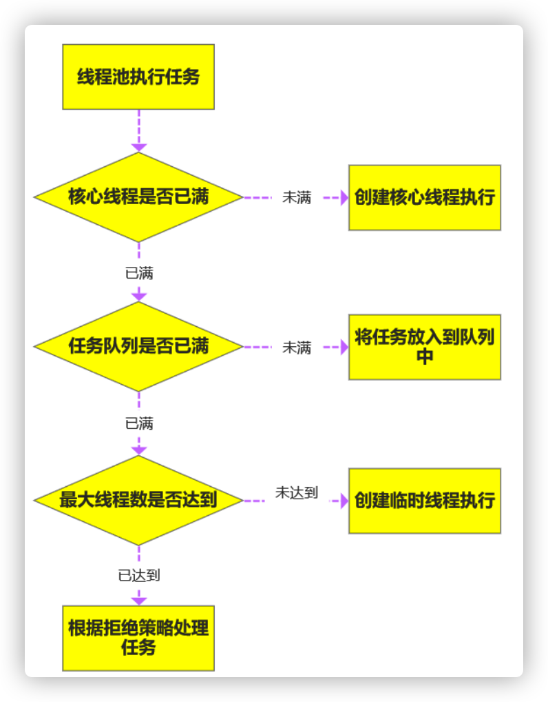

# 二、线程、并发相关

## 1_线程的生命周期？线程有几种状态?

1. 线程通常有五种状态，创建，就绪，运行、阻塞和死亡状态。

2. 生命周期的状态
   	1.新建状态(New):新创建了一个线程对象。
   	2.就绪状态(Runnable)：线程对象创建后，其他线程调用了该对象的**start**方法。
          该状态的线程位于**可运行线程池**中，变得可运行，等待获取CPU的**使用权**。
   	3.运行状态(Running):就绪状态的线程获取了CPU,执行程序代码。
   	4.阻塞状态(Blocked)：阻塞状态是线程因为某种原因放弃CPU使用权，暂时停止运行。直到线程进入就绪状态，才有机会转到运行状态。
   	5.死亡状态(Dead):线程执行完了或者因异常退出了**run**方法，该线程结束生命周期。

3. 阻塞的情况又分为三种：
   (1)、同步阻塞(synchronized)：一个方法加了synchronized，该线程就会竞争**同步锁**，若该同步锁被别的线程占用，则JVM会把该线程放入“**锁池**"中等待，当前面的线程释放同步锁后锁池中的线程去竞争同步锁，当某个线程得到后会进入**就绪队列**等待**cpu资源分配**。	

   (2)、等待阻塞：在synchronized代码块内，拿到锁，不在锁池中，执行**wait**方法（wait是object类的方法），该线程会释放占用的所有资源，JVM会把该线程放入"**等待池**"中（wait()把锁释放掉，不会去竞争同步锁）。
   进入这个状态后，是不能自动唤醒的，必须依靠其他线程调用**notify**或notifyAll方法才能被唤醒，notify()是随机从等待池选出一个线程放到锁池，而notifyAll() 是将等待池的所有线程放到锁池当中。

   (3)、其他阻塞：运行的线程执行**sleep**（sleep是Thread类的方法）或**join**方法，或者发出了I/O请求时，JVM会把该线程置为阻塞状态。当 sleep状态超时、join等待线程终止或者超时、或者**l/O处理完毕**时，线程重新转入就绪状态。

## 2_sleep()、wait()的区别

- sleep()、wait()区别

> 同：如果在睡眠期间其他线程调用了这个线程的interrupt方法，那么这个线程也会抛出interruptException异常返回 

1、sleep是Thread类的**静态**本地方法，wait则是Object类的本地方法。
2、sleep方法不会释放锁，锁带着进入了冻结状态，其他线程不可能获取到这个锁，当定时时间结束变为就绪状态
	但是wait会释放锁，而且会加入到等待队列（等待池）中，**不指定时间**的话需要被唤醒
3、sleep方法不依赖于同步器synchronized（不在synchronized方法里面也可以调用）,但是wait需要依赖synchronized关键字。
4、sleep一般用于当前线程休眠，或者**轮循暂停**操作，wait则多用于多线程之间的通信（A线程调用notify唤醒B线程）。
5、sleep会让出CPU执行时间且强制上下文切换，而wait则不一定，wait后可能还是有机会重新竞争到锁继续执行的。

## 3_join()、yield()的区别

- yield()执行后线程直接进入就绪状态，马上释放了cpu的执行权，但是依然保留了cpu的执行资格，所以有可能之后还能执行
- join()执行后线程进入阻塞状态，例如在线程B中调用线程A的join(),那线程B会进入到阻塞队列，直到线程A结束或中断线程

```java
public static void main(string[]args)throws InterruptedException{
  Thread t1 new Thread(new Runnable(){
    @override
    public void run(){
      try{
      Thread.sleep(3000);
      }catch (InterruptedException e){
      e.printstackTrace();
      }
      system.out.println("22222222"); 
     }
  });
      t1.start();
  		//main线程进入阻塞，不是t1线程
      t1.join();
      //这行代码必须要等t1全部执行完毕，才会执行
      System.out.println("1111"); 
}
//22222222
//1111
```

## 4_说说对线程安全的理解

- 线程安全：多个线程访问**同一个对象**结果和单个线程访问结果一样
- 线程安全讲得不是线程安全、应该是内存安全，因为堆是共享内存，可以被一个进程的所有线程访问，这就是造成问题的潜在原因。
- 堆是进程和线程共有的空间，分全局堆和局部堆。全局堆就是所有没有分配的空间，局部堆就是用户分配的空间。
  堆在操作系统对进程初始化的时候分配，运行过程中也可以向系统要额外的堆，但是用完了要还给操作系统，要不然就是内存泄漏。
- 栈是每个线程独有的，保存其**运行状态**和局部变量的。
  栈在线程开始的时候初始化，每个线程的栈互相独立，栈是线程安全的。
  操作系统在切换线程的时候会自动切换栈。栈空间不需要在高级语言里面显式的分配和释放。【当前方法执行完，就弹出栈，空间自动回收】

## 5_Thread、Runable的区别

- 新建线程的方式要么继承Thread，要么实现Runable。Thread实现了Runable接口。
- 无论使用Runnable还是Thread,都会new Thread,然后调用start()，内部执行run方法。
- 用法上，如果有复杂的线程操作需求，那就选择继承Thread（Thread API更加丰富），如果只是简单的执行一个任务，那就实现runnable。

```java
//会卖出多一倍的票，new MyThread两个
public class Test{
	public static void main(string[]args){
//TODO Auto-generated method stub
		new MyThread().start();
    new MyThread().start();
}
static class MyThread extends Thread{
    private int ticket 5;
    public void run(){
      while(true){
        System.out.println("Thread ticket ="ticket--);
        if(ticket < 0){
          break;
        }
      }
    }
  }
}
```

## 6_对守护线程的理解

- 任何一个守护线程都为整个JVM中**所有**非守护线程提供服务
- 生命周期：守护线程的生命周期依赖整个进程而运行；其他线程都执行完毕，程序就结束了，守护线程就死亡；
- 注意：由于守护线程的终止是自身无法控制的，因此千万不要把访问**固有资源**、I/O、File等重要操作逻辑分配给它；
- 举例，GC垃圾回收线程：当我们的程序中不再有任何运行的Thread,程序就不会再产生垃圾，所以垃圾回收线程会自动离开。
  它始终在低级别的状态中运行，用于**实时监控和管理**系统中的可回收资源。
- 应用场景：
  - 来为其它线程提供服务支持的情况；
  - 在任何情况下，程序结束时，守护线程必须正常且立刻关闭；
    反之，如果一个正在执行某个操作的线程不能随意中断，必须要正确地关闭掉否则就会出现不好的后果的话，那么这个线程就不能是守护线程，而是用户线程。
    通常都是些关键的事务，比方说，数据库录入或者更新，这些操作都是不能中断的。
  - 不能把正在运行的常规线程设置为守护线程。【thread.setDaemon(true)必须在thread.start()之前设置，否则会跑出一个llegalThreadStateException异常。】
- 另外
  - 在守护线程中产生的新线程也是守护线程。 
  - Java自带的多线程框架，比如**ExecutorService**,会将守护线程转换为用户线程，所以如果要使用守护线程就不能用Java的线程池。

## 7_ThreadLocal的底层原理 

1. ThreadLocal是Java中所提供的**线程本地存储机制**，可以利⽤该机制将数据**缓存在某个线程内部**， 该线程可以在任意时刻、任意⽅法中获取缓存的数据 
2. 每个Thread对象（注意不是ThreadLocal对象）中都存在⼀个ThreadLocalMap，Map的key为ThreadLocal对象，Map的value为需要缓存的值。
   所以一个线程可以缓存许多数据。 
3. 线程池中的线程不会回收，⽽线程对象**强引⽤**指向ThreadLocalMap，ThreadLocalMap**强引⽤**指向Entry对象，线程不被回收， Entry对象也就不会被回收，从⽽出现内存泄漏（内存泄露为程序在申请内存后，无法释放已申请的内存空间，一次内存泄露危害可以忽略，但内存泄露堆积后果很严重，无论多少内存,迟早会被占光）
   解决办法是，在使⽤了ThreadLocal对象之后，⼿动调⽤ThreadLocal的**remove**⽅法，⼿动清除Entry对象
4. ThreadLocal经典的应⽤场景就是**连接管理**（⼀个线程持有⼀个连接，该**连接对象**可以在不同的⽅法之间进⾏传递，线程之间不共享同⼀个连接）

```java
public class User{
  private ThreadLocal<String>name;
  public void setName(){
  	name.set("周瑜")； 
  }
  public void getName(){
  	String s = this.name.get();
  	name.remove();
  }
}
```


## 8_并发、并⾏、串⾏之间的区别 

1. 串⾏：⼀个任务执⾏完，才能执⾏下⼀个任务（排队）

2. 并⾏(Parallelism)：多个任务在**同一时刻互不干扰**地同时执⾏

3. 并发(Concurrency)：多个任务整体看上去是同时执⾏，在底层，任务被拆成了很多份，串行执行，cpu快速调用执行，允许任务彼此干扰

## 9_并发的三大特性

- 原子性
  - 不被中断操作，要不全部执行完成，要不都不执行。
  - 就好比转账，从账户A向账户B转1000元，那么必然包括2个操作：从账户A减去1000元，往账户B加上1000元。2个操作必须全部完成。

```java
private long count = 0;
public void calc(){
count++;
}
```

比如自增操作，它本身其实并不是原子性操作，分了3步。

1:将count从主存读到**工作内存**（线程各自的）中的副本中
2:+1的运算
3:将结果写入工作内存
【前3步操作是原子性，要么一起做，要么都不做】
4:将工作内存的值刷回**主存**，什么时候刷入由操作系统决定（不确定)

所以在多线程中，有可能一个线程还没自增完，可能才执行到第二部，另一个程就已经读取了值，导致结果错误。那如果我们能保证自增操作是一个原子性的操作，那么就能保证其他线程读取到的一定是自增后的数据。

关键字：synchronized

- 可见性
  - 当多个线程访问同一个变量时，一个线程修改了这个变量的值，其他线程能够立即看得到修改的值。
  - 可见性问题：若线程1改变了i的值还没刷新到主存，线程2又使用了i,那么这个i值肯定还是之前的，线程1对变量的修改线程2没看到这就是可见性问题。
  - 关键字：volatile、synchronized、final
- 有序性
  对于那些改变顺序之后不会对最终结果造成影响的代码，虚拟机不一定会按照我们写的代码的顺序来执行，有可能将他们重排序。实际上，对于有些代码进行重排序之后，虽然对变量的值没有造成影响，但有可能会出现线程安全问题。

```java
int a = 0;
boo1 flag = false;
public void write(){
  //单个线程执行write()，方法的顺序不影响结果
  //多个线程执行时如果发生cpu调度，方法的顺序会影响结果
  a = 2;						//1
  flag = true;			//2
}

public void multiply(){
	if (flag) {				//3
		int ret = a * a;//4
  }
}
```

- write方法里的1和2做了重排序，线程1先对flag赋值为true,随后执行到线程2，ret直接计算结束，再到线程 1,这时候a才赋值为2，很明显迟了一步
- 关键字：volatile、synchronized
- volatile本身就包含了禁止**指令重排序**的语义，而synchronized关键字是因为"一个变量在同一时刻只允许一条线程对其进行lock操作"。

## 10_Java死锁如何避免？ 

造成死锁的⼏个原因： 

1. ⼀个资源每次只能被⼀个线程使⽤ 

2. ⼀个线程在阻塞等待某个资源时，不释放已占有资源 

3. ⼀个线程已经获得的资源，在未使⽤完之前，不能被强⾏**剥夺** 

4. 若⼲线程循环等待锁

   如果要避免死锁，只需要不满⾜其中某⼀个条件即可。⽽其中前3个条件是作为锁要符合的条件，所以要避免死锁就需要打破第4个条件，不出现循环等待锁的关系。 

在开发过程中： 

1. 要注意**加锁顺序**，保证每个线程按同样的顺序进⾏加锁（线程1先加A锁再加B锁，线程2也先加A锁再加B锁）

2. 要注意**加锁时限**，可以针对所设置⼀个超时时间（超时加不到目标的锁，就连带着原来占有的锁放弃）

3. 要注意**死锁检查**，这是⼀种预防机制，确保在第⼀时间发现死锁并进⾏解决

## 11_如何理解volatile关键字

- volatile关键字用来修饰对象的**属性**，在并发环境下可以保证这个属性的可见性，对于加了volatile关键字的属性，在对这个属性进行修改时，会直接将cpu高速缓存中的数据在修改的时候写回到主内存，对这个变量的读取也会直接从主内存中读取，从而保证了可见性。
  如果没有加volatile关键字的属性，读/写cpu高速缓存中的数据，再写回到主内存。
- 使用了内存屏障，所以会**禁止指令重排**，所以同时也就保证了有序性。
- 在很多**并发**场景下，如果用好volatile关键字可以很好的提高执行效率。

## 12_为什么用线程池？

1、降低资源消耗：提高线程利用率，降低创建和销毁线程的消耗。
2、提高响应速度；任务来了，直接有线程可执行，而不是先创建线程，再执行。
3、提高线程的**可管理性**；线程是稀缺资源，使用线程池可以统一分配**调优监控**。

## 13_解释下线程池参数？（6个）

- corePoolSize代表**核心线程数**，也就是正常情况下创建工作的线程数，这些线程创建后并不会消除，而是一种**常驻线程**（最终随着线程池一起回收）
- maxinumPoolSize代表最大允许被创建的线程数，比如当前任务较多，将核心线程数都用完了，还无法满足需求时，此时就会创建新的线程，但是线程池内线程总数不会超过最大线程数
- keepAliveTime、unit表示超出核心线程数之外的线程的空闲存活时间，也就是核心线程不会消除，但是 超出核心线程数的线程如果空闲一定的时间则会被消除，我们可以通过setKeepAliveTime来设置空闲时间
- workQueue**缓冲队列**（属于阻塞队列）用来存放待执行的任务，假设我们现在核心线程都已被使用，还有任务进来则全部放入队列，直到整个队列被放满但任务还再持续进入则会开始创建新的线程
- ThreadFactory是线程工厂，用来生产线程。我们可以选择使用默认的创建工厂，产生的线程都在同一个组内，拥有相同的优先级，且都不是守护线程。当然我们也可以根据业务来自定义不同的线程工厂
- Handler**任务拒绝策略**，有两种情况，第一种是当我们调用shutdown等方法关闭线程池后，这时候即使线程池内部还有没执行完的任务正在执行，但是由于线程池已经关闭，我们再继续想线程池提交任务就会遭到拒绝。另一种情况就是当达到最大线程数，线程池已经没有能力继续处理新提交的任务时，就拒绝

## 14_线程池的底层⼯作原理 

线程池内部是通过队列+线程实现的，当我们利⽤线程池执⾏任务时： 

1. 如果此时线程池中的线程数量⼩于corePoolSize，即使线程池中的线程都处于空闲状态，也要创建新的线程来处理被添加的任务。 
2. 如果此时线程池中的线程数量等于corePoolSize，但是**缓冲队列**workQueue未满，那么任务被放⼊缓冲队列。 
3. 如果此时线程池中的线程数量⼤于等于corePoolSize，缓冲队列workQueue满，并且线程池中的数量⼩于maximumPoolSize，建新的线程来处理被添加的任务。 
4. 如果此时线程池中的线程数量⼤于corePoolSize，缓冲队列workQueue满，并且线程池中的数量等于maximumPoolSize，那么通过 handler所指定的策略来处理此任务。 
5. 当线程池中的线程数量⼤于 corePoolSize时，如果某线程空闲时间超过keepAliveTime，线程将被终⽌。这样，线程池可以动态的调整池中的线程数 



## 15_线程池中阻塞队列的作用？

1. 一般的队列只能保证作为一个有限长度的缓冲区，如果超出了缓冲长度，就无法**保留当前的任务**了，阻塞队列通过阻塞可以保留住当前想要继续入队的任务。（阻塞队列满了，后面的任务就会阻塞住）
2. 阻塞队列可以保证任务队列中没有任务时**阻塞获取任务的线程**，使得线程**进入wait状态**，释放cpu资源。阻塞队列自带唤醒的功能，不需要额外处理。

## 16_为什么是先添加列队而不是先创建最大线程？

在创建新线程的时候，是要获取全局锁的，这个时候其它的就得**阻塞**，影响了整体效率。

就好比一个企业里面有10个(core)正式工的名额，最多招10个正式工，要是任务超过正式工人数(task> core)的情况下，工厂领导（线程池）不是首先扩招工人，还是这10人，但是任务可以稍微积压一下，即先放到队列去（代价低）。10个正式工慢慢干，迟早会干完的，要是任务还在继续增加，超过正式工的加班忍耐极限了 (队列满了)，就的招外包帮忙了（注意是临时工）要是正式工加上外包还是不能完成任务，那新来的任务就会被领导拒绝了（线程池的**拒绝策略**）。

## 17_线程池中线程复用原理

线程池将线程和任务进行解耦，摆脱了之前通过Thread创建线程时每次执行任务都会调用Thread.start()来创建新线程的限制。

在线程池中，同一个线程可以从阻塞队列中不断获取新任务来执行
其核心原理在于**线程池对Thread进行了封装**，并不是每次执行任务都会调用Thread.start()来创建新线程，而是让每个线程去执行一个"循环任务"，在这个"循环任务"中不停检查是否有任务需要被执行，如果有则直接执行（调用任务中的run方法），通过这种方式只使用固定的线程就将所有任务的run方法串联起来。（我们通常使用线程不用run()，这会同步执行，用start()来异步执行）

## 18_ReentrantLock中的公平锁和⾮公平锁的底层实现 

- ⾸先不管是公平锁和⾮公平锁，⼀旦没竞争到锁，都会使⽤AQS来进⾏线程排队，
  它们的区别在于：
  线程在使⽤lock()⽅法加锁时，如果是公平锁，会先检查AQS队列中是否存在线程在排队，如果有线程再排队
  如果是⾮公平锁，则不会去检查是否有线程在排队，⽽是直接排队。 
- **当锁释放时**，都是唤醒排在最前⾯的线程，所以⾮公平锁只是体现在了线程**加锁阶段**，⽽没有体现在线程被唤醒阶段。 
- 另外，ReentrantLock是**可重⼊锁**，不管是公平锁还是⾮公平锁都是可重⼊的。

## 19_ReentrantLock中tryLock()和lock()⽅法的区别 

1. tryLock()表示非阻塞加锁，尝试加锁，该⽅法不会阻塞线程，如果加到锁则返回 true，没有加到则返回false

2. lock()表示阻塞加锁，线程会阻塞直到加到锁，⽅法也没有返回值 

## 20_CountDownLatch和Semaphore的区别和底层原理 

- CountDownLatch表示计数器，可以设置值，⼀个线程调⽤ CountDownLatch的await()就会阻塞，进入AQS排队，其他线程可以调⽤CountDownLatch的countDown()⽅法来对CountDownLatch中的数字减⼀，当数字被减成0后，所有AQS中排队的await线程都将被唤醒。具体哪个线程拿到锁就不一定。
- Semaphore表示**信号量**，可以设置值，表示同时允许最多 多少个线程使⽤该信号量，通过**acquire()**来获取许可，如果没有许可则线程阻塞，并通过AQS来排队，当某个线程通过release()释放了某个许可后，会从AQS中正在排队线程依次唤醒。具体哪个线程拿到锁就不一定。

```java
static CountDownLatch countDownLatch = new CountDownLatch(3);
public static void main(String[]args) throws InterruptedException{
//线程1
countDownLatch.await(); 
//线程5
countDownLatch.await();
//线程2
countDownLatch.countDown ();
//线程3
countDownLatch.countDown ();
//线程4
countDownLatch.countDown ();
}
```

```java
static Semaphore semaphore = new Semaphore(permits:3);
public static void main(String[]args) throws InterruptedException{
//线程1
semaphore.acquire();
//线程2
semaphore.acquire();
//线程3
semaphore.acquire();
//线程4
semaphore.acquire();//阻塞
//线程1
semaphore.release()
}
```

## 21_Sychronized的偏向锁、轻量级锁、重量级锁 

1. 偏向锁：在锁对象的**对象头**中记录当前获取到该锁的线程ID，这把锁现在就处于偏向状态，偏向某个线程，该线程下次如果⼜来获取该锁就可以直接获取到

2. 轻量级锁：由偏向锁升级⽽来，当⼀个线程获取到锁后，此时这把锁是偏向锁，此时如果有第⼆个线程来竞争锁，偏向锁就会升级为轻量级锁，轻量级锁底层是通过**JVM层面⾃旋**来实现的，并不会阻塞线程

3. 如果⾃旋次数过多仍然没有获取到锁，则会升级为重量级锁，会导致线程阻塞 

4. 从偏向锁到重量锁过度期间，使用自旋锁在中间判断是否存在竞争，自旋锁是一种**锁竞争机制**。

   ⾃旋锁：⾃旋锁就是线程在获取锁的过程中，不会去阻塞线程，也就⽆所谓唤醒线程，阻塞和唤醒这两个步骤都是需要操作系统去进⾏的，⽐较消耗时间，
   **⾃旋锁是线程通过CAS获取预期的⼀个标记**，如果没有获取到，则继续循环获取，如果获取到了则表示获取到了锁，这个过程线程⼀直在运⾏中，相对⽽⾔没有使⽤太多的操作系统资源，⽐较轻量。 

## 22_Sychronized和ReentrantLock的区别

1. sychronized是一个关键字，ReentrantLock是一个类

2. sychronized:会自动的**加锁与释放锁**，ReentrantLock需要程序员手动加锁与释放锁

3. sychronized的底层是JVM层面的锁，ReentrantLock是API层面的锁

4. sychronized是**非公平锁**，ReentrantLock可以选择公平锁或非公平锁

5. sychronized锁的是对象，把对象当作锁使用，锁信息保存在对象头中，ReentrantLock本身就是锁，通过int类型的state标识来标识锁的状态

   ReentrantLock有属性记录当前哪个线程占用了这把锁，想要加锁的线程调用lock()，里面就会判断该线程和已经占用锁的线程是否是同一个，是一个线程state加一。解锁的次数和加锁的次数对应。

6. sychronized底层有锁升级的过程

## 23_谈谈你对AQS的理解，AQS如何实现可重入锁？

1. **AQS是一个JAVA线程同步的框架。是JDK中很多锁工具的核心实现框架**
2. 在AQS中，维护了一个信号量state和一个线程组成的双向链表队列。
   这个线程队列，就是用来给线程排队的，而state就像是一个红绿灯，用来**控制线程排队或者获取锁**。
3. 在可重入锁这个场景下（参照ReentrantLock），state就用来表示**加锁的次数**。0标识无锁，每加一次锁，state就加1。释放锁state就减1。