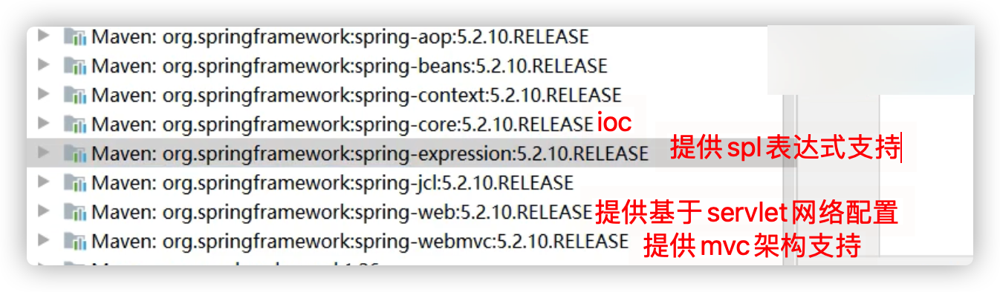

# 三、 Spring底层篇

## 什么是Spring?

Spring:是一个企业级java应用框架，他的作用主要是简化软件的开发以及配置过程，简化项目部署环境。

Spring jar包：

Spring的优点：
1、Spring低侵入设计，对业务代码的污染非常低。（大多基于注解，不需要依赖于spring底层基础的类）
2、Spring的DI机制将对象之间的关系交由框架处理，减少组件的耦合。
3、Spring提供了AOP技术，支持将一些通用的功能进行集中式管理，从而提供更好的复用。（配置安全权限）
4、Spring对于主流框架提供了非常好的支持。

## 谈谈你对IOC和AOP的理解

IOC就是控制反转，指创建对象的控制权转移给Spring来进行管理。简单来说，就是应用不用去new对象了，而全部交由Spring自动生产。
所有的对象只要配置好，在容器启动过程中，就会帮我们把这些对象例化好，把依赖关系给建好，

IOC有三种注入方式：

1、构造器注入

2、setter方法注入

3、根据注解注入。

AOP面向切面。用于将那些与业务无关，但却对多个对象产生影响的公共行为（日志，权限认证）。抽取并封装成一个可重用的模块。AOP的核心就是动态代理。动态代理分为JDK的动态代理和CGLIB动态代理。

## 谈谈你对AOP的理解

系统是由许多不同的组件所组成的，每一个组件各负责一块特定功能。除了实现自身核心功能之外，这些组件还经常承担着额外的职责。例如日志、事务管理和安全这样的非核心服务经常融入到自身具有核心业务逻辑的组件中去。 这些系统服务经常被称为横切关注点，因为它们会跨越系统的多个组件。
当我们需要为分散的对象引入公共行为的时候，OOP（面向对象）则显得无能为力。也就是说，OOP允许你定义从上到下的关系，但并不适合定义从左到右的关系。例如在支付接口写打印日志的代码，订单接口也是。
日志代码往往水平地散布在所有对象层次中，而与它所散布到的对象的核心功能毫无关系。
在OOP设计中，它导致了大量代码的重复，而不利于各个模块的重用。
AOP:将程序中的交叉业务逻辑（比如安全，日志，事务等），封装成一个切面，然后注入到目标对象（具体业务逻辑)中去。AOP可以对某个对象或某些对象的功能进行增强，比如对象中的方法进行增强，可以在执行某个方法前后额外的做一些事情。一个接口里面没有写打印日志逻辑，但是自动拥有打印日志功能。

## 谈谈你对IOC的理解

