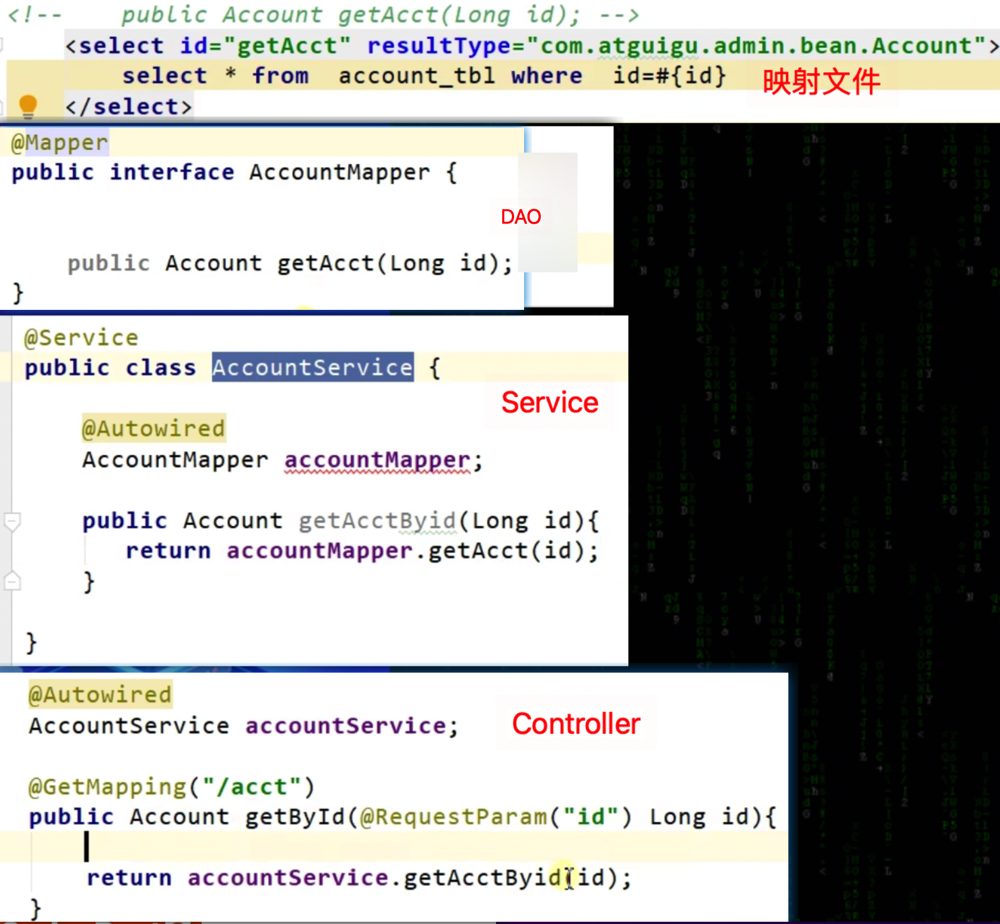

# 4_SpringMVC,SpringBoot

## Spring、SpringMVC、SpringBoot区别

- Spring是一个轻量级的控制反转（IOC）和面向切面（AOP）的**容器框架**。使用依赖注入实现控制反转，降低程序耦合，可以方便整合各种框架，提供AOP机制弥补OOP的代码重复问题、将不同类不同方法中的共同处理逻辑抽取成切面、**
  自动注入给方法执行**，比如日志、异常等。
- **SpringMVC是Spring对web层的解决方案，是Spring的一部分**，提供了一个**总的前端控制器**DispatcherServlet，用来接收http请求，解析请求、处理参数，定义了一套**路由策略**
  （url到Handler处理器的映射）**及适配器执行Handler**（处理请求的方法），将Handler结果使用视图解析技术生成视图展现给前端
- **Springboot是Spring提供的一个快速开发工具包，让程序员能更方便、更快速的开发Spring+SpringMVC应用**
  ，简化了配置（约定了默认配置）；只要引入starter，这个场景的所有常规需要的依赖我们都自动引入；内嵌web服务器Tomcat等

## Spring/SpringMVC/SpringBoot常用注解

- Spring注解:
    - 类上的注解：类是交给Spring容器进行管理，用于**注册Bean**
        - @controller 控制器层
        - @service 业务层（注入dao）
        - @repository 持久层（**实现dao访问**)
        - @component （泛指组件，当组件不好归类的时候）
        - @Bean

    - @Configuration 配置类
    - @ComponentScan 包扫描
    - @Autowired：**依赖注入实体类**
- SpringMVC注解:
    - @RequestParam(“username”) 将请求参数和控制器方法的形参创建映射关系，defaultValue 表示设置默认值，required 通过设置是否是必须要传入的参数，value值表示传入的**参数名**。
    - @RequestMapping ：来映射URL请求，指定控制器可以处理哪些URL请求 @RequestMapping("/test")，可以指定method。
    - @RequestMapping的派生注解
        - 处理get请求的映射-->@GetMapping
        - 处理post请求的映射-->@PostMapping
    - @ResponseBody：将java对象转为json格式的数据，作用在方法上
- springboot注解：
    - @SpringBootApplication：启动类注解
    - @ConfigurationProperties(prefix = "user1")，修饰类，使用配置文件.properties中前缀为user1的属性的值初始化该bean的同名属性

## SpringMVC工作流程（重要）

简单版：

1. 浏览器发送请求，若请求地址符合前端控制器url-pattern，该请求就会被前端控制器DispatcherServlet处理。
2. 前端控制器会读取SpringMVC的核心配置文件，通过扫描组件找到控制器，将请求地址和控制器中**@RequestMapping**注解的value属性值进行匹配，若匹配成功，该注解所标识的控制器方法就是处理请求的方法。
3. 处理请求的方法需要返回一个字符串类型的视图名称，该视图名称会被**视图解析器解析**，加上前缀和后缀组成**视图的路径**，通过Thymeleaf对视图进行渲染，最终转发到视图所对应页面

复杂版：（先不背）

1. 浏览器发送请求，若请求地址符合前端控制器的url-pattern，该请求就会被前端控制器DispatcherServlet处理。
2. DispatcherServlet收到请求调用HandlerMapping**处理器映射器**（维护url到Handler的映射关系）。
3. HandlerMapping，根据 xml 配置、注解，查找遍历找到具体的**处理器Handler**，生成处理器及**处理器拦截器**(如果有则生成)一并返回给 DispatcherServlet。
4. DispatcherServlet遍历所有HandlerAdapter适配器，调用support()判断handler的类型，找到对应的HandlerAdapter。
5. HandlerAdapter，执行拦截器的preHandler()，调用handler即controller方法处理请求，返回 ModelAndView。
6. HandlerAdapter将ModelAndView 返回给 DispatcherServlet，执行拦截器的postHandle()，DispatcherServlet将 ModelAndView
   传给ViewReslover视图解析器，ViewReslover解析后返回具体View。
7. DispatcherServlet 根据 View 进行渲染视图（即将模型数据填充至视图中），渲染视图完毕执行拦截器的afterCompletion()，并将**视图**响应给客户端。

## SpringMVC主要组件

1. DispatcherServlet：**前端控制器**

    - 作用：统一处理请求和响应，整个流程控制的中心，由它调用其它组件处理用户的请求

2. HandlerMapping：**处理器映射器**

    - 作用：根据请求的url、method等信息查找Handler控制器方法

3. Handler：**处理器**，需要工程师开发

    - 作用：对具体的用户请求进行处理，在Controller层中@RequestMapping标注的方法都可以看成是一个Handler。

4. HandlerAdapter：**处理器适配器**

    - 作用：通过HandlerAdapter对Handler处理器（控制器方法）进行执行

5. ViewResolver：**视图解析器**

    - 作用：进行视图解析，得到相应的视图，例如：ThymeleafView、InternalResourceView、RedirectView

   **Handler是工具；HandlerMapping根据需要干的活找到相应的工具；HandlerAdapter是使用工具干活的人。**

## SpringMVC特点

1. **Spring 家族原生产品**，与 IOC 容器等基础设施无缝对接
2. **基于原生的Servlet**，通过了功能强大的**前端控制器DispatcherServlet**，对请求和响应进行统一处理
3. 表述层各细分领域需要解决的问题**全方位覆盖**，提供**全面解决方案**
4. 代码清新简洁**，大幅度提升开发效率**
5. **内部组件化程度高，可插拔式组件**即插即用**，想要什么功能配置相应组件即可**
6. 性能卓著，尤其适合现代大型、超大型互联网项目要求

## RESTful/Rest风格

- RESTful的实现：

    - HTTP 协议里面，四个表示操作方式的动词：GET、POST、PUT、DELETE。
    - 分别对应四种基本操作：GET 用来获取资源，POST 用来新建资源，PUT 用来更新资源，DELETE 用来删除资源。

  REST 风格提倡 URL 地址使用统一的风格设计，从前到后各个单词使用斜杠分开，不使用问号键值对方式携带请求参数，而是将要发送给服务器的数据作为 URL 地址的一部分，以保证整体风格的一致性。

  | 操作     | 传统方式         | REST风格                |
    | -------- | ---------------- | ----------------------- |
  | 查询操作 | getUserById?id=1 | user/1-->get请求方式    |
  | 保存操作 | saveUser         | user-->post请求方式     |
  | 删除操作 | deleteUser?id=1  | user/1-->delete请求方式 |
  | 更新操作 | updateUser       | user-->put请求方式      |

- HiddenHttpMethodFilter

  浏览器只支持发送get和post方式的请求，那么该如何发送put和delete请求呢？

  SpringMVC 提供了 **HiddenHttpMethodFilter** 帮助我们**将 POST 请求转换为 DELETE 或 PUT 请求**

  **HiddenHttpMethodFilter** 处理put和delete请求的条件：

  a>当前请求的请求方式必须为post

  b>当前请求必须传输请求参数/隐藏域 _method

  满足以上条件，**HiddenHttpMethodFilter** 过滤器就会将当前请求的请求方式转换为请求参数_method的值

## HttpMessageConverter

- HttpMessageConverter，报文信息转换器，将请求报文转换为Java对象，或将Java对象转换为响应报文。
- HttpMessageConverter提供了两个注解和两个类型：
    1. @RequestBody：在控制器方法设置一个形参，使用@RequestBody进行标识，当前请求的请求体赋值给注解所标识的形参。
    2. RequestEntity：封装请求报文的一种类型，在控制器方法的形参中设置该类型的形参，当前请求的请求报文就会赋值给该形参，可以通过getHeaders()获取请求头信息，通过getBody()获取请求体信息
    3. @ResponseBody：将该方法的返回值直接作为响应报文的响应体响应到浏览器，导入jackson的依赖，可以将Java对象自动转换为Json格式的字符串响应到浏览器。
    4. ResponseEntity：控制器方法返回ResponseEntity实例，就是响应到浏览器的响应报文。

## 拦截器

- SpringMVC中的拦截器用于**拦截控制器方法**的执行

- SpringMVC中的拦截器需要实现HandlerInterceptor

- SpringMVC中的拦截器有三个抽象方法：

    - preHandle：控制器方法执行之前执行preHandle()，其boolean类型的返回值表示是否拦截或放行，返回true为放行，即调用控制器方法；返回false表示拦截，即不调用控制器方法
    - postHandle：控制器方法执行之后执行postHandle()
    - afterComplation：处理完视图和模型数据，渲染视图完毕之后执行afterComplation()

- 多个拦截器的执行顺序

  a>若每个拦截器的preHandle()都返回true

  此时多个拦截器的执行顺序和拦截器在SpringMVC的配置文件的配置顺序有关：

  ​ preHandle()会按照配置的顺序执行，而postHandle()和afterComplation()会按照配置的反序执行

  b>若某个拦截器的preHandle()返回了false

  preHandle()返回false和它之前的拦截器的preHandle()都会执行，postHandle()都不执行，返回false的拦截器之前的拦截器的afterComplation()会执行

## SpringBoot与数据库交互使用



```java
@Mapper
public interface CityMapper {
  	////注解模式
    @Select("select * from city where id=#{id}")
    public City getById(Long id);
 		//配置.xml
    public void insert(City city);
}
```

## lombok插件

- @Data---帮助生产getset方法
- @ToString---帮助生成ToString方法
- @AllArgsConstructor---生成全参构造器
- @NoArgsConstructor---生成无参构造方法
- @EqualsAndHashCode---生成HashCode方法

---

下面先不背：

## SpringBoot自动配置/装配原理(重要)

@EnableAutoConfiguration：

- @Import + @Configuration + @Bean + 通过Spring spi机制加载
- 自动配置类由各个starter提供，使用@Configuration + @Bean定义配置类，配置类的全路径作为字符串，放到META-INF/Spring.factories
- 使用Spring spi扫描META-INF/Spring.factories下的配置类
- 使用@Import导入**自动配置类**到ioc容器中


上图解读【主要还是背图片以上的文字好了】：

---

- SpringBoot使用就是写一个starter类，加上@SpringBootApplication
- @AutoConfigurationPackage-->@import导入Registrar.class-->将指定目录下的所有组件导入到Spring容器中，将扫描路径注册到全局，给其他组件查询（例如：JPA）。
-
selectlmports方法返回存储在META-INF/Spring.factories文件中的字符串数组，键值对形式，key是EnableAutoConfiguration，value是类的全路径，通过SpringFactoriesLoader.loadFactoryNames这个API（Spring的spi机制），通过反射配合@import，将类路径加载到Spring的IOC容器中，最终会变成Spring的bean。
如果这个bean有@Configuration，里面定义的bean有@Bean注解，则里面的bean也会加载到IOC容器中。
- 修饰的类本身是IOC容器的类，里面每个@Bean都会变成bean对象
- 比如我们使用MyBatis需要配置相关的bean，手动配置通过xml文件bean标签配置。 自动配置，MyBatis提供META-INF/Spring.factories文件，使用@Configuration +
  @Bean定义配置类，将配置类的全路径放在Spring.factories里面，这样Spring就会自动加载Bean

## 理解SpringBoot的Starter

- 以前使用Spring + SpringMVC，如果需要引入mybatis等框架，需要到xml中定义mybatis需要的bean。
-
现在定义一个starter的jar包，写一个@Configuration配置类、将这些bean定义在里面，然后把配置类的全路径放在META-INF/spring.factories中，springboot会按照约定来加载该配置类到IOC容器中。
-
开发人员只需要将相应的starter包依赖进应用，进行相应的属性配置（有的可以使用默认配置），就可以直接进行代码开发，使用对应的功能了，比如mybatis-spring-boot-starter，spring-boot-starter-redis。

## 什么是嵌入式服务器？为什么要使用嵌入式服务器?

Spring+SpringMVC开发时，需要单独在操作系统上部署tomcat中间件，将应用打包成war包，部署到tomcat的webApp目录上。

SpringBoot内置了tomcat.jar，就是嵌入式服务器，运行main方法时会去启动tomcat，并利用tomcat的spi机制加载SpringMVC。只需要安装JVM，就可以直接在上面部署应用程序jar包，直接运行。

使用嵌入式服务器更方便部署。

## SpringBoot如何启动Tomcat

1. 首先，SpringBoot在启动时会先创建一个Spring容器
2. 在创建Spring容器过程中，会利用@ConditionalOnClass判断当前classpath中是否存在Tomcat依赖，如果存在则会生成一个**启动Tomcat的Bean**
3. Spring容器创建完之后，就会获取启动Tomcat的Bean,并创建Tomcat对象，并**绑定端口**等，然后启动Tomcat
