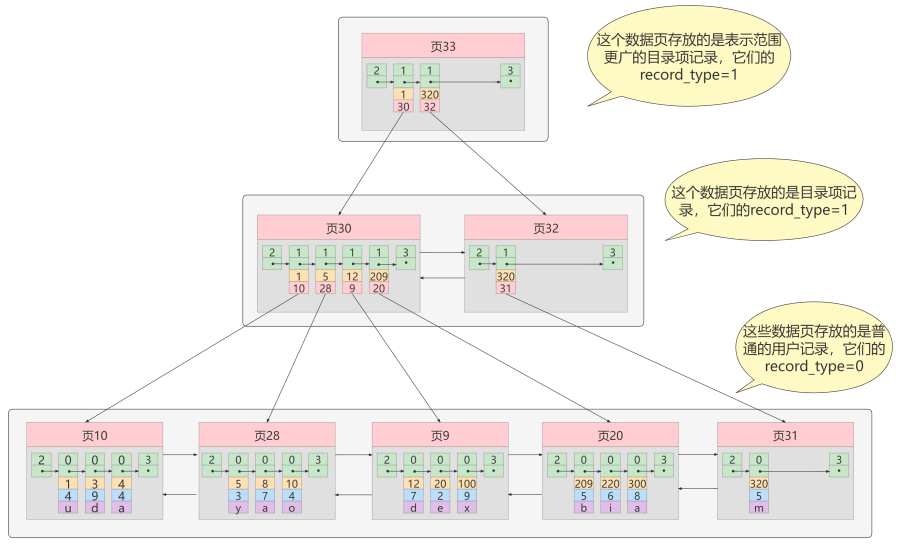
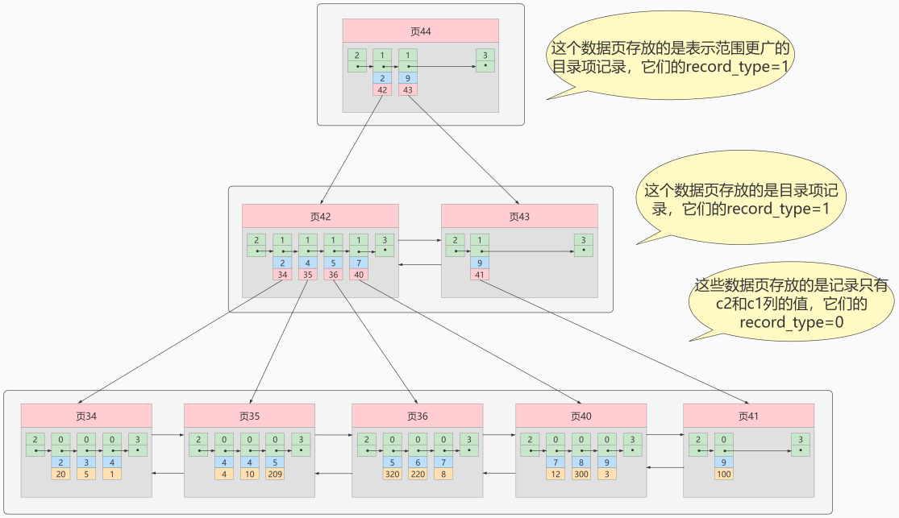
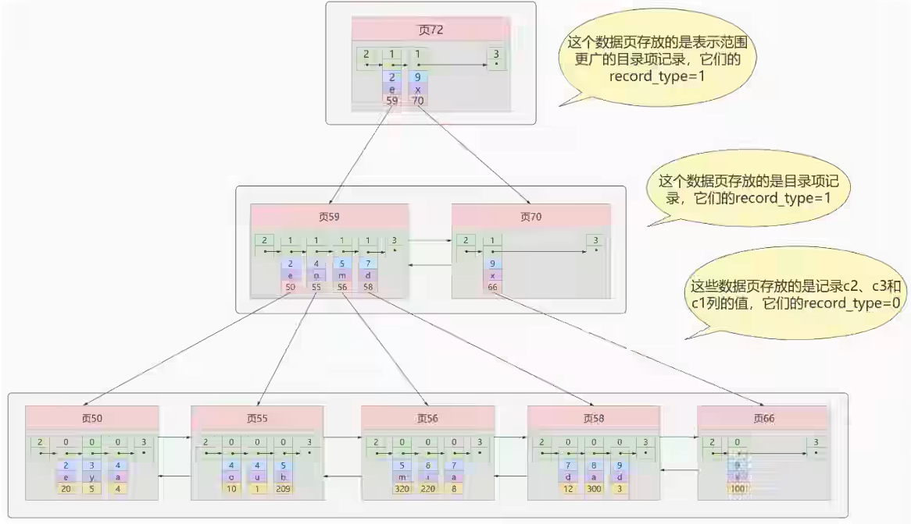
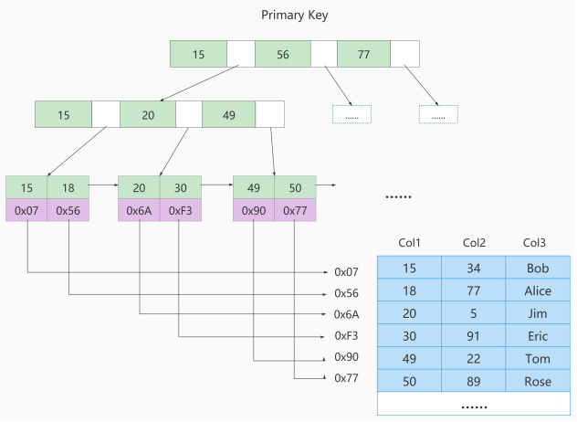
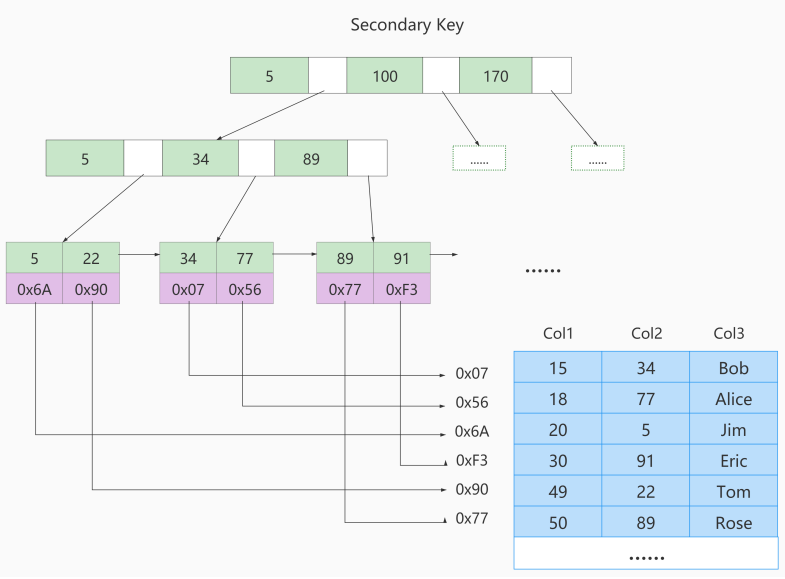
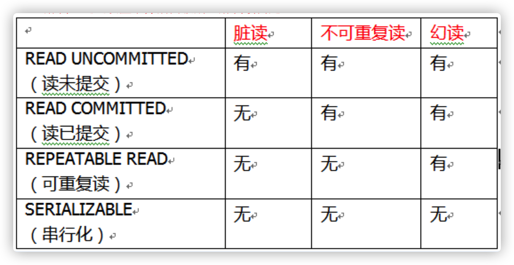
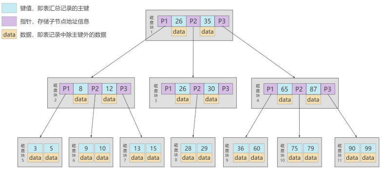
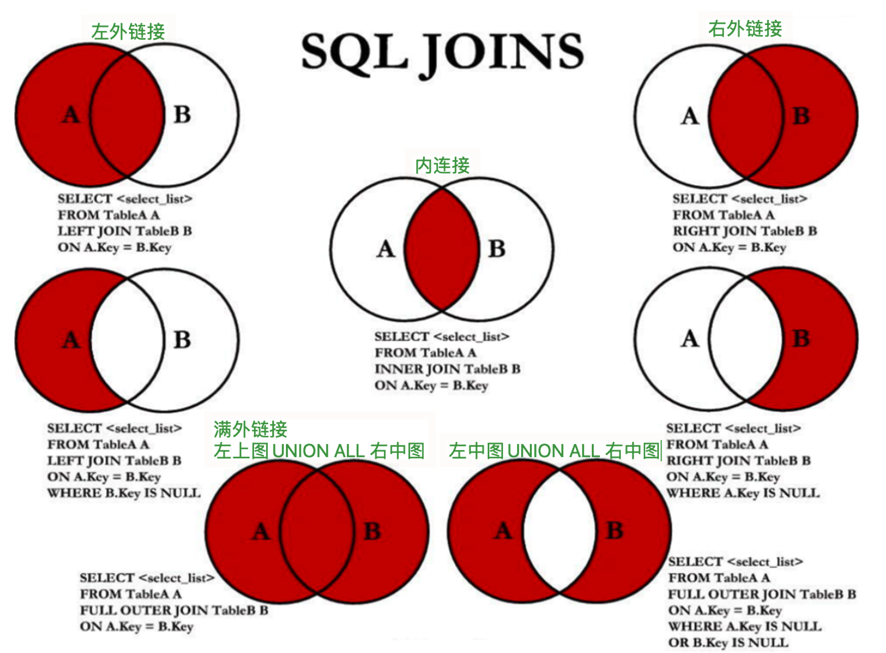
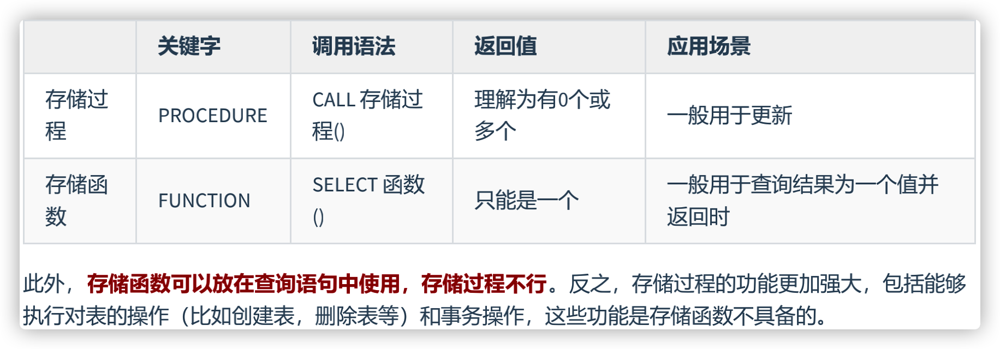

#   MySQL

## MySQL是什么

MySQL是一个开源的**关系型数据库管理系统**，可以定制。

> DBMS:数据库管理系统(Database Management System)

## 关系型数据库与非关系型数据库

关系型数据库(RDBMS)：

- 关系型数据库以 行(row) 和 列(column) 的形式存储数据，行和列组成 表(table) ，多个表组成了库(database)。
- 表与表之间的数据有关系(relationship)。
- 关系型数据库绝对是 DBMS 的主流，使用最多 Oracle、 MySQL 和 SQL Server。
- **优势**
  - 可以用SQL语句进行复杂的单表查询、多表查询。
  - 支持事务， 能够更安全实现数据访问。

非关系型数据库(非RDBMS) ：

- **非关系型数据库**，基于键值对存储数据，不需要经过SQL层的解析， 性能非常高 。
- NoSQL 泛指非关系型数据库

## 表的关联关系

- 一对一关联：在实际的开发中应用不多，因为一对一可以创建成一张表。
  - 基础信息表 （常用信息）：学号、姓名、手机号码、班级、系别
  - 档案信息表 （不常用信息）：学号、身份证号码、家庭住址、籍贯、紧急联系人、...
- 一对多关联：客户表和订单表
- 多对多关联：要表示多对多关系，必须创建第三个表，该表通常称为 联接表 ，它将多对多关系划分为两个一对多关系。**将这两个表的主键都插入到第三个表中。**
  “订单”表和“产品”表有一种多对多的关系，这种关系是通过与订单表建立两个一对多关系来定义的。
- **自我引用**：员工表，员工姓名，部门编号， 主管编号。

## 索引的基本原理

- 索引（Index）是帮助MySQL高效获取数据的数据结构。如果没有索引，一般来说执行查询时遍历整张表。
- 索引的原理：就是**把无序的数据变成有序的查询**

## InnoDB中索引怎么实现的







- 说的时候从下往上，实际从上往下

- 使用 **Compact** 行格式来实际存储记录：

  1. record_type ：表示记录的类型， 0普通记录、1目录项记录、 2最小记录、 3最大记录
  2. next_record：表示记录的下一条记录
  3. 记录的列值

- 聚簇索引：是**一种数据存储方式**（所有的用户记录都存储在叶子结点），`索引即数据，数据即索引`。

  1. 不需要在MySQL语句中显式使用INDEX语句创建， `InnDB` 存储引擎会 `自动` 创建聚簇索引。
2. 按照主键值的大小 进行**页内的记录和页的排序**
  3. 记录之间单向链表、数据页之间双向链表

  - **特点：**

    **优点：**

    1. 数据访问更快 ，聚簇索引将索引和数据保存在同一个B+树中
  2. 用聚簇索进行主键的排序查找 和 范围查找，速度快 
    3. 按照聚簇索引排列顺序，查询显示一定范围数据的时候，由于数据都是紧密相连，数据库不用从多个数据块中提取数据，节省了大量io操作 。

    **缺点：**

    1. 插入速度严重依赖于插入顺序，按照自增的主键的顺序插入是最快的方式，否则将会出现**页分裂**，严重影响性能
    2. 更新主键代价高 ，会导致被更新的行移动。InnoDB表，我们一般定义**主键为不可更新**
    3. 二级索引访问需要两次索引查找，第一次找到主键值，第二次根据主键值找到行数据

- 非聚簇索引（包括联合索引）非聚集索引、二级索引、辅助索引：

  1. **按照选取列值的大小 进行页内的记录和页的排序**
  2. B+树的叶子节点存储的不是完整的用户记录，只是选取列+主键这两个列的值。
  3. 目录项记录 选取列的值+页号。
  4. （回表）查找必须根据主键值去聚簇索引中再查找一遍完整的用户记录。

- 聚簇索引与非聚簇索引：

  1. 聚簇索引的叶子节点存储所有数据记录, 非聚簇索引的叶子节点存储 列+主键。
  1. 非聚簇索引不会影响数据表的物理存储顺序。
  2. 一个表只能有一个聚簇索引，可以有多个非聚簇索引，多个索引目录提供数据检索。
  3. 排序查找、范围查找使用聚簇索引，查询效率高，不需要回表；插入，删除，更新，非聚簇索引效率高。
  3. 聚簇索引维护昂贵，尤其是插入新行或主键更新，容易导致分页。

- 联合索引：在c2，c3列建立联合索引

  - 同时为多个列建立索引，各条记录先按照c2列的值进行排序，如果记录的c2列相同，则按照c3列的值进行排序
  - B+树叶子节点处的用户记录由c2、c3和主键c1列组成

## mysql存储引擎

- InnoDB（MySQL的默认存储引擎）主键索引一定是聚簇索引。
- MyISM（MySQL5.5之前的默认存储引擎）主键索引使用非聚簇索引。

如果涉及到**大数据量的排序、全表扫描、count等操作**，MyISAM占优势些，因为**索引所占空间小**，叶子节点不存储所有数据。

## MyISAM中索引怎么实现的





- MyISAM将索引和数据分开存储：
  将表中的记录按照记录的插入顺序单独存储在**数据文件**。这个文件并不划分为若干个数据页。
  由于在插入数据时没有按照主键大小排序，所以不能在这些数据上使用二分法进行查找。
- 使用MyISAM存储引擎的表会把索引信息存储到**索引文件**中。MyISAM会单独为表的主键创建一个索引，只不过在索引的叶子节点中存储的不是完整的用户记录，而是主键值/指定列值+数据记录地址的组合。
- 在MylSAM中，主键索引和二级索引在结构上没有区别，只是主键索引要求key唯一，而二级索引的key可以重复。

## 索引设计的原则与禁忌

查询更快、占用空间更小

适合建立索引：

1. 字段的数值有唯一性的限制
2. 频繁作为 WHERE 查询条件的字段
3. 经常 GROUP BY 和 ORDER BY 的列（两个都有考虑组合索引）
4. DISTINCT 字段需要创建索引（确定范围）
5. 使用列的类型小的创建索引（一个数据页记录更多）
6. 使用字符串前缀创建索引（一个数据页记录更多）
7. 区分度高(散列性高)的列适合作为索引
8. 使用最频繁的列放到联合索引的左侧（"最左前缀原则"，增加联合索引的使用率）
9. 在多个字段都要创建索引的情况下，联合索引优于单值索引

不适合建立索引：

1. 在where中使用不到的字段，不要设置索引
2. 数据量小的表最好不要使用索引
3. 有大量重复数据的列上不要建立索引（性别）
4. 避免对经常更新的表创建过多的索引
5. 不建议用无序的值作为索引
6. 删除不再使用或者很少使用的索引
7. 不要定义夯余或重复的索引

## 8_简述MyISAM和InnoDB(最多)的区别

1. InnoDB支持事务，支持表级锁、行级锁，支持外键；
   MyISAM不支持事务，但是每次查询都是原子的，支持表级锁，即每次操作是对整个表加锁；
2. InnoDB主键索引采用聚簇索引；
   MyISAM主键索引采用非聚簇索引
3. InnoDb不存储总行数；
   MyISAM存储表的总行数
4. InnoDB支持XA事务（可以手动控制回滚与提交）
5. InnoDB支持savePoints（部分回滚机制）

**MyISAM的索引方式都是“非聚簇”的，InnoDB包含1个聚簇索引。小结两种引擎中索引的区别：**

① 在InnoDB存储引擎中，我们只需要根据主键值对 聚簇索引 进行一次查找就能找到对应的记录，而在 MyISAM 中却需要进行一次 回表 操作，意味着MyISAM中建立的索引相当于全部都是 二级索引 。

 ② InnoDB的数据文件本身就是索引文件，而MyISAM索引文件和数据文件是 分离的 ，索引文件仅保存数 据记录的地址。

 ③ InnoDB的非聚簇索引data域存储相应记录 主键的值 ，而MyISAM索引记录的是 地址 。换句话说， InnoDB的所有非聚簇索引都引用主键作为data域。

 ④ MyISAM的回表操作是十分 快速 的，因为是拿着地址偏移量直接到文件中取数据的，反观InnoDB是通 过获取主键之后再去聚簇索引里找记录，虽然说也不慢，但还是比不上直接用地址去访问。 

⑤ InnoDB要求表 必须有主键 （ MyISAM可以没有 ）。如果没有显式指定，则MySQL系统会自动选择一个 可以非空且唯一标识数据记录的列作为主键。如果不存在这种列，则MySQL自动为InnoDB表生成一个隐 含字段作为主键，这个字段长度为6个字节，类型为长整型。

## 9_关心过业务系统里面的sql耗时吗？统计过慢查询吗？对慢查询都怎么优化过？

- 在业务系统中，除了使用主键进行的查询，其他的都会在测试库上测试其耗时，慢查询的统计主要由运维在做，会定期将业务中的慢查询反馈给我们。
- 优化
  - 检查是否走了索引，如果没有则利用索引
  - 可能是加载了许多结果中并不需要的列，查了多余的列就去掉。
  - 分析语句的**执行计划**，获得使用索引的情况，修改语句使得尽可能命中索引。
  - 考虑表中的数据量是否太大，如果是的话可以进行横向或者纵向的分表。

## 10_事务的基本特性/事务等状态和隔离级别

事务基本特性ACID分别是：

- **原子性**(Atomicity)：事务是一个不可分割的工作单位，事务中的操作要么全部成功，要么全部失败。
- **一致性**(Consistency)：数据从一个 `合法性状态` 变换到另外一个 `合法性状态` 。这种状态是 `语义上` 的而不是语法上的，跟具体的业务有关。比如A转账给B100块钱，假设A只有90块，事务不能成功。数据的一致性，转账前和转账后，从前面数据状态变为后面数据状态，不能对不上数。
- **隔离性**(Isolation)：一个事务内部的操作及使用的数据对`并发`的其他事务是隔离的，并发执行的各个事务之间不能相互干扰。
- **持久性**(Durability)一旦事务提交，所做的修改就会永久保存到数据库中。
- 原子性是基础，隔离性是手段，一致性是约束条件， 而持久性是我们的目的。

隔离性有4个隔离级别，分别是：随着隔离级别的增高，并发性能降低



- **读未提交**(read uncommit)，所有事务都可以看到其他未提交事务的执行结果。不能避免脏读、不可重复读、幻读。 
- **读已提交**(read commit)（oracle默认）只能读取已提交的事务。可以避免脏读，但不可 重复读、幻读问题仍然存在。 
- **可重复复读**(repeatable read) （mysql的默认），事务A在读到一条数据之后，此时事务B对该数据进行了修改并提 交，那么事务A再读该数据，读到的还是原来的内容。可以避免脏读、不可重复读，但幻读问题仍然存在。
- **串行**(serializable)，在这个事务持续期间，禁止 其他事务对该表执行插入、更新和删除操作。所有的并发问题都可以避免，但性能十分低下。

按照严重性来排一下序：脏写 > 脏读 > 不可重复读 > 幻读

- **脏写**(Dirty Write)，事务Session A `修改了` 另一个 `未提交` 事务Session B `修改过` 的数据
- **脏读**(Drity Read)，Session A `读取` 了已经被 Session B `更新` 但还 `没有被提交` 的字段。 之后若 Session B `回滚` ，Session A `读取 `的内容就是 `临时且无效` 的。
- **不可重复读**(Non-repeatable read)，Session A `读取`了一个字段，然后 Session B `更新`了该字段。 之后 Session A `再次读取` 同一个字段， `值就不同` 了。
- **幻读**(Phantom Read)，Session A 从一个表中 `读取` 了一个字段, 然后 Session B 在该表中插 入了一些新的行。 之后, 如果 Session A `再次读取` 同一个表, 就会多出几行。

## 11_InnoDB是如何实现事务的

以一个update语句为例：

1. InnoDB在收到一个update语句后，会先根据条件找到数据所在的页，并将该页缓存在BufferPool中
2. 执行update语句，修改BufferPool中的数据，也就是内存中的数据
3. 针对update语句生成一个RedoLog对象，并存入LogBuffer中
4. 针对update语句生成UndoLog对象，用于事务回滚
5. 如果事务提交，那么则把**存在LogBuffer的RedoLog对象进行持久化**，后续还有其他机制将BufferPool中所修改的数据页持久化到磁盘中
6. 如果事务回滚，则利用UndoLog日志进行回滚

## 12_B树和B+树的区别，为什么MySQL使用B+树

- B树的特点：
  1. 节点排序
  2. 一个节点了可以存多个元素，多个元素也排序了
- B+树的特点：
  1. 拥有B树的特点
  2. 叶子节点之间有指针，mysql范围查找通过指针找到前后节点的数据
  3. 非叶子节点存储索引数据。
- MySQL索引使用的是B+树，因为索引是用来加快查询，而B+树通过对数据进行排序所以是可以提高查询速度的，然后通过一个节点中可以存储多个元素，从而可以使得：
  - B+树的高度不会太高。
  - 可以很好的支持**全表扫描**，范围查找等SQL语句。

- B树：



**B+ 树和 B 树的差异在于以下几点：**

1. 有 k 个孩子的节点就有 k 个关键字。也就是孩子数量 = 关键字数，而 B 树中，孩子数量 = 关键字数 +1。
2. 非叶子节点仅用于索引，不保存数据记录，跟记录有关的信息都放在叶子节点中。而 B 树中， 非 叶子节点既保存索引，也保存数据记录 。 
3. B+所有关键字都在叶子节点出现，叶子节点构成一个有序链表，而且叶子节点本身按照关键字的大 小从小到大顺序链接。

为什么说B+树比B-树更适合实际应用中操作系统的文件索引和数据库索引？

1、B+树的磁盘读写代价更低
B+树的内部结点并没有指向关键字具体信息的指针。因此其内部结点相对B树更小。如果把所有同一内部结
点的关键字存放在同一盘块中，那么盘块所能容纳的关键字数量也越多。一次性读入内存中的需要查找的关
键字也就越多。相对来说O读写次数也就降低了。
2、B+树的查询效率更加稳定
由于非终结点并不是最终指向文件内容的结点，而只是叶子结点中关键字的索引。所以任何关键字的查找必 须走一条从根结点到叶子结点的路。所有关键字查询的路径长度相同，导致每一个数据的查询效率相当。

## 13_Mysql锁有哪些，如何理解

- 按锁粒度分类：
  1. 行锁：锁某行数据，锁粒度最小，并发度高
  2. 表锁：锁整张表，锁粒度最大，并发度低
  3. 间隙锁：锁的是一个区间，某一行数据与某一行数据之间的间隙
- 还可以分为：
  1. 共享锁：也就是读锁，一个事务给某行数据加了读锁，该事务可以读，不能写；其他事务加共享锁可以读，不能写。
  2. 排它锁：也就是写锁，一个事务给某行数据加了写锁，该事务可以读、写；其他事务不能读、写。
- 还可以分为：
  1. 乐观锁：并不会真正的去锁某行记录。在更新的时候会判断一下在此期间别人有没有去更新这个数据，可以使用版本号等机制。乐观锁适用于多读的应用类型，这样可以提高吞吐量。
  2. 悲观锁：上面所的锁都是悲观锁

## 14_简述MySQL中索引类型及对数据库的性能的影响

- 普通索引：允许被索引的**数据列**包含重复的值。
- 唯一索引：保证数据记录的唯一性。
- 主键：是特殊的唯一索引，在一张表中只能定义一个主键索引，用于**唯一标识一条记录**，使用关键字PRIMARY KEY。
- **联合索引**：索引可以覆盖多个数据列，如像INDEX(columnA,columnB)索引。
- 全文索引：比如文章找词，但是一般不用，用ES技术，建立**倒排索引**，可以极大的提升检索效率，解决判断**字段是否包含**的问题，是目前搜索引擎使用的一 种关键技术。

索引对数据库的影响：

- 优点：
  - 索引可以极大的提高数据的查询速度。
  - 通过使用索引，可以在查询的过程中，使用**优化隐藏器**，提高**系统的性能**。
- 缺点：
  - 会降低插入、删除、更新表的速度，因为在执行这些写操作时，还要操作索引文件
  - 索引需要占物理空间，如果要建立聚簇索引，那么需要的空间就会更大，如果非聚簇索引很多，一旦聚簇索引改变，那么所有非聚簇索引都会跟着变。

## 索引类型

- 普通索引、唯一性索引、主键索引、单列索引、多列索引、全文索引
- 唯一性约束、主键约束自动添加对应索引，添加唯一性索引、主键索引添加对应约束；删除索引或约束，另一方也删除，两者捆绑式。

## 索引失效

用不用索引，最终都是优化器说了算。

1. 全值匹配，用覆盖更全的索引（多个AND查询，用联合索引覆盖更多的）
2. 最佳左前缀法则，即最左优先，对于多列索引，**过滤条件要使用索引必须按照索引建立时的顺序，依次满足，一旦跳过某个字段，索引后面的字段都无法被使用**。如果查询条件中没有用这些字段中第一个字段时，多列（或联合）索引不会被使用。
3. 计算、函数、类型转换(自动或手动)导致索引失效
4. 范围条件右边的列索引失效，age,name,classId建立联合索引，会用到范围查找的字段放在最右边，classId放在最右边
5. 不等于(!= 或者<>)索引失效
6.  is null可以使用索引，is not null无法使用索引
7. like以通配符%开头索引失效，只有'%'不在第一个位置，索引才会起作用。
8. OR 前后存在非索引的列，索引失效，只要有条件列没有进行索引，就会进行`全表扫描`，因此所以的条件列也会失效。

**一般性建议**

- 对于单列索引，尽量选择针对当前query过滤性更好的索引
- 在选择组合索引的时候，当前query中过滤性最好的字段在索引字段顺序中，位置越靠前越好。
- 在选择组合索引的时候，尽量选择能够当前query中where子句中更多的索引。
- 在选择组合索引的时候，如果某个字段可能出现范围查询时，尽量把这个字段放在索引次序的最后面。

----

## sql语句整理

### 书写规范

- **字符串型**和**日期时间**类型的数据可以使用**单引号**（' '）表示
- 列的别名，尽量使用双引号（" "），而且不建议省略as 
- 每条命令以 ; （navicat）或 \g 或 \G 结束（terminal）
- **推荐采用统一的书写规范：**
  - 数据库名、表名、表别名、字段名、字段别名等都小写
  - SQL 关键字、函数名、绑定变量等都大写

### 常用sql关键词

```sql
-- 列的别名
-- 列的别名不能在WHERE中使用。

-- AS
SELECT employee_id emp_id,
last_name AS lname,
department_id "部门id",
salary * 12 AS "annual sal"
FROM employees;

-- 去除重复行
SELECT DISTINCT department_id 
FROM employees;

-- 排序
-- 如果没有使用排序操作，默认情况下查询返回的数据是按照添加数据的顺序显示的。
#练习：显示员工信息，按照department_id的降序排列，salary的升序排列
-- 默认按照升序排列。
SELECT employee_id,salary,department_id
FROM employees
ORDER BY department_id DESC,salary ASC;

-- 分页
-- LIMIT [位置偏移量,] 行数
-- 前10条记录： 
SELECT * FROM 表名 LIMIT 0,10; 
-- （当前页数-1）* 每页条数，每页条数
LIMIT(PageNo - 1)*PageSize,PageSize;
# 需求2：每页显示20条记录，此时显示第2页
SELECT employee_id,last_name
FROM employees
LIMIT 20,20;

-- sql基本关键词顺序
-- LIMIT 子句必须放在整个SELECT语句的最后！
SELECT employee_id,last_name,salary
FROM employees
WHERE salary > 6000
ORDER BY salary DESC
#limit 0,10;
LIMIT 10;

SELECT (DISTINCT)....,....,....(存在聚合函数)
FROM ... (LEFT / RIGHT)JOIN ....ON 多表的连接条件 
(LEFT / RIGHT)JOIN ... ON .... （习惯上把数据多的放在左边，一般就是左外）
WHERE 不包含聚合函数的过滤条件
GROUP BY ...,....
HAVING 包含聚合函数的过滤条件
ORDER BY ....,...(ASC / DESC )
LIMIT ...,....

#SQL语句的执行过程：
#FROM ...,...-> ON -> (LEFT/RIGNT  JOIN) -> WHERE -> GROUP BY -> HAVING -> SELECT -> DISTINCT -> 
# ORDER BY -> LIMIT
```

### 多表查询

```sql
-- 多表查询
-- 多表查询的分类
/*
等值连接vs非等值连接
自连接vs非自连接
内连接vs外连接
*/
#自连接的例子：
#练习：查询员工id,员工姓名及其管理者的id和姓名
SELECT emp.employee_id,emp.last_name,mgr.employee_id,mgr.last_name
FROM employees emp ,employees mgr
WHERE emp.`manager_id` = mgr.`employee_id`;

-- (LEFT)JOIN ...ON
-- 超过三个表禁止join。需要 join 的字段，数据类型保持绝对一致；多表关联查询时， 保证被关联的字段需要有索引。
#内连接：
-- 连续使用
SELECT last_name,department_name,city
FROM employees e JOIN departments d
ON e.`department_id` = d.`department_id`
JOIN locations l
ON d.`location_id` = l.`location_id`;
-- 左/右外连接
SELECT last_name,department_name
FROM employees e LEFT JOIN departments d
ON e.`department_id` = d.`department_id`;

#满外连接：mysql不支持FULL OUTER JOIN

-- UNION关键字，给多条SELECT语句，并将它们的结果组合成单个结果集。合并时，两个表对应的列数和数据类型必须相同，并且相互对应。
-- UNION 返回两个查询的结果集的并集，去除重复记录
-- UNION ALL 返回两个查询的结果集的并集。对于两个结果集的重复部分，不去重。
# 左下图：满外连接
# 方式1：左上图 UNION ALL 右中图
SELECT employee_id,department_name
FROM employees e LEFT JOIN departments d
ON e.`department_id` = d.`department_id`
UNION ALL
SELECT employee_id,department_name
FROM employees e RIGHT JOIN departments d
ON e.`department_id` = d.`department_id`
WHERE e.`department_id` IS NULL;
```



### 运算符

```sql
-- 所有运算符或列值遇到null值，运算的结果都为null

-- 比较运算符
-- 比较的结果为真则返回1，比较的结果为假则返回0，其他情况则返回NULL。
-- 数字用符号 字段用关键字

-- 等于运算符 一个等号 =
-- 安全等于运算符（<=>）可以用来对NULL进行判断。在两个操作数均为NULL时，其返回值为1，而不为NULL；当一个操作数为NULL时，其返回值为0，而不为NULL。

BETWEEN运算符使用的格式通常为 WHERE C (NOT) BETWEEN A AND B，此时，当C大于或等于A，并且C小于或等于B时，结果为1，否则结果为0。 

-- IN运算符
-- 给定的值是否是IN列表中的一个值，如果是则返回1，否则返回0。如果给定的值为NULL则结果为NULL。 
WHERE department_id (NOT) IN (NULL,10,20,30);

-- LIKE运算符主要用来匹配字符串，通常用于模糊匹配，如果满足条件则返回1，否则返回0。
/*
通配符
“%”：不确定个数的字符0个或多个字符。 
“_”：只能匹配一个字符。
*/
#练习：查询第3个字符是'a'的员工信息
WHERE last_name LIKE '__a%';
------------------------------------------------------------------------------------------------------
-- 逻辑运算符
逻辑非（NOT或!）运算符表示当给定的值为0时返回1；当给定的值为非0值时返回0；当给定的值为NULL时，返回NULL。 
逻辑与（AND或&&）运算符是当给定的所有值均为非0值，并且都不为NULL时，返回1；当给定的一个值或者多个值为0时则返回0；否则返回NULL。 
逻辑或（OR或||）运算符是当给定的值都不为NULL，并且任何一个值为非0值时，则返回1，否则返回0；
当一个值为NULL，并且另一个值为非0值时，返回1，否则返回NULL；当两个值都为NULL时，返回NULL。 
```

### 函数

```sql
-- 函数
/*
内置函数分为两类： 单行函数 、 聚合函数（或分组函数）
单行函数：每行返回一个结果，可以嵌套
聚合函数：输入的是一组数据的集合，输出的是单个值，不能嵌套调用

字符串函数（单行函数）
- MySQL里面，字段名下数据的查询不分大小写，即使查询条件是字段名下数据的小写，大写的数据也会查询出来
- MySQL里面，字符串的角标从1开始

IF(value,value1,value2)如果value的值为TRUE，返回value1，否则返回value2 
IFNULL(value1, value2)如果value1不为NULL，返回value1，否则返回value2
*/

-- 聚合函数一般要起别名
AVG / SUM ：只适用于数值类型的字段（或变量）,不能用于日期，字符串
MAX / MIN :适用于任意数据类型

SELECT MAX(salary) max_sal ,MIN(salary) mim_sal,AVG(salary) avg_sal,SUM(salary) sum_sal
FROM employees;

/*
COUNT 计算指定字段在查询结构中出现的个数
count(*)会统计值为 NULL 的行，而 count(列名)不会统计此列为 NULL 值的行。
*/
#需求：查询公司中平均奖金率
SELECT SUM(commission_pct) / COUNT(IFNULL(commission_pct,0)),
FROM employees;

-- GROUP BY 的使用
#需求：查询各个部门的平均工资，最高工资
SELECT department_id,AVG(salary),SUM(salary)
FROM employees
GROUP BY department_id

#HAVING的使用 (作用：用来过滤数据的)
#要求1：如果过滤条件中使用了聚合函数，则必须使用HAVING来替换WHERE。否则，报错。
#要求2：HAVING 必须声明在 GROUP BY 的后面。

#练习：查询各个部门中最高工资比10000高的部门信息
SELECT department_id,MAX(salary)
FROM employees
GROUP BY department_id
HAVING MAX(salary) > 10000;
```

### 子查询

```sql
-- 子查询
-- 外查询（或主查询）、内查询（或子查询）
/*
- 子查询（内查询）在主查询之前一次执行完成。
- 子查询的结果被主查询（外查询）使用 。
- 注意事项
  - 子查询要包含在括号内
  - 将子查询放在 比较条件 的右侧
  WHERE比较的就是子查询里面SELECT的内容
  
  子查询中的空值问题，不返回任何行
  */
  
 -- 单行子查询，内查询返回单行
 -- 单行操作符下的子查询
#需求：谁的工资比Abel的高？
#方式3：子查询
SELECT last_name,salary
FROM employees
WHERE salary > (
		SELECT salary
		FROM employees
		WHERE last_name = 'Abel'
		);

-- HAVING中的子查询
HAVING MIN(salary) > (SELECT MIN(salary)   …… );

-- 多行子查询，内查询返回多行，使用多行比较操作符（IN，ANY，ALL）
WHERE  salary IN
                (SELECT   MIN(salary)
                 FROM     employees
                 GROUP BY department_id); 
                 
WHERE job_id <> 'IT_PROG'
AND salary < ANY/ALL (
		SELECT salary
		FROM employees
		WHERE job_id = 'IT_PROG'
		);
		
-- 相关子查询
-- 外部送到子查询一条记录，子查询处理过后与比较操作符比较，为真返回1保留，为假返回0不保留
#题目：查询员工中工资大于本部门平均工资的员工的last_name,salary和其department_id
#方式1：使用相关子查询
SELECT last_name,salary,department_id
FROM employees e1
WHERE salary > (
		SELECT AVG(salary)
		FROM employees e2
		WHERE department_id = e1.`department_id`
		);
		
-- EXISTS 与 NOT EXISTS关键字
-- EXISTS关键字表示如果存在某种条件，则返回TRUE，否则返回FALSE。
#方式3：使用EXISTS（能用IN的考虑使用EXISTS，能用NOT IN的考虑使用NOT EXISTS）
SELECT employee_id,last_name,job_id,department_id
FROM employees e1
WHERE EXISTS (
				 -- SELECT *表示送出一条结果
	       SELECT *
	       FROM employees e2
	       WHERE e1.`employee_id` = e2.`manager_id`
	     );
```

### 事务提交与回滚

```sql
START TRANSACTION 或者 BEGIN ，作用是显式开启一个事务。（不论自动提交设置）
COMMIT 和 ROLLBACK
# COMMIT:提交数据。一旦执行COMMIT，则数据就被永久的保存在了数据库中，意味着数据不可以回滚。
# ROLLBACK:回滚数据。一旦执行ROLLBACK,则可以实现数据的回滚。回滚到最近的一次COMMIT之后。

① DDL（数据定义语言，CREATE 、 DROP 、 ALTER）的操作一旦执行成功，就不可回滚。指令SET autocommit = FALSE 对DDL操作失效。(因为在执行完DDL操作之后，一定会执行一次COMMIT。而此COMMIT操作不受SET autocommit = FALSE影响的。)
  DDL操作要么成功要么回滚，DDL的原子化
② DML（数据操作语言，INSERT 、 DELETE 、 UPDATE 、 SELECT）的操作默认情况，一旦执行，也是不可回滚的。但是，如果在执行DML之前，执行了 SET autocommit = FALSE，则执行的DML操作就可以实现回滚。


```

### 增删改

```sql
-- 数据处理之增删改
#1. 添加数据
INSERT INTO emp1(id,NAME,salary)
VALUES
(4,'Jim',5000),
(5,'张俊杰',5500);

#将查询结果插入到表中
INSERT INTO emp1(id,NAME,salary,hire_date)
SELECT employee_id,last_name,salary,hire_date FROM ……

#2. 更新数据 （或修改数据）
# UPDATE .... SET .... WHERE ...
UPDATE emp1
SET hire_date = CURDATE(),salary = 6000
WHERE id = 4;

#3. 删除数据 DELETE FROM .... WHERE....
DELETE FROM emp1
WHERE id = 1;
```

### 数据类型

```sql
整形常用 INT
其他数值常用 DECIMAL 定点数类型，因为浮点类型有误差
简短 或 固定长度用CHAR，其他VARCHAR
```

### 约束

```sql
约束
① not null (非空约束)【单列】
② unique  (唯一性约束，允许出现多个空值：null，自动在该字段添加唯一索引)【可多列组合值唯一】
③ primary key (主键约束，唯一约束+非空约束，一定只要有一个主键约束，主键名PRIMARY，不要修改主键字段的值)【可多列复合主键】
④ foreign key (外键约束) (非空且唯一，必须引用/参考主表的主键或唯一约束的列)限定某个表的某个字段的引用完整性。
比如：员工表的员工所在部门的选择，必须在部门表能找到对应的部分。主表（父表）：被引用的表，被参考的表。
当创建外键约束时，系统默认会在所在的列上建立对应的普通索引，删除外键约束后，必须手动删除对应的索引。
约束关系是针对主从表双方的。
外键约束有约束等级，最好是采用:     
FOREIGN KEY (deptid) REFERENCES dept(did)  ON UPDATE CASCADE ON DELETE SET NULL
⑤ default (默认值约束)

自增列 auto_increment
某个字段的值自增，默认从1开始（包括1），一个表最多只能有一个自增长列；
自增长列约束的列必须是键列（主键列，唯一键列）；
自增约束的列的数据类型必须是整数类型。
```

### 视图

```sql
-- 视图
① 视图，可以看做是一个虚拟表，本身是不存储数据的。
视图的本质，就可以看做是存储起来的 SELECT 语句
② 视图中 SELECT 语句中涉及到的表，称为基表
③ 针对视图做DML操作，会影响到对应的基表中的数据,反之亦然。对视图数据的更改，都是通过对实际数据表里数据的操作来完成的，一般不通过视图更改数据。
④ 视图本身的删除，不会导致基表中数据的删除。
⑤ 视图的应用场景：针对于小型项目，不推荐使用视图。针对于大型项目，可以考虑使用视图。
⑥ 视图的优点：简化查询; 控制数据的访问；
缺点：数据表结构改变，维护不方便，加之嵌套视图

#针对于多表
CREATE OR REPLACE VIEW vu_emp_dept
AS
SELECT e.employee_id,e.department_id,d.department_name
FROM emps e JOIN depts d
ON e.`department_id` = d.`department_id`;
-- 当我们创建好一张视图之后，还可以在它的基础上继续创建视图。
#删除视图
DROP VIEW IF EXISTS vu_emp2,vu_emp3;
```

### 存储过程、存储函数



```sql
-- 存储过程
存储过程预先存储在 MySQL 服务器上，需要执行的时候，客户端只需要向服务器端发出调用存储过程的命令，服务器端就可以把预先存储好的这一系列 SQL 语句全部执行。
阿里【强制】禁止使用存储过程，存储过程难以调试和扩展，更没有移植性。

DELIMITER $
CREATE PROCEDURE 存储过程名(IN|OUT|INOUT 参数名 参数类型,...)
[characteristics ...]
BEGIN
sql语句1;
sql语句2; 
END $
DELIMITER ;

INOUT ：当前参数既可以为输入参数，也可以为输出参数。
characteristics 表示创建存储过程时指定的对存储过程的约束条件
BEGIN… END： BEGIN… END 中间包含了多个语句，每个语句都以（;）号为结束符。 
SET：赋值语句，用于对变量进行赋值。 
SELECT… INTO：把从数据表中查询的结果存放到变量中，也就是为变量赋值。
“ DELIMITER //”语句的作用是将MySQL的结束符设置为//，并以“ END //”结束存储过程。存储过程定义完毕之后再使用“DELIMITER ;”恢复默认结束符。 DELIMITER也可以指定其他符号作为结束符。

#带 IN 和 OUT
#创建存储过程show_someone_salary2()，查看“emps”表的某个员工的薪资，
#并用IN参数empname输入员工姓名，用OUT参数empsalary输出员工薪资。
DELIMITER //
CREATE PROCEDURE show_someone_salary2(IN empname VARCHAR(20),OUT empsalary DECIMAL(10,2))
BEGIN
	SELECT salary INTO empsalary
	FROM employees
	WHERE last_name = empname;
END //
DELIMITER ;

#调用
SET @empname = 'Abel';
CALL show_someone_salary2(@empname,@empsalary);
SELECT @empsalary;
----------------------------------------------------------------------
#带 INOUT
#创建存储过程show_mgr_name()，查询某个员工领导的姓名，并用INOUT参数“empname”输入员工姓名，输出领导的姓名。
DELIMITER $
CREATE PROCEDURE show_mgr_name(INOUT empname VARCHAR(25))
BEGIN
	SELECT last_name INTO empname
	FROM employees
	WHERE employee_id = (
				SELECT manager_id
				FROM employees
				WHERE last_name = empname
				);
END $
DELIMITER ;

#调用
SET @empname := 'Abel';
CALL show_mgr_name(@empname);
SELECT @empname;
```

```sql
-- 存储函数
存储函数是用户自己定义的，而内部函数是MySQL的开发者定义的。
FUNCTION中总是默认为IN参数。(因为存储函数一定存在return语句)

DELIMITER //
CREATE FUNCTION 函数名(参数名 参数类型,...) 
RETURNS 返回值类型 
[characteristics ...]
BEGIN 函数体 
#函数体中肯定有 RETURN 语句 
END //
DELIMITER ;

#举例2：创建存储函数，名称为email_by_id()，参数传入emp_id，该函数查询emp_id的email，并返回，数据类型为字符串型。
#声明函数
DELIMITER //
CREATE FUNCTION email_by_id(emp_id INT)
RETURNS VARCHAR(25)
BEGIN
	RETURN (SELECT email FROM employees WHERE employee_id = emp_id);
END //
DELIMITER ;

#调用
SELECT email_by_id(101);
SET @emp_id := 102;
SELECT email_by_id(@emp_id);
```

### 变量

```sql
-- 变量
- 在MySQL数据库的存储过程和函数中，可以使用变量来存储查询或计算的中间结果数据，或者输出最终的结果数据。
- 在 MySQL 数据库中，变量分为 系统变量（变量由系统定义） 以及 用户自定义变量。

系统变量分为全局系统变量/全局变量（需要添加 global 关键字）以及会话系统变量/local变量（需要添加 session 关键字）。
如果不写，默认会话级别。
静态变量（在 MySQL 服务实例运行期间它们的值不能使用 set 动态修改）属于特殊的全局系统变量。
每一个MySQL客户机成功连接MySQL服务器后，都会产生与之对应的会话。这些会话系统变量的初始值是全局系统变量值的复制。
MySQL 中的系统变量以两个“@” 开头，其中“@@global”仅用于标记全局系统变量，“@@session”仅用于标记会话系统变量。“@@”首先标记会话系统变量，如果会话系统变量不存在，则标记全局系统变量。

#查看指定的系统变量的值
SELECT @@global.变量名;
#查看指定的会话变量的值 
SELECT @@session.变量名;
#或者
SELECT @@变量名;

-- 修改系统变量的值
#方式1：
SET @@global.变量名 = 变量值;
#方式2：
SET GLOBAL 变量名 = 变量值;

#为某个会话变量赋值 
#针对于当前会话是有效的，一旦结束会话，重新建立起新的会话，就失效了。
#方式1：
SET @@session.变量名 = 变量值;
#方式2：
SET SESSION 变量名 = 变量值;
--------------------------------------------------------------------------------
MySQL 中的用户变量以一个“@” 开头。根据作用范围不同，又分为会话用户变量和局部变量。
局部变量：只在 BEGIN 和 END 语句块中有效。局部变量只能在 存储过程和函数 中使用。

-- 会话用户变量
#会话用户变量不用声明数据类型
#查看某个未声明的会话用户变量时，将得到NULL值
#方式1：
SET @m1 = 1;
SET @m2 := 2;
SET @sum := @m1 + @m2;

#方式2：
SELECT @count := COUNT(*) FROM employees;

#方式3：
SELECT AVG(salary) INTO @avg_sal FROM employees;
-- 查看用户变量的值
SELECT @avg_sal;

-- 会话用户变量可以当函数返回值
#2. 创建函数ename_salary(),根据员工姓名，返回它的工资
DELIMITER $
CREATE FUNCTION ename_salary(emp_name VARCHAR(15))
RETURNS DOUBLE
BEGIN
	#声明变量
	SET @sal = 0; #定义了一个会话用户变量
	#赋值
	SELECT salary INTO @sal FROM employees WHERE last_name = emp_name;	
	RETURN @sal;
END $
DELIMITER ;
#调用
SELECT ename_salary('Abel');
SELECT @sal;
------------------------------------------------------------------------------------
-- 局部变量
-- 局部变量如果没有DEFAULT子句，初始值为NULL
-- 需要指定数据类型
-- 位置：只能放在 BEGIN ... END 中，而且只能放在第一句
DELIMITER //
CREATE PROCEDURE test_var()
BEGIN
	#1、声明局部变量
	DECLARE a INT DEFAULT 0;
	DECLARE b INT ;
	#DECLARE a,b INT DEFAULT 0;
	DECLARE emp_name VARCHAR(25);
	#2、赋值
	SET a = 1;
	SET b := 2;
	SELECT last_name INTO emp_name FROM employees WHERE employee_id = 101;
	#3、使用
	SELECT a,b,emp_name;	
END //
DELIMITER;

#调用存储过程
CALL test_var();
```

### 定义条件、处理程序

```sql
- 定义条件事先定义程序执行过程中可能遇到的问题， 处理程序定义了在遇到问题时应当采取的处理方式，并且保证存储过程或函数在遇到警告或错误时能继续执行。这样可以增强存储程序处理问题的能力，避免程序异常停止运行。
- 说明：定义条件和处理程序在存储过程、存储函数中都是支持的。
- 在存储过程中未定义条件和处理程序，且当存储过程中执行的SQL语句报错时，MySQL数据库会抛出错误，并退出当前SQL逻辑，不再向下继续执行。

-- 定义条件
定义条件就是给MySQL中的错误码命名，这有助于存储的程序代码更清晰。它将一个 错误名字 和 指定的错误条件 关联起来。这个名字可以随后被用在定义处理程序的 DECLARE HANDLER 语句中。

DECLARE 错误名称 CONDITION FOR 错误码（或错误条件）
#方式1：使用MySQL_error_code
DECLARE Field_Not_Be_NULL CONDITION FOR 1048;
#方式2：使用sqlstate_value
DECLARE Field_Not_Be_NULL CONDITION FOR SQLSTATE '23000'

-- 定义处理程序 
DECLARE 处理方式 HANDLER FOR 错误类型 处理语句
处理方式：处理方式有3个取值：
- CONTINUE ：表示遇到错误不处理，继续执行。
- EXIT ：表示遇到错误马上退出。
- UNDO ：表示遇到错误后撤回之前的操作。MySQL中暂时不支持这样的操作。

-- 捕获mysql_error_value
DECLARE CONTINUE HANDLER FOR 1146 SET @info = 'NO_SUCH_TABLE';
#先定义条件，再调用
DECLARE no_such_table CONDITION FOR 1146;
DECLARE CONTINUE HANDLER FOR no_such_table SET @info = 'NO_SUCH_TABLE';
```

### 流程控制

```sql
-- 流程控制
针对于MySQL 的流程控制语句主要有 3 类。注意：只能用于存储过程。
- 条件判断语句 ： IF 语句和 CASE 语句
- 循环语句 ： LOOP、 WHILE 和 REPEAT 语句
- 跳转语句 ： ITERATE 和 LEAVE 语句

-- IF 使用在begin end中
DECLARE age INT DEFAULT 20;
	IF age > 40
		THEN SELECT '中老年';
	ELSEIF age > 18
		THEN SELECT '青壮年';
	ELSEIF age > 8
		THEN SELECT '青少年';
	ELSE
		SELECT '婴幼儿';
	END IF;
	
-- CASE
DELIMITER //
CREATE PROCEDURE test_case()
BEGIN
	#演示1：case ... when ...then ...
	/*
	declare var int default 2;
	
	case var
		when 1 then select 'var = 1';
		when 2 then select 'var = 2';
		when 3 then select 'var = 3';
		else select 'other value';
	end case;
	*/
	#演示2：case when ... then ....
	DECLARE var1 INT DEFAULT 10;
	CASE 
	WHEN var1 >= 100 THEN SELECT '三位数';
	WHEN var1 >= 10 THEN SELECT '两位数';
	ELSE SELECT '个数位';
	END CASE; 
-- END [case]（如果是放在begin end中需要加上case，如果放在select后面不需要）
END //
DELIMITER ;
#调用
CALL test_case();

-------------------------------------------------------------------------------------
-- LOOP 
DELIMITER //
CREATE PROCEDURE test_loop()
BEGIN
	#声明局部变量
	DECLARE num INT DEFAULT 1;
	loop_label:LOOP
		#重新赋值
		SET num = num + 1;
		#可以考虑某个代码程序反复执行。（略）
		IF num >= 10 THEN LEAVE loop_label;
		END IF;
	END LOOP loop_label;
	#查看num
	SELECT num;
END //
DELIMITER ;
#调用
CALL test_loop();

-- WHILE
DELIMITER //
CREATE PROCEDURE test_while()
BEGIN	
	#初始化条件
	DECLARE num INT DEFAULT 1;
	#循环条件
	WHILE num <= 10 DO
		#循环体（略）
		#迭代条件
		SET num = num + 1;
	END WHILE;
	#查询
	SELECT num;
END //
DELIMITER ;

-- REPEAT 首先会执行一次循环
DELIMITER //
CREATE PROCEDURE test_repeat()
BEGIN
	#声明变量
	DECLARE num INT DEFAULT 1;
	REPEAT
		SET num = num + 1;
		UNTIL num >= 10
	END REPEAT;
	#查看
	SELECT num;
END //
DELIMITER ;
--------------------------------------------------------------------
-- ITERATE
ITERATE语句：只能用在循环语句（LOOP、REPEAT和WHILE语句）内，表示重新开始循环，将执行顺序转到语句段开头处。如果你有面向过程的编程语言的使用经验，你可以把 ITERATE 理解为 continue，意思为“再次循环”。
ITERATE label

-- LEAVE
LEAVE语句：可以用在循环语句内，或者以 BEGIN 和 END 包裹起来的程序体内，表示跳出循环或者跳出程序体的操作。如果你有面向过程的编程语言的使用经验，你可以把 LEAVE 理解为 break。
LEAVE 标记名
```

没写：单行函数。数据库、表整体的创建、增、删。部分数据类型。一些查看修改删除，约束、变量。Check约束。游标，触发器。

