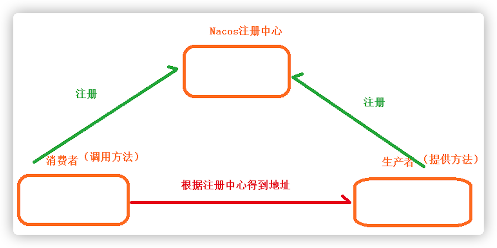

# 8_SpringCloud

## 什么是微服务架构？

- 微服务是一种**架构风格**
- 解决单体架构：扩展性差，可靠性不高，维护成本高，耦合度高问题。
- 一个应用拆分为一组小型服务
- 每个服务运行在自己的进程内，可独立部署和升级
- 服务之间使用轻量级HTTP交互
- 服务围绕业务功能拆分
- 去中心化，服务自治。服务可以使用不同的语言、不同的存储技术

## 微服务优缺点

- 优点：
  1. 服务简单，便于学习和上手，容易维护
  2. 独立部署，灵活扩展
  3. 技术栈丰富，不同模块之间可以使用不同的技术
- 缺点
  1. 运维成本太高----需要过多的服务器，颗粒细化，维护成本高
  2. 接口可能不匹配----session一致性需要去保持
  3. 代码可能重复
  4. 架构复杂度提高，Nginx配置以及**多服务的部署**，运维复杂性增加。

## SpringCloud  

- Spring Cloud是微服务的开发框架，是**一系列框架的集合**。
- 它利用Spring Boot的开发便利性简化了分布式系统基础设施的开发，如**服务发现、服务注册、配置中心、消息总线、负载均衡、 熔断器、数据监控**等，都可以用Spring Boot的开发风格做到**一键启动和部署**。

## SpringCloud和SpringBoot关系

- Spring Boot 是 Spring 的一套快速配置脚手架，Spring Cloud是一个基于Spring Boot实现的开发工具；
- Spring Boot专注于快速、方便集成单个微服务个体，Spring Cloud关注**全局的服务治理框架**； 

## 微服务的基础服务组件

1. 服务发现——Netflix Eureka （Nacos）
2. 服务调用——Netflix Feign
3. 熔断器——Netflix Hystrix 
4. 服务网关——Spring Cloud GateWay 
5. **分布式配置**——Spring Cloud Config  （Nacos）
6. 消息总线 —— Spring Cloud Bus （Nacos）

## Spring Cloud具体调用

Spring Cloud 在接口调用上，大致会经过如下几个组件配合：

1. 调用端 **指定调用服务名称，定义调用的方法路径**--->
2. Nacos服务发现，找到需要调用的服务--->
3. Feign服务调用--->
4. Hystrix熔断器：需要调用的服务能不能调到（服务器宕机），调不到就熔断--->
5. Ribbon**负载均衡**：将请求平均分担到集群的服务器中--->
6. **Http Client**(apache http components 或者 Okhttp)：真正执行方法

## Nacos



- Nacos 是阿里巴巴推出来的一个新开源项目，是一个更易于**构建云原生应用的动态服务发现、配置管理和服务管理平台**。
- 服务发现功能：
  - 注册中心：
    - 注册中心用来集中管理微服务，实现服务的**注册，发现，检查**等功能；
    - 把这些模块在注册中心进行注册，实现不同微服务模块之间调用
  - 注册中心和服务发现：服务 A 与服务 B 注册进注册中心，形成**服务注册表**（表里登记了服务 A 和服务 B 的地址等相关信息）。当 A 服务想要访问 B 服务时，可以通过注册中心的**服务发现机制**，获取服务注册表进而找到服务 B；
  - 使用：
    - 启动类添加注解**@EnableDiscoveryClient**，该服务就注册到注册中心
- 分布式配置：使用配置中心实现。
  - 配置中心：做配置文件的统一管理
  - 以前，多个服务各自用自己的配置文件application.properties；现在，多个服务使用配置中心的一个配置文件application.properties。方便统一管理配置文件。
  - 配置文件加载顺序：bootstrap-->application(可以使用配置中心)-->application-dev（可以使用配置中心）

## Feign

- 用来**服务调用**。Feign是Netflix开发的声明式、模板化的HTTP客户端， Feign可以帮助我们更快捷、优雅地调用HTTP API。
- 使用：前提，服务已经注册过。
  - 在**调用端**的启动类添加注解@EnableFeignClients
  - 在调用端 创建interface，使用注解**指定调用服务名称，定义调用的方法路径，完成服务提供方的接口绑定**
  - 调用

```java
//指定从哪个服务中调用功能 ，名称与被调用的服务名保持一致。
@FeignClient("service-vod")
@Component
public interface VodClient {
  //定义调用的方法路径
    @DeleteMapping(value = "/eduvod/vod/video/{videoId}")
  	//@PathVariabie注解一定要指定参数名称
    public R removeVideo(@PathVariable("videoId") String videoId);
}

//调用
vodClient.removeVideo(videoSourceId);
```

## Hystrix

- Hystrix **供分布式系统使用，提供延迟**(延长请求超时限制)和**容错**(服务器宕机，熔断机制触发，其他请求也不能请求该服务器)功能，保证复杂的分布系统在面临不可避免的失败时，仍能有弹性。

- 使用：

  - 创建interface对应实现类，在实现类 实现方法，出错了输出内容

  ```java
  @Component
  public class VodFileDegradeFeignClient implements VodClient {
      @Override
      public R removeVideo(String videoId) {
          return R.error().message("time out");
      }
      @Override
      public R removeVideoList(List videoIdList) {
          return R.error().message("time out");
      }
  }
  ```

  - 在interface上面添加注解和属性

  ```java
  @FeignClient(name = "service-vod", fallback = VodFileDegradeFeignClient.class)
  ```

## GateWay

- 网关：在客户端和服务端中间一面墙，可以请求转发，负载均衡，权限控制等。
- 网关也是服务，要到注册中心注册；通过网关来访问其他服务，客户端访问网关的端口号
- Nginx起到网关作用

---

下面先不背

## 分布式

- 远程调用
- 服务发现：看哪些服务是可用的
- 负载均衡：按照配置的算法合理的将请求分配给不同的服务器
- 服务容错：各种错误情况下的处理方式
- 配置管理：配置中心，修改配置让服务们自己同步
- 服务监控：多个服务以及云平台的资源消耗和健康状况
- 链路追踪：找到出错的服务器
- 日志管理
- 任务调度

分布式的解决

- SpringBoot + SpringCloud

## 分布式&集群&微服务

- 集群：同一个业务，部署在多个服务器上（多个人在一起作同样的事）。
- 分布式 ：一个业务拆分为多个子业务，部署在多个服务器上（多个人在一起作不同的事）。
- 分布式与微服务：分布式侧重点在于分不同服务器部署；微服务侧重点是业务拆分独立部署，至于是不是部署在同一台服务器上，不是侧重点。
