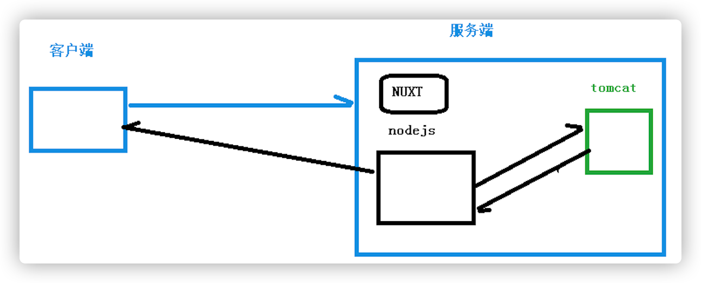

# 前端

## HTML5常用标签

HTML:超文本标记语言-决定页面上显示什么内容

```html
<html> 开始标签
</html>结束标签

<head>网页的头
<body>网页身体内容

标题标签<h1> - <h6>
段落标签<p></p>
  
定义表格<table> 
<tr> 行
<td> 列
<th> 表头列
  
<form>表单
<div> 分块
```

## CSS常用样式

- CSS:页面上的内容显示的风格（决定页面上内容的美观程度）
- 标签样式表、类样式表、ID样式表

```css
background-color
background-image

border: 1px solid red;
solid 实线
dotted 点线
dashed 虚线

line-height

font-size：字体大小
font-weight：字体粗细
```

## JavaScript语言

- JavaScript:页面特效，可以绑定各种事件进行人机交互

```js
event : 当前发生的事件
event.srcElement : 事件源
alert(event.srcElement) ：弹出对话框
```

## Vue框架

vue是JavaScript封装成的框架。

```js
v-bind  简写(:value) 单向数据绑定
v-model 双向数据绑定

v-if和v-else之间不能有其他的节点
v-show是通过样式表display来控制节点是否显示
v-for 迭代，v-for={fruit in fruitList}
v-on 绑定事件
-------------------
 生命周期：
created()：页面渲染之前，用得最多，调用方法发送请求获取数据  
mounted()：页面渲染之后，可以使用已经获取到的数据
-------------------
//事件
data: {
     searchMap:{
         keyWord: '尚硅谷'
     },
     //查询结果
     result: {}
},
methods:{
    search(){
        console.log('search')
        //TODO
    }
}

<!-- v-on 指令绑定事件，click指定绑定的事件类型，事件发生时调用vue中methods节点中定义的方法 -->
<button v-on:click="search()">查询</button>
-------------------
//定义局部组件
//创建一个vue对象 
  var app = new Vue({
    el: '#app',//绑定vue作用的范围 
    // 定义局部组件，这里可以定义多个局部组件
    components: {
        //组件的名字
        'Navbar': {
            //组件的内容
            template: '<ul><li>首页</li><li>学员管理</li></ul>'
        }
    }
})

<div id="app">
    <Navbar></Navbar>
</div>
-------------------
```

## Thymeleaf模板引擎

- Thymeleaf 支持 HTML 原型，其文件后缀为“.html”,Thymeleaf 是一款用于渲染 XML/XHTML/HTML5 内容的模板引擎。thymeleaf是用来帮助我们做视图渲染的一个技术。
- 使用:
  - 新建一个Servlet类ViewBaseServlet继承HttpServlet（可以配置），使得我们的DispacherServlet继承ViewBaseServlet
  - 在web.xml文件中添加配置
       - 配置前缀 view-prefix
       - 配置后缀 view-suffix
  - 根据逻辑视图名称 得到 物理视图名称；
    物理视图名称 ：   view-prefix + 逻辑视图名称 + view-suffix
  - thymeleaf语法：
     - 比较运算，条件运算th:if , th:unless, th:case
     - 设置属性值 th:attr
     -  迭代 th:each，
     - ${...}*获取请求域、session域、对象等值
     - 字符串拼接、替换

## Element Ul组件

element--ui是饿了么前端出品的基于Vue.js的后台组件库，方便程序员进行页面快速布局和构建

## NPM包管理工具

NPM全称Node Package Manager，是Node.js包管理工具，是全球最大的模块生态系统，里面所有的模块都是开源免费的；也是Node.js的包管理工具，相当于前端的Maven 。

## Node.js



- node.js是JavaScript的运行环境，用于执行JavaScript。不需要浏览器，可以在终端运行Javascript代码，可以用js调用系统内核。
- 用来测验js代码，能够排除浏览器的干扰。不同的浏览器 js内核不同，不能保证这段代码在每个浏览器上得到一样的执行结果。但是只要你我安装的node版本大概一致得到的结果就一致。
- 帮助完成服务端渲染：在服务端内通过node.js请求tomcat，得到数据在node.js里面封装，将数据返回客户端。

## JQuery

是一个快速而简洁的JavaScript库，简化了HTML文档遍历（parent返回被选元素的直接父元素等），事件处理（鼠标、键盘、表单事件），动画和Ajax交互（jQuery 提供多个与 AJAX 有关的方法，通过 jQuery AJAX 方法，您能够使用 HTTP Get 和 HTTP Post 从远程服务器上请求文本、HTML、XML 或 JSON - 同时您能够把这些外部数据直接载入网页的被选元素中。），以实现快速Web开发。

## Ajax

- AJAX = 异步 JavaScript 和 XML（Asynchronous JavaScript and XML）。
- 目的： 客户端用来发送**异步请求**，然后当服务器给我响应的时候再进行回调操作
- 好处： 提高用户体验；局部刷新：降低服务器负担、减轻浏览器压力、减轻网络带宽压力
- 缺点：不利于SEO（搜索引擎排名，因为异步请求，在加载完 有页面后请求），抓取工具不会等待异步完成后再进行页面内容的抓取

## Axios

- Axios是Ajax的一个框架，简化Ajax操作
- Axios执行Ajax操作的步骤：

2-1. 客户端向服务器端异步发送普通参数值
 - 基本格式： axios(POST/GET,url,携带参数).then(成功响应时执行的回调，可以获取到服务器响应内容).catch(有异常时执行的回调，可以获取到响应的内容，查看错误的信息)

 2-2. 客户端向服务器发送JSON格式的数据

 - 客户端发送JSON格式的数据给服务器端

 -  服务器端给客户端响应JSON格式的字符串，然后客户端需要将字符串转化成js Object

## 常见状态码

- 200 : 正常响应
- 404 : 找不到资源
- 405 : 请求方式不支持
- 500 : 服务器内部错误