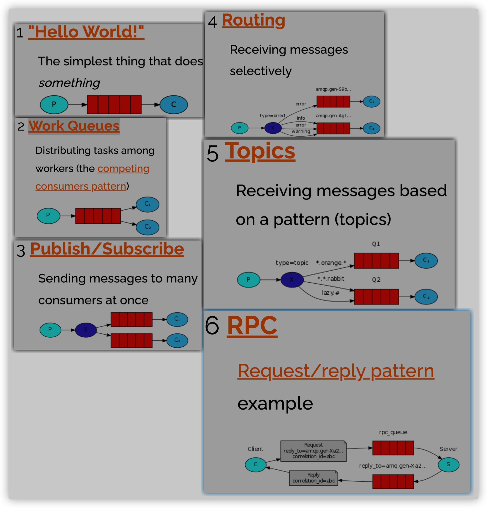

https://www.cnblogs.com/kebibuluan/p/13061319.html

https://www.bilibili.com/video/BV1TE411g74u

# RabbitMQ

- 消息队列/消息中间件[MQ(Message Queue)]，实现应用程序和应用程序之间的通信。
  - 队列（容器）：先进先出
  - 使用场景：
    - 自动续费（不经常使用，时间要求不高，适合异步操作）：生产者扫表。消费者（中转服务）调用其他服务处理数据，如果要切换服务直接改一下消费者这个中转服务就行。里面包含三个服务。
    - 流量削峰：将订单信息放到MQ中，再从MQ中取出订单信息访问数据库，减轻数据库压力
    - 收集日志
    - 分布式架构服务之间通信
    - 异步处理：耗时，不急着用的操作使用MQ实现

---

- RabbitMQ是一个实现MQ的产品，是实现了**高级消息队列协议**的消息中间件。
  - 优点：
    - 性能很好，延时低
    - 吞吐量到万级，功能完备
    -  有良好的管理界面管理工具 社区相对比较活跃
- AMQP协议
  Advanced Message Queuing Protocol高级消息队列协议，规定了下图的架构
- https://www.rabbitmq.com/getstarted.html
- 

消息种类6种

- 一个生产者，一个消费者：
  - 生产者：
    1. 获取链接connection
    2. 创建通道channel
    3. 创建队列：
       - 参数：
         - 队列名
         - 是否持久化
         - 是否独占：一个队列是否只能有一个消费者来消费
         - 当最后一个消费者断开连接之后队列是否自动被删除
         - 其他参数
    4. 创建设置消息
    5. 通过通道发送给队列消息：
       - 参数 ：
         - 交换机Exchange名
         - 队列名
         - 消息
         - 其他参数
    6. 关闭通道、链接
  - 消费者：
    1. 获取链接connection
    2. 创建通道channel
    3. 创建队列
    4. 定义消费者：重写handleDelivery()
       - 提供body参数，即接收的消息；
       - 提供consumerTag参数，一个链接对应一个consumerTag，即一个消费者对应一个consumerTag  
    5. 让消费者在通道上监听指定队列，监听到了消息执行handleDelivery()
- Work Queues：一个生产者，多个消费者，同一个消息只能被一个消息者消费 ：可以设定消费者预处理消息数量
- Publish/Subscribe：生产者把消息给交换机，交换机分配给所有队列，绑定队列的多个消费者可以获取到相同信息
  - 变化：生产者通过通道发送给交换机exchange消息；消费者绑定队列和交换机
- Routing：交换机根据routingKey分配队列，routingKey与消费者的bindingKey一致才会发送给指定队列
- Topics：交换机和队列通过通配符绑定
- RPC：远程调用（同步请求）
  - correlationID消息的唯一编号；replyTo回调队列，服务端回应时，将消息发送到指定队列，客户端监听指定回调队列，客户端获取消息编号

集群：

- 主备/普通模式（默认）Warren： RabbitMQ集群中队列的内容仅位于单个节点上（即声明该队列的节点，也就是主节点），其它节点上并不含有队列。如果队列所在的节点故障，则队列就崩溃了。
- 镜像模式Mirror：集群中所有的节点设备都是同步的，向queue中写消息时，都会自动同步到每一个节点上。
- 镜像模式+反向代理：采用一个负载均衡器，采用nginx或者haproxy也好，进行负载均衡。     

RabbitMQ管理界面：队列、交换机、用户、配置镜像……