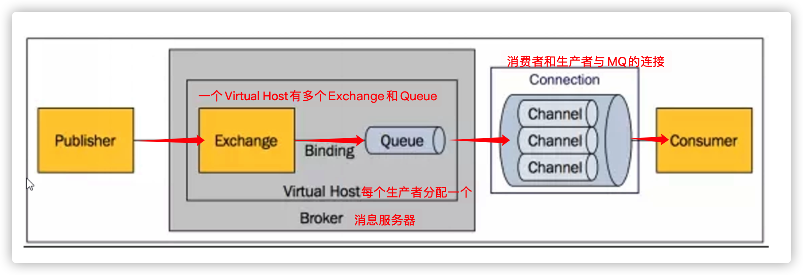

# RabbitMQ

- 消息队列/消息中间件[MQ(Message Queue)]，实现应用程序和应用程序之间的通信。
  - 队列（容器）：先进先出
  - 使用场景：
    - 流量削峰：将订单信息放到MQ中，再从MQ中取出订单信息访问数据库，减轻数据库压力
    - 收集日志
    - 分布式架构服务之间通信
    - 异步处理：耗时，不急着用的操作使用MQ实现

---

- RabbitMQ是一个实现MQ的产品，是实现了**高级消息队列协议**的消息中间件。
  - 优点：
    - 性能很好，延时低
    - 吞吐量到万级，功能完备
    -  有良好的管理界面管理工具 社区相对比较活跃
- AMQP协议
  Advanced Message Queuing Protocol高级消息队列协议，规定了下图的架构

- 一个生产者，一个消费者：

  - 生产者：

    1. 获取链接connection
    2. 创建通道channel
    3. 创建队列：
       - 参数：
         - 队列名
         - 是否持久化
         - 是否独占：一个队列是否只能有一个消费者来消费
         - 当最后一个消费者断开连接之后队列是否自动被删除
         - 其他参数
    4. 创建设置消息
    5. 通过通道发送消息：
       - 参数 ：
         - 交换机Exchange名
         - 队列名
         - 消息(字节数组)
         - 其他参数
    6. 关闭通道、链接

  - 消费者：

    1. 获取链接connection

    2. 创建通道channel

    3. 创建队列

    4. 定义消费者：重写handleDelivery()，提供body参数，即接收的消息(字节数组)

    5. 让消费者在通道上监听指定队列，监听到了消息执行handleDelivery()

       