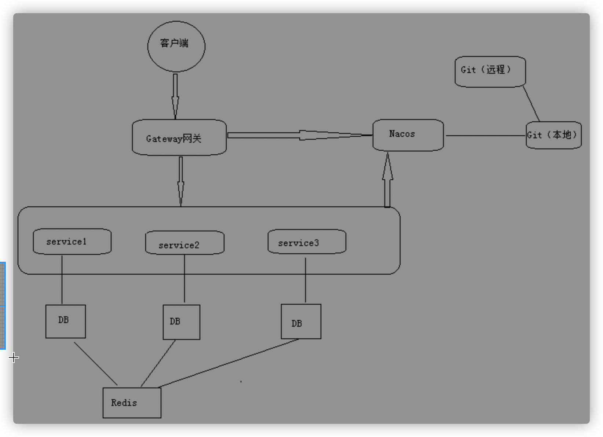

总共几个数据库表

# 项目

## 项目描述

- 项目前后端分离开发，后端通过SpringBoot搭建，采用SpringCloud微服务架构，持久层用的是MyBatis，使用Swagger生成接口文档，前端采用vue 、element-ui、nuxt、babel等等。

  接入了阿里云视频点播、阿里云OSS、短信服务。

  系统分为前台用户系统和后台管理系统两部分。

  前台用户系统包括：首页数据显示、课程列表和详情、课程支付，课程视频播放，微信登录、微信支付等等

  后台管理系统包括：讲师管理、课程分类管理、课程管理、统计分析、Banner管理、订单管理、权限管理等功能。

- 加入了SpringCloud，将一些关键业务和访问量比较大的部分分离了出去

  目前独立出来的服务有教学服务、视频点播服务、用户服务、统计分析服务、网关服务

# 功能点

## 一、项目后台管理系统功能

1. 登录功能（SpringSecurity框架）
   - SpringSecurity框架:
     - 用户认证(用户能否访问该系统)和用户授权(用户是否有权限执行某个操作)
     - SpringSecurity用filter，对请求的路径进行过滤。
     - 系统的模块众多，每个模块都需要就行授权与认证，选择基于token的形式。
       用户根据用户名密码认证成功，以用户名为key，权限列表为value的形式存入redis缓存中，根据用户名生成token返回，浏览器将token记录到cookie中，Spring-security解析header头获取token信息，解析token获取当前用户名，根据用户名就可以从redis中获取权限列表，Spring-security来判断当前请求是否有权限访问。

2. 权限管理模块

   角色：管理员（都可以），讲师（课程管理模块，统计分析模块）

   1)菜单管理：菜单（前台对应的路由）

   - 列表、添加、修改、删除

   2）角色管理

   - 列表、添加、修改、删除、批量删除
   - 为角色分配菜单（操作某菜单权限）

   3）用户管理

   - 列表、添加、修改、删除、批量删除
   - 为用户分配角色

   4）权限管理表和关系：使用五张表

3. 讲师管理模块：分页列表（第三方分页工具）、条件查询、添加、修改、删除

4. 课程分类模块
   - 课程分类列表：使用树形结构显示课程分类列表（一级分类、二级分类）
   - 添加课程分类：读取Excel里面课程分类数据，添加到数据库中(EasyExcel)

5. 课程管理模块
   - 课程列表功能：编辑课程基本信息、编辑课程大纲息、删除课程信息
   - **发布课程**：
     - 流程：第一步填写课程基本信息，第二步添加课程大纲（章节和小节），第三步课程信息确认，最终课程发布
     - 课程如何判断是否已经被发布了？使用status字段
     - **添加小节上传课程视频**：阿里云视频点播SDK，数据库存储视频id

6. 统计分析模块

   - **生成统计数据**：

     使用cron表达式，定时统计数据；
     统计分析数据表里，一天对应一行，生成一行数据；
     以每天注册人数统计为例：把从用户表查询出注册人数存储到统计分析数据表。(Cannal数据库同步先放一放)

   - 统计数据图表显示：ECharts

## 二、项目前台用户系统功能

1、首页数据显示

（1）显示幻灯片功能

（2）显示热门课程

（3）显示名师

2、注册功能

（1）获取手机验证码

3、登录功能

（1）普通登录和退出

 SSO（单点登录）

单点登录三种常见方式：
第一种：session广播机制实现
第二种：使用cookie+redis实现
第三种：使用token实现

JWT

使用JWT生成token字符串

JWT有三部分组成

 登录实现流程

登录调用登录接口返回token字符串，把返回token字符串放到cookie里面，创建前端拦截器进行判断，如果cookie里面包含token字符串，把token字符串放到header里面。调用接口根据token获取用户信息，把用户信息放到cookie里面，进行显示

（2）微信扫描登录

OAuth2

是针对特定问题解决方案

主要有两个问题：开放系统间授权，分布式访问 

如何获取扫描人信息过程？

扫描之后微信接口返回code（临时票据），拿着code值请求微信固定地址，得到两个值：access_token（访问凭证）和openid（微信唯一标识）,你拿着这两个值再去请求微信固定的地址，得到微信扫描人信息（比如昵称，头像等等）

4、名师列表功能

5、名师详情功能 

6、课程列表功能

（1）条件查询分页列表功能 

7、课程详情页

（1）课程信息显示（包含课程基本信息，分类，讲师，课程大纲）

（2）判断课程是否需要购买

8、课程视频在线播放 

9、课程支付功能（微信支付）

（1）生成课程订单

（2）生成微信支付二维码

（3）微信最终支付

微信支付实现流程：

如果课程是收费课程，点击立即购买，生成课程订单

点击订单页面去支付，生成微信支付二维码

使用微信扫描支付二维码实现支付

支付之后，每隔3秒查询支付状态（是否支付成功），如果没有支付成功等待，如果支付成功之后，更新订单状态（已经支付状态），向支付记录表添加支付成功记录

# 技术点

## 前端

1、在线教育项目采用前后端分离开发

2、项目使用前端技术

（1）vue

基本语法

常见指令 ： v-bind  v-model  v-if  v-for  v-html

绑定事件： v-on-click  @click

生命周期：created() 页面渲染之前   mounted()页面渲染之后

ES6规范

（2）Element-ui

（3）nodejs

是JavaScript运行环境，不需要浏览器直接运行js代码，模拟服务器效果

（4）NPM

包管理工具，类似于Maven

npm命令： npm init    npm install  依赖名称

（5）Babel

转码器，可以把ES6代码转换成ES5代码 

（6）前端模块化

通过一个页面或者一个js文件，调用另外一个js文件里面的方法

问题：ES6的模块化无法在Node.js中执行，需要用Babel编辑成ES5后再执行

（7）后台系统使用vue-admin-template

基于vue+Element-ui

（8）前台系统使用Nuxt

基于vue

服务器渲染技术

（9）Echarts

图表工具

## 后端技术一

1、项目采用微服务架构

2、SpringBoot

（1）SpringBoot本质是就是Spring，只是快速构建Spring工程脚手架

（2）细节：

启动类包扫描机制

设置扫描规则 @ComponentScan(***\*"包路径"\****)

配置类

（3）SpringBoot配置文件

配置文件类型：properties和yml

配置文件加载顺序：bootstrap   application   application-dev 

3、SpringCloud

（1）是很多框架总称，使用这些框架实现微服务架构，基于SpringBoot实现

（2）组成框架有哪些？

服务发现一Netflix Eureka(Nacos)
服务调用一Netflix Feign
熔断器一 -Netflix Hystrix
服务网关一Spring Cloud GateWay
分布式配置一Spring Cloud Config(Nacos)
消息总线一Spring Cloud Bus(Nacos)

（3）项目中，使用阿里巴巴Nacos，替代SpringCloud一些组件

（4）Nacos

使用Nacos作为注册中心

使用Nacos作为配置中心 

（5）Feign

服务调用，一个微服务调用另外一个微服务，实现远程调用 

（6）熔断器 

（7）Gateway网关

SpringCloud之前zuul网关，目前Gateway网关 

（8）版本

Finchley
2.0.×
Greenwich
2.1.X
Hoxton
2.2.X

4、MyBatisPlus

（1）MyBatisPlus就是对MyBatis做增强

（2）自动填充

（3）乐观锁

（4）逻辑删除

（5）代码生成器

5、EasyExcel

（1）阿里巴巴提供操作excel工具，代码简洁，效率很高

（2）EasyExcel对poi进行封装，采用SAX方式解析

（3）项目应用在添加课程分类，读取excel数据

## 后端技术二

1、Spring Security

（1）在项目整合框架实现权限管理功能

（2）SpringSecurity框架组成：认证和授权

（3）SpringSecurity登录认证过程

（4）SpringSecurity代码执行过程 

2、Redis

（1）首页数据通过Redis进行缓存

（2）Redis数据类型

（3）使用Redis作为缓存，不太重要或者不经常改变数据适合放到Redis作为缓存 

3、Nginx

（1）反向代理服务器

（2）请求转发，负载均衡，动静分离 

4、OAuth2+JWT

（1）OAuth2针对特定问题解决方案

（2）JWT包含三部分 

5、HttpClient

（1）发送请求返回响应的工具，不需要浏览器完成请求和响应的过程

（2）应用场景：微信登录获取扫描人信息，微信支付查询支付状态 

6、Cookie

（1）Cookie特点：

客户端技术

每次发送请求带着cookie值进行发送

cookie有默认会话级别，关闭浏览器cookie默认不存在了，

但是可以设置cookie有效时长  setMaxAge

7、微信登录

8、微信支付

9、阿里云OSS

（1）文件存储服务器

（2）添加讲师时候上传讲师头像

10、阿里云视频点播

（1）视频上传、删除、播放

（2）整合阿里云视频播放器进行视频播放

使用视频播放凭证 

11、阿里云短信服务

（1）注册时候，发送手机验证码 

12、Git

（1）代码提交到远程Git仓库 

13、Docker+Jenkins

（1）手动打包运行

（2）idea打包

（3）jenkins自动化部署过程

---

## 微服务

- 微服务是一种架构风格
- 一个应用拆分为一组小型服务
- 每个服务运行在自己的进程内，也就是可独立部署和升级
- 服务之间使用轻量级HTTP交互
- 服务围绕业务功能拆分
- 可以由全自动部署机制独立部署
- 去中心化，服务自治。服务可以使用不同的语言、不同的存储技术

## 分布式

- 远程调用
- 服务发现：看哪些服务是可用的
- 负载均衡：按照配置的算法合理的将请求分配给不同的服务器
- 服务容错：各种错误情况下的处理方式
- 配置管理：配置中心，修改配置让服务们自己同步
- 服务监控：多个服务以及云平台的资源消耗和健康状况
- 链路追踪：找到出错的服务器
- 日志管理
- 任务调度

分布式的解决

- SpringBoot + SpringCloud

# 问题

1、系统中都有那些角色？数据库是怎么设计的？

前台：会员（学员）

后台：系统管理员、运营人员

后台分库，每个微服务一个独立的数据库，使用了分布式id生成器

2、视频点播是怎么实现的（流媒体你们是怎么实现的）

直接接入了阿里云的云视频点播。云平台上的功能包括视频上传、转码、加密、智能审核、监控统计等。

还包括视频播放功能，阿里云还提供了一个视频播放器。

3、前后端联调经常遇到的问题：

   1、请求方式post、get

   2、json、x-wwww-form-urlencoded混乱的错误

   3、后台必要的参数，前端省略了

   4、数据类型不匹配

   5、空指针异常

   6、分布式系统中分布式id生成器生成的id 长度过大（19个字符长度的整数），js无法解析（js智能解析16个长度：2的53次幂）

​     id策略改成 ID_WORKER_STR

4、前后端分离项目中的跨域问题是如何解决的

后端服务器配置：我们的项目中是通过Spring注解解决跨域的 @CrossOrigin

也可以使用nginx反向代理、httpClient、网关

5、说说你做的哪个部分、遇到了什么问题、怎么解决的

问题1：

分布式id生成器在前端无法处理，总是在后三位进行四舍五入。

分布式id生成器生成的id是19个字符的长度，前端javascript脚本对整数的处理能力只有2的53次方，也就是最多只能处理16个字符

解决的方案是把id在程序中设置成了字符串的性质

问题2：

项目迁移到Spring-Cloud的时候，经过网关时，前端传递的cookie后端一只获取不了，看了cloud中zuul的源码，发现向下游传递数据的时候，zull默认过滤了敏感信息，将cookie过滤掉了

解决的方案是在配置文件中将请求头的过滤清除掉，使cookie可以向下游传递

6、**前端渲染和后端渲染有什么区别**

前端渲染是返回json给前端，通过javascript将数据绑定到页面上

后端渲染是在服务器端将页面生成直接发送给服务器，有利于SEO的优化

7、能画一下系统架构图吗

1、前端问题-路由切换问题

（1）多次路由跳转到同一个vue页面，页面中created方法只会执行一次

（2）解决方案：使用vue监听

2、前端问题-ES6模块化运行问题

（1）Nodejs不能直接运行ES6模块化代码，需要使用Babel把ES6模块化代码转换ES5代码 执行

3、mp生成19位id值

（1）mp生成id值是19位，JavaScript处理数字类型值时候，只会处理到16位

4、跨域问题

（1）访问协议，ip地址，端口号，这三个如果有任何一个不一样，产生跨域

（2）跨域解决：

在Controller添加注解

通过网关解决 

5、413问题

（1）上传视频时候，因为Nginx有上传文件大小限制，如果超过Nginx大小，出现413

（2）413错误：请求体过大

（3）在Nginx配置客户端大小

（4）响应状态码：413  403  302

6、Maven加载问题

（1）maven加载项目时候，默认不会加载src-java文件夹里面xml类型文件的

（2）解决方案：

直接复制xml文件到target目录

通过配置实现