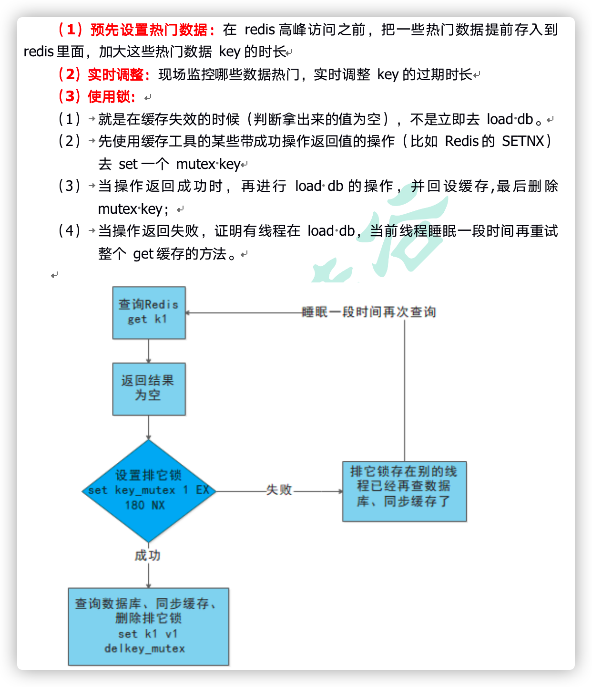

# 问的

1. 自我介绍

   大四，学校，专业，自学快一年

2. 为啥学这个专业

   以前对人文历史感兴趣、一带一路听说有前途、号称第二难的语言挑战自己

3. 和英语比起来希腊语的难度

   难，性，变位，逻辑

4. 希腊语和计算机语言的相同点

   都是表达完整逻辑的方式

5. 为啥学java/计算机

   本专业就业不好、不给自己设限、想做希腊语教学 词典应用、有趣

6. 怎么学的，学习计划

   加群 求推荐学习资料 路线，看网上推荐学习的资料 路线，为了快速入手；之后也准备看书深入学习

7. 除了java，做的这个项目以外还学啥计算机的

   学C打底

---

1. 学java困难的点（我提到一开始配置环境

   有问题自己解决，概念知识的问题，找很多资料才懂，很多解读不适合新手，动不动就深入源码；Mac配置各种中间件等等要单独找资料，arm芯片各种坑

2. 理解为什么配置java环境

   JDK JRE JVM

3. 为什么要配置Path环境变量？

   它提供了windowsi命令行中指令的可执行文件（比如：.exe文件）路径，在命令行中输入命令时，能够找到对应的可执行文件执行
   简单说：让命令在命令行中使用有效

4. **Linux搞过吗（被建议可以用虚拟机、云服务器等学）** 问了，不急，先放着

5. Linux Mac搞简单吧

6. 介绍项目

7. 项目的单点登录

8. 如何设置30天免登录

   设置cookie的有效时间，redis有效时间

9. 描述缓存击穿，问是什么问题。如何解决

   - 预先设置热门数据，延长有效期
   - 实时调整：现场监控哪些数据热门，实时调整key的过期时长
   - 
   - 锁：在redis查数据，如果返回结果是空，就设置锁，如果失败，等一会儿再查询直到成功

10. 用过Mysql索引吗？基于什么数据结构

11. 索引：主键用字符串还是整形效率高？随机整数和随机字符串？如何比较字符串的大小（答案：ASK码，比较的是数）

# 给的建议

1. 计算机网络，协议等（准备的先够用）
2. **MongoDB**
3. **基础算法（包括hash排序）**
4. 项目先不用搞
5. 看开源项目，源码（不急）
6. 不要自顾自说自己的

